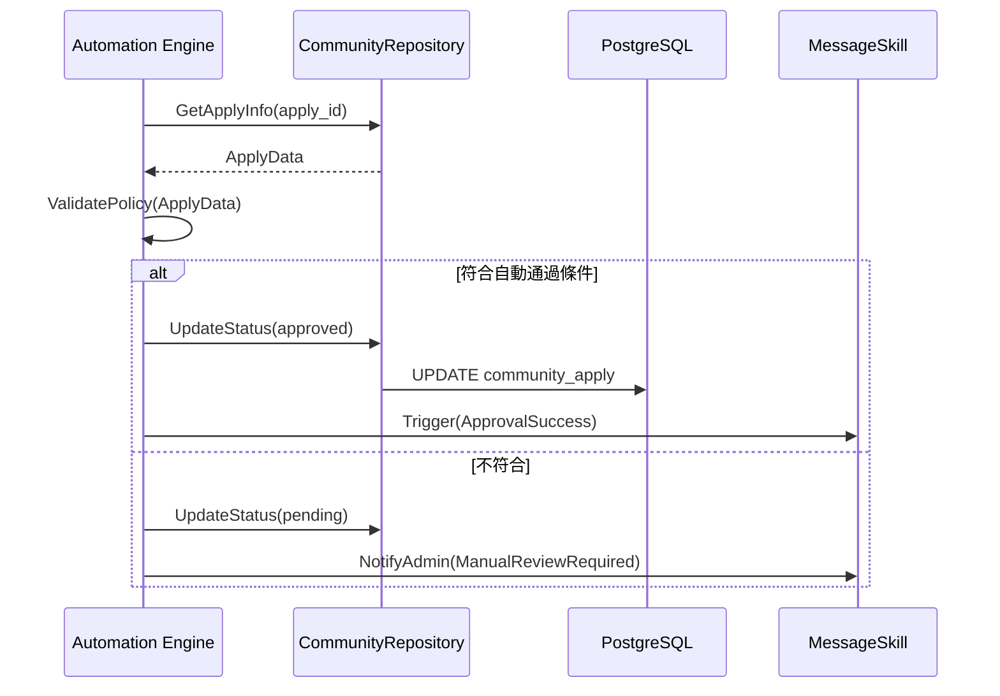

# Skill: 自動化社區申請審核 (Auto Approval)

## Definition
本 Skill 用於自動化處理使用者的社區加入申請。當申請者滿足預設的安全與邏輯條件時，系統可自動將其狀態從 `pending` 變更為 `approved`，無需人工介入。

## Context
- `community_id`: 目標社區 ID。
- `apply_user_id`: 申請人 ID。
- `policy`: 社區預設的審核策略。

## Triggers
- 使用者送出加入申請時。
- 管理員啟動「批次自動審核」操作時。

## Workflow

### 邏輯判斷標準
1. **黑名單檢查**：申請人是否在該社區的黑名單中。
2. **重複性檢查**：是否已有相同 Home_id 的有效住戶。
3. **驗證碼/邀請碼**：若申請包含正確的邀請碼，則自動通過。

### 執行步驟 (Sequence Diagram)

## Actions
- `UpdateCommunityApplyStatus`: 變更資料庫狀態。
- `SendNotification`: 發送審核結果給使用者。

## Constraints
- 僅限 Level 5 (社區管理員) 以上權限可配置此 Skill。
- 敏感住宅區域 (如 VIP 棟別) 禁止使用自動審核。
