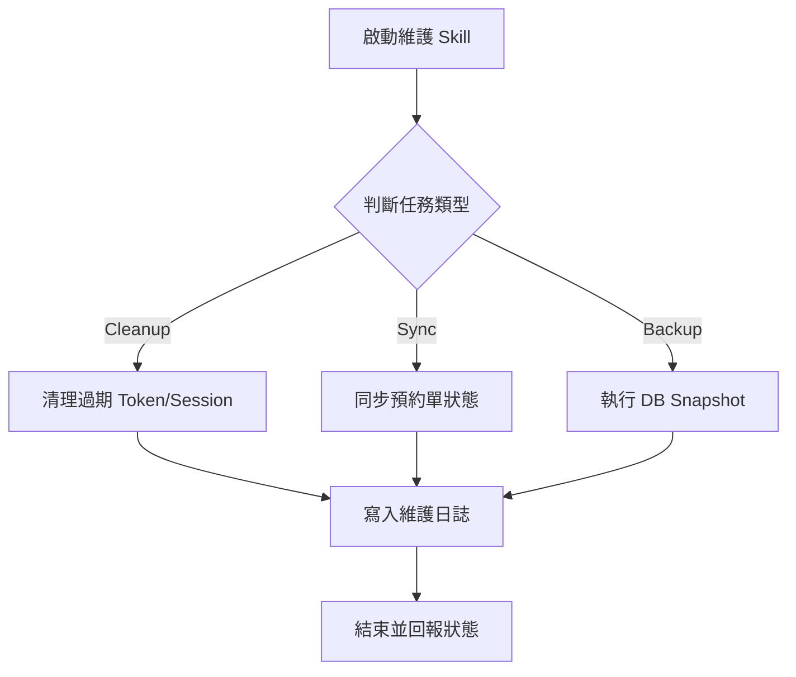

# Skill: 系統維護與定時任務 (Maintenance Cron)

## Definition
本 Skill 用於處理系統後台的定時維護任務。確保資料庫效能、清理冗餘數據並維護系統安全性。

## Context
- `task_type`: 維護任務類型 (Cleanup, Backup, Sync)。
- `retention_days`: 資料保留天數設定。

## Triggers
- 定時任務 (Cron Job) 每小時或每日觸發。
- 系統管理員手動執行強制維護。

## Workflow

### 主要維護項目
1. **過期 Token 清理**：從 `user_info` 中清除已超過 `exp` 時間的 Token。
2. **預約單狀態同步**：將過期未使用的設施預約單狀態設為 `expired`。
3. **日誌壓縮**：將超過 90 天的 `user_log` 進行封存或刪除。

### 執行步驟 (Activity Diagram)

## Actions
- `CleanupExpiredTokens`: 執行資料庫刪除指令。
- `UpdateReservationStatus`: 批次更新預約狀態。
- `MaintenanceLogRepository`: 記錄維護結果。

## Constraints
- 必須在系統低峰期間 (如凌晨 03:00) 執行。
- 執行過程中需監控資料庫 CPU 使用率，避免影響正常服務。
