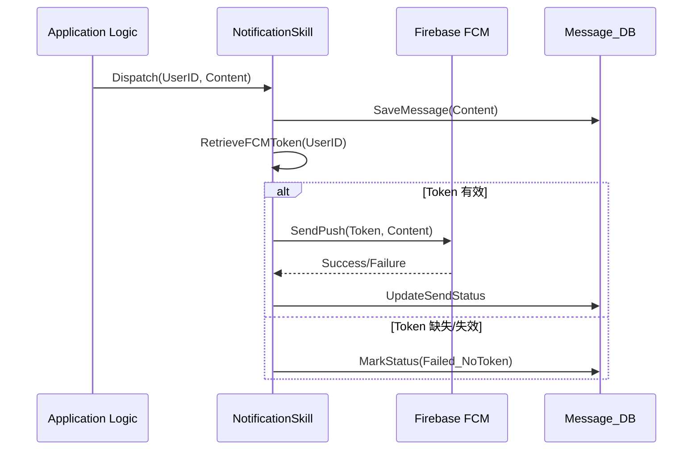

# Skill: 訊息推播分發 (Notification Dispatch)

## Definition
本 Skill 負責將系統產生的事件（如：預約成功、包裹到貨、社區公告）轉換為推播訊息，並透過 Firebase FCM 或其他管道準確分發給目標使用者。

## Context
- `target_user_id`: 接收者 ID。
- `message_body`: 訊息內容。
- `fcm_token`: 裝置推播憑證。

## Triggers
- 業務邏輯完成後觸發（如 `app/controller/v1/message/Message_SendMessage.go`）。
- 手動發送全社區公告時。

## Workflow

### 發送路徑選擇
1. **單一發送**：針對特定使用者的裝置進行推播。
2. **主題訂閱 (Topics)**：針對訂閱特定社區 ID 的所有裝置發送（如公告）。

### 執行步驟 (Sequence Diagram)

## Actions
- `FCMPushService`: 呼叫 Firebase SDK。
- `MessageLogRepository`: 記錄發送歷史與讀取狀態。

## Constraints
- 每秒發送頻率限制 (Rate Limiting)，避免被 FCM 封鎖。
- 敏感資訊（如個人密碼）嚴禁出現於推播內容中。
