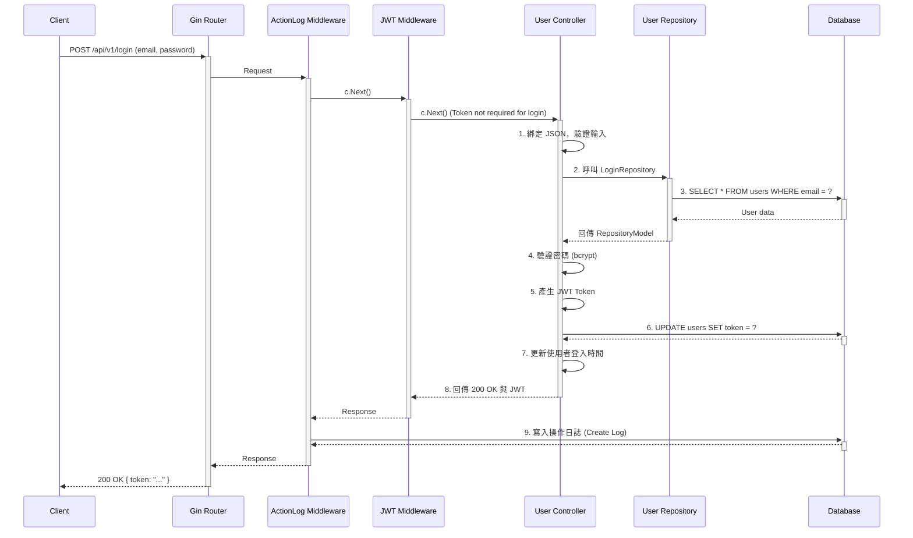

# 開發指南與專案分析

本文檔旨在分析 `Community_Notification_System` 專案的架構、檔案結構和開發風格，為新加入的開發者提供一份清晰的指南。

## 1. 專案概觀

本專案是一個基於 Go 語言的「社群通知系統」。它採用了現代化的網頁開發框架和設計模式，旨在提供一個可擴展、可維護的後端服務。

- **核心語言**: Go
- **Web 框架**: Gin
- **資料庫 ORM**: GORM
- **資料庫**: PostgreSQL
- **身份驗證**: JWT (JSON Web Tokens)
- **API 文件**: Swagger

## 2. 檔案結構

專案遵循分層的架構，將不同職責的程式碼分離到各自的目錄中。

```text
/
├── main.go                 # 應用程式進入點，初始化服務與中介層
├── go.mod, go.sum          # Go 模組依賴管理
├── Dockerfile              # 用於部署的 Docker 設定檔
├── docker-compose.yml      # Docker Compose 設定
├── configs/                # 環境變數與組態設定
├── database/               # 資料庫連線、遷移與模型定義
├── routers/                # API 路由定義與版本控制
├── app/
│   ├── controller/         # 控制器 (Controller)，處理業務邏輯
│   ├── models/             # API 請求/回應的資料模型
│   └── repositories/       # 倉儲庫 (Repository)，負責資料庫操作
├── middlewares/            # Gin 中介層 (CORS, JWT, Logging)
├── utils/                  # 共用工具函式 (如 JWT 生成)
├── pkg/                    # 專案內部共用的套件
├── docs/                   # Swagger API 文件與其他開發文件
├── scripts/                # 安裝與建置腳本
└── README.md               # 專案說明文件
```

### 各目錄詳細職責

- **`main.go`**: 應用程式的起點。它初始化 Gin 引擎、註冊全域中介層、初始化資料庫連線、並設定 API 路由的根路徑。
- **`configs/`**: 讀取 `.env` 檔案，將環境變數載入到應用程式中。
- **`database/`**:
    - **`db.go`**: 負責建立與 PostgreSQL 的 GORM 連線，並執行 `AutoMigrate` 來自動更新資料庫結構。
    - **`*_DB/`**: 每個資料庫模型都有自己的子目錄。此目錄遵循一個特定模式：
        - `*_Schema.go`: 定義 GORM 的 `struct` 模型。
        - `*_Table.go`: 包含一個 "Controller" 工廠，用於執行該模型的資料表遷移 (`AutoMigrate`) 和資料初始化 (seeding)。
- **`routers/`**:
    - **`router.go`**: 設定 API 的根路徑 (`/api`)，並透過 `v1`, `v2` 等子目錄實現 **API 版本控制**。
    - **`api/v*/`**: 每個 API 版本都有自己的路由定義檔案，將 URL 路徑對應到 `app/controller` 中的具體處理函式。
- **`app/controller/`**:
    - 實現核心業務邏輯。遵循 **一個動作一個檔案** 的模式 (例如 `User_Login.go`, `User_Register.go`)。
    - 職責：處理 HTTP 請求、驗證輸入、呼叫 Repository 進行資料操作、並回傳結構化的 JSON 回應 (成功或失敗)。
- **`app/models/`**: 定義 API 的請求主體 (request body) 和回應主體 (response body) 的 `struct`。
- **`app/repositories/`**:
    - 抽象化資料庫存取邏輯。
    - 每個函式對應一個特定的資料庫查詢。
    - 使用全域的 `database.DB` 實例。
    - 回傳自訂的 `RepositoryModel[T]` 結構，用於將結果和錯誤狀態標準化地傳遞回 Controller。
- **`middlewares/`**: 包含所有 Gin 中介層。這些中介層處理跨領域的關注點，例如：
    - `cors_middleware.go`: 處理跨域請求。
    - `jwt_middleware.go`: 驗證 JWT Token 並解析使用者資訊。
    - `action_log_middleware.go`: 自動記錄所有 API 請求的日誌。

## 3. 架構與設計模式

### 3.1. 分層架構

專案採用經典的 **三層式架構**：

1.  **Controller (控制層)**: `app/controller` - 處理 HTTP 請求和業務流程。
2.  **Repository (倉儲層)**: `app/repositories` - 負責所有資料庫的讀寫操作。
3.  **Model (模型層)**: `database/*_DB` & `app/models` - 定義資料庫結構和 API 資料結構。

這種分離使得程式碼更易於理解、測試和維護。

### 3.2. 工廠模式 (Factory Pattern)

專案在多處使用工廠模式來建立物件實例：

- **資料庫表格建立**: `database/*_DB/*_Table.go` 中的 `New*Controller()` 函式用於建立一個負責遷移資料表的物件。
- **控制器**: `app/controller/v1/v1.go` 中的 `v1.User()` 或 `v1.Message()` 等函式返回對應 Controller 的實例，讓路由定義更簡潔。

### 3.3. 中介層 (Middleware)

Gin 的中介層被廣泛用於實現橫切關注點 (Cross-Cutting Concerns)。所有請求都會經過在 `main.go` 中註冊的全域中介層，確保了如身份驗證和日誌記錄等功能的一致性。

### 3.4. 請求時序圖 (Sequence Diagram)

為了更清晰地展示系統各層之間的互動，以下是使用者登入 (`/api/v1/login`) 的請求流程時序圖：



這個圖表展示了：
1.  請求如何依序通過 `ActionLog` 和 `JWT` 中介層。
2.  `Controller` 如何協調業務邏輯，包括呼叫 `Repository`。
3.  `Repository` 如何執行資料庫查詢。
4.  回應如何反向流過中介層，並觸發日誌記錄。

## 4. 開發風格與慣例

- **命名**:
    - 檔案和目錄：使用蛇形命名法 (`user_controller.go`) 或首字母大寫 (`User_DB`)，風格並未完全統一，但可觀察到規律。*建議統一為蛇形命名法*。
    - Go 變數/函式：遵循 Go 的 `camelCase` (私有) 和 `PascalCase` (公有) 規範。
    - 資料庫表：GORM 預設將 `struct` 名稱轉為蛇形的複數形式，但專案透過 `SingularTable: true` 設定為單數。
- **錯誤處理**: Controller 層會捕捉錯誤，並回傳一個包含 `http.StatuCode` 和錯誤訊息的標準化 JSON 物件 (`model.ErrorRequest`)。
- **註解**: 專案中的程式碼，特別是 Controller 層，有著良好的中文註解，解釋了程式碼區塊的意圖和安全考量。
- **資料庫存取**:
    - 主要透過 Repository 模式進行。
    - 存在部分 Controller 或 Repository 直接存取全域 `database.DB` 實例的情況。
- **API 設計**:
    - 採用 RESTful 風格。
    - 透過 `/api/v1/`, `/api/v2/` 進行明確的版本控制。

## 5. 如何新增一個功能模組 (範例)

若要新增一個 `Product` 模組，您可以遵循以下步驟：

1.  **建立資料庫模型**:
    - 在 `database/` 下建立 `Product_DB/` 目錄。
    - 建立 `Product_Schema.go` 定義 `Product` 結構。
    - 建立 `Product_Table.go`，包含 `NewProductController()` 和 `ProductTable()` 方法來處理資料表遷移。
    - 在 `database/db.go` 中呼叫 `product_db.NewProductController().ProductTable(DB)`。
2.  **建立 Repository**:
    - 在 `app/repositories/` 下建立 `product_repository.go`。
    - 新增如 `CreateProduct`, `GetProductByID` 等函式，執行 GORM 操作。
3.  **建立 API 資料模型**:
    - 在 `app/models/` 下建立 `product_model.go`，定義新增或查詢產品時 API 的請求和回應結構。
4.  **建立 Controller**:
    - 在 `app/controller/v1/` 下建立 `product/` 目錄。
    - 建立 `Product_Create.go`, `Product_Get.go` 等檔案。
    - 實現處理 HTTP 請求、呼叫 Repository、回傳 JSON 的邏輯。
    - 在 `app/controller/v1/v1.go` 中新增一個 `Product()` 工廠函式。
5.  **定義路由**:
    - 在 `routers/api/v1/v1.go` 中新增路由，例如：
      ```go
      rg.POST("/product", v1.Product().CreateProduct)
      rg.GET("/product/:id", v1.Product().GetProduct)
      ```

## 6. 已發現的潛在改進點

- **檔名一致性**: `app/controller/v1/user/User_Controoller.go` 存在拼寫錯誤。建議將專案中的檔案命名風格統一（例如，全部使用 `snake_case`）。
- **純粹的 Repository 模式**: 在 `User_Login.go` 中存在直接呼叫 `database.DB` 的情況。為了更好地實現關注點分離，建議將所有資料庫操作都封裝在 Repository 層。
