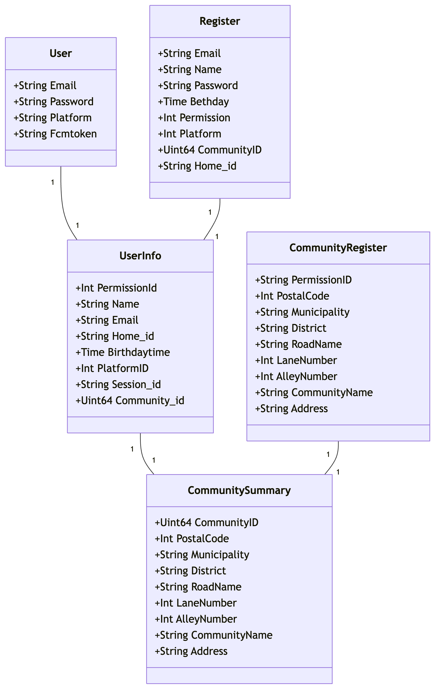
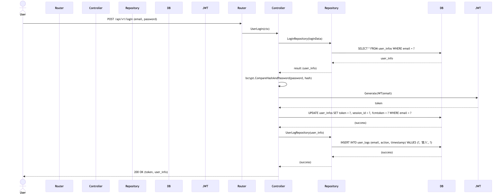

# GEMINI.md

## Project Overview

This project is a Community Notification System built in Go. It utilizes the Gin web framework for handling HTTP requests and GORM for database interactions with PostgreSQL. The system features a versioned API (v1 and v2), JWT-based authentication, and Swagger for API documentation.

**Key Technologies:**

- **Language:** Go
- **Web Framework:** Gin
- **Database:** PostgreSQL
- **ORM:** GORM
- **Authentication:** JWT
- **API Documentation:** Swagger

## Architecture

The project follows a clean architecture pattern, separating concerns into distinct layers. This approach enhances maintainability, testability, and scalability.

- **`main.go`**: The application entry point, responsible for initializing the server, database, and middleware.
- **`routers/`**: Defines the API routes and groups them by version (`/api/v1`, `/api/v2`). It maps incoming requests to the appropriate controllers.
- **`app/controller/`**: Contains the business logic for handling requests. Controllers are responsible for parsing requests, validating input, and calling repositories to interact with the database.
- **`app/models/`**: Defines the data structures and models used throughout the application, including request/response bodies and database entities.
- **`app/repositories/`**: Implements the database operations, abstracting the data access logic from the controllers.
- **`database/`**: Manages the database connection and schema creation. It uses GORM to automatically migrate the database schema on startup.
- **`middlewares/`**: Includes custom middleware for CORS, JWT authentication, and cookie handling, providing a centralized way to manage cross-cutting concerns.
- **`configs/`**: Handles application configuration, loading environment variables from a `.env` file.
- **`docs/`**: Contains the auto-generated Swagger documentation, as well as other development documents like architecture diagrams and commit summaries.

### Class Diagram

The following class diagram illustrates the relationships between the main data models in the system:



### Sequence Diagram: User Login

This sequence diagram shows the process of a user logging into the system:



## Building and Running

To build and run the project, follow these steps:

1.  **Install Dependencies:**

    ```bash
    go mod tidy
    ```

2.  **Set Environment Variables:**
    Create a `.env` file in the root directory with the following variables:

    ```
    PORT=:9080
    DB_HOST=127.0.0.1
    DB_USER=postgres
    DB_PASSWORD=your_password
    DB_NAME=db_Community
    DB_PORT=5432
    DB_TIMEZONE=Asia/Shanghai
    JWTPASSWORD=your_jwt_secret
    ```

3.  **Run the Application:**
    ```bash
    go run main.go
    ```

The application will be accessible at `http://localhost:9080`.

## Development Conventions

- **API Versioning:** The API is versioned under the `/api/v1` and `/api/v2` paths.
- **Authentication:** Most routes are protected by JWT authentication. The token should be provided in the `Authorization` header as a Bearer token.
- **Database:** The application uses GORM to interact with a PostgreSQL database. Database tables are created automatically on startup.
- **API Documentation:** API documentation is available at `http://localhost:9080/swagger/index.html`.

## File Structure
```text
Community_Notification_System/
├─ main.go                         # 服務進入點，載入設定、中介層與路由
├─ go.mod / go.sum                 # 依賴與模組設定
├─ app/
│  ├─ controller/
│  │  └─ v1/
│  │     ├─ v1.go                 # 控制器工廠，提供 Message/User 實例
│  │     ├─ message/
│  │     │  ├─ Message_Controller.go
│  │     │  └─ Message_SendMessage.go
│  │     └─ user/
│  │        ├─ User_Controller.go
│  │        ├─ User_Login.go
│  │        ├─ User_Login_test.go
│  │        ├─ User_Register.go
│  │        ├─ User_Delete.go
│  │        └─ User_Update.go (預留)
│  ├─ models/
│  │  ├─ account/                  # 登入/註冊請求與回應模型
│  │  ├─ message/                  # 訊息推播請求模型
│  │  ├─ model/                    # 共用錯誤與訊息結構
│  │  └─ repository/               # 泛型回傳包裝器
│  └─ repositories/
│     ├─ user/                     # 使用者 CRUD、登入紀錄、查詢列表
│     ├─ message/                  # 訊息相關查詢（預留）
│     └─ home/                     # 住戶相關 repository（預留）
├─ configs/
│  └─ config.go                    # 載入 .env
├─ database/
│  ├─ db.go                        # 建立 GORM 連線並自動建表
│  ├─ User_DB/                     # 使用者資料表 schema 與建表邏輯
│  ├─ UserLog_DB/                  # 使用者操作紀錄表
│  ├─ Message_DB/                  # 訊息資料表（預留）
│  └─ Home_DB/                     # 住戶資料表（預留）
├─ middlewares/
│  ├─ cors_middleware.go
│  ├─ jwt_middleware.go
│  └─ cookie_middleware.go
├─ routers/
│  ├─ router.go                    # 註冊 /api/v1、/api/v2
│  └─ api/
│     ├─ v1/v1.go                  # v1 路由：登入、註冊、刪除、發送訊息
│     └─ v2/v2.go                  # 目前共用 v1 控制器
├─ utils/
│  └─ Jwt_Token.go                 # JWT 簽發工具
├─ docs/
│  ├─ README.md                   # 文件索引與分類說明
│  ├─ architecture/               # 架構流程與時序圖文件
│  ├─ commit_summaries/           # 月度 commit 摘要（新→舊）
│  ├─ docs.go                     # Swag 產生的程式碼（勿手動修改）
│  ├─ swagger.json                # Swagger 定義（自動生成）
│  └─ swagger.yaml                # Swagger 定義（自動生成）
├─ pkg/common/                     # 共用建表工具
├─ tmp/                            # air 熱重載暫存（保持忽略）
├─ AGENTS.md, GEMINI.md            # 專案補充說明
└─ README.md                       # 本文件
```

## 提交與 Pull Request 規範

- Commit：簡短、命令式、標明範疇（如：`fix(chart): clamp pan at edges`）
- 語言 ： 請以繁體中文書寫
- 請將相關變更分組，避免不相關的重構
- PR 必須包含：
  - 變更摘要與原因
  - UI 變更請附截圖/GIF
  - 手動測試步驟與影響模組/路徑
  - 若適用請附上相關 issue 或任務 ID
- 分支命名：`feature/<name>`、`fix/<name>`、`chore/<name>`
- 每個 PR 需至少一位審核者
- 請保持 PR 規模小且聚焦（盡量少於 300 行）
- 請將所有 commit 經過逐行分析後放進/docs 中的 commit*summary_2025*{當月月份}.md 的文件中
- commit*summary_2025*{當月月份}.md 請以時間新到舊排序

## 使用套件的版本

- 確保環境安裝腳本有確認是否安裝必要套件

## 軟體架構

- clean architecture

## 開發文件管理

- 必須放在 /docs
- 必須依照種類建立資料夾並依照種類存放
- 除了 swagger 相關的不處理
- 自動處理相關條件

## 產生開發文件

- 放到 /docs
- 每行程式碼逐一分析
- 必須要產生時序圖
- 必須產生 class 圖