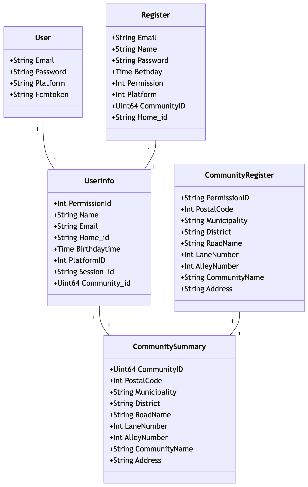
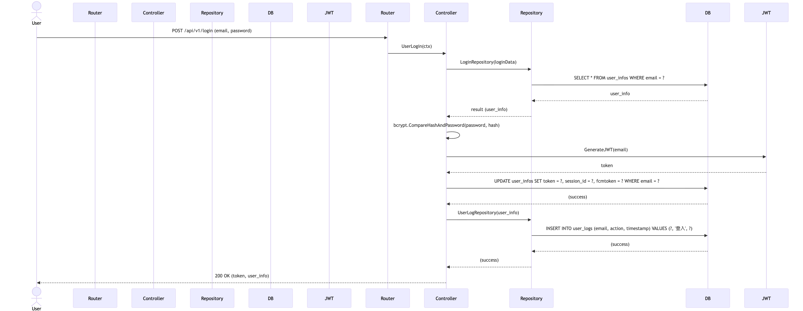

# GEMINI.md

## Project Overview

This project is a Community Notification System built in Go. It utilizes the Gin web framework for handling HTTP requests and GORM for database interactions with PostgreSQL. The system features a versioned API (v1 and v2), JWT-based authentication, and Swagger for API documentation.

**Key Technologies:**

- **Language:** Go
- **Web Framework:** Gin
- **Database:** PostgreSQL
- **ORM:** GORM
- **Authentication:** JWT
- **API Documentation:** Swagger

## Architecture

The project follows a clean architecture pattern, separating concerns into distinct layers. This approach enhances maintainability, testability, and scalability.

- **`main.go`**: The application entry point, responsible for initializing the server, database, and middleware.
- **`routers/`**: Defines the API routes and groups them by version (`/api/v1`, `/api/v2`). It maps incoming requests to the appropriate controllers.
- **`app/controller/`**: Contains the business logic for handling requests. Controllers are responsible for parsing requests, validating input, and calling repositories to interact with the database.
- **`app/models/`**: Defines the data structures and models used throughout the application, including request/response bodies and database entities.
- **`app/repositories/`**: Implements the database operations, abstracting the data access logic from the controllers.
- **`database/`**: Manages the database connection and schema creation. It uses GORM to automatically migrate the database schema on startup. (IoT-related schemas are reserved for future phases).
- **`middlewares/`**: Includes custom middleware for CORS, JWT authentication, and cookie handling, providing a centralized way to manage cross-cutting concerns.
- **`configs/`**: Handles application configuration, loading environment variables from a `.env` file.
- **`docs/`**: Contains the auto-generated Swagger documentation, as well as other development documents like architecture diagrams and commit summaries.

### Class Diagram

The following class diagram illustrates the relationships between the main data models in the system:



### Sequence Diagram: User Login

This sequence diagram shows the process of a user logging into the system:



## Building and Running

To build and run the project, follow these steps:

1.  **Install Dependencies:**

    ```bash
    go mod tidy
    ```

2.  **Set Environment Variables:**
    Create a `.env` file in the root directory with the following variables:

    ```
    PORT=:9080
    DB_HOST=127.0.0.1
    DB_USER=postgres
    DB_PASSWORD=your_password
    DB_NAME=db_Community
    DB_PORT=5432
    DB_TIMEZONE=Asia/Shanghai
    JWTPASSWORD=your_jwt_secret
    ```

3.  **Run the Application:**
    ```bash
    go run main.go
    ```

The application will be accessible at `http://localhost:9080`.

## Development Conventions

- **API Versioning:** The API is versioned under the `/api/v1` and `/api/v2` paths.
- **Authentication:** Most routes are protected by JWT authentication. The token should be provided in the `Authorization` header as a Bearer token.
- **Database:** The application uses GORM to interact with a PostgreSQL database. Database tables are created automatically on startup.
- **API Documentation:** API documentation is available at `http://localhost:9080/swagger/index.html`.

## File Structure
```text
Community_Notification_System/
├─ main.go                         # 服務進入點，載入設定、中介層與路由
├─ go.mod / go.sum                 # 依賴與模組設定
├─ app/
│  ├─ controller/
│  │  └─ v1/
│  │     ├─ v1.go                 # 控制器工廠，提供各模組實例
│  │     ├─ communityManager/
│  │     │  ├─ CommunityManager_Controller.go
│  │     │  ├─ CommunityManager_add.go
│  │     │  ├─ CommunityManager_GetList.go
│  │     │  ├─ CommunityManager_Approve.go
│  │     │  └─ CommunityManager_Reject.go
│  │     ├─ facility/
│  │     │  └─ Facility_Controller.go
│  │     ├─ reservation/
│  │     │  └─ Reservation_Controller.go
│  │     ├─ permission/
│  │     │  └─ CommunityPermission_Controller.go
│  │     ├─ platform/
│  │     │  ├─ Platform_Controller.go
│  │     │  └─ Platform_GetList.go
│  │     ├─ message/
│  │     │  ├─ Message_Controller.go
│  │     │  └─ Message_SendMessage.go
│  │     └─ user/
│  │        ├─ User_Controller.go
│  │        ├─ User_Login.go
│  │        ├─ User_Login_test.go
│  │        ├─ User_Register.go
│  │        ├─ User_Delete.go
│  │        └─ User_Update.go
│  ├─ models/
│  │  ├─ account/                  # 登入/註冊請求與回應模型
│  │  ├─ community/                # 社區與申請單模型
│  │  ├─ facility/                 # 設施主檔模型
│  │  ├─ reservation/              # 預約與改期模型
│  │  ├─ permission/               # 權限角色 Profile 模型
│  │  ├─ platform/                 # 平台清單模型
│  │  ├─ message/                  # 訊息推播模型
│  │  ├─ model/                    # 共用錯誤與訊息結構
│  │  └─ repository/               # 泛型回傳包裝器
│  └─ repositories/
│     ├─ user/                     # 使用者 CRUD
│     ├─ community/                # 社區申請與審核
│     ├─ facility/                 # 設施管理
│     ├─ reservation/              # 預約邏輯
│     ├─ permission/               # 權限 Profile 管理
│     ├─ platform/                 # 平台查詢
│     ├─ message/                  # 訊息相關
│     └─ home/                     # 住戶相關
├─ configs/
│  └─ config.go                    # 載入 .env
├─ database/
│  ├─ db.go                        # 建立 GORM 連線並自動建表
│  ├─ Community_DB/                # 社區與申請單 Schema
│  ├─ Facility_DB/                 # 設施、規則、預約與改期 Schema
│  ├─ Permission_DB/               # 權限與角色名稱 Schema
│  ├─ Platform_DB/                 # 平台 Schema
│  ├─ User_DB/                     # 使用者資料表 Schema
│  ├─ UserLog_DB/                  # 使用者操作紀錄表
│  ├─ Message_DB/                  # 訊息資料表
│  └─ Home_DB/                     # 住戶資料表
├─ middlewares/
│  ├─ cors_middleware.go
│  ├─ jwt_middleware.go
│  ├─ cookie_middleware.go
│  ├─ community_context_middleware.go # 解析社區 ID 上下文
│  └─ permission_middleware.go        # 權限等級驗證
├─ routers/
│  ├─ router.go                    # 註冊 /api/v1、/api/v2
│  └─ api/
│     ├─ v1/v1.go                  # v1 路由定義
│     └─ v2/v2.go                  # 目前共用 v1 控制器
├─ utils/
│  └─ Jwt_Token.go                 # JWT 簽發工具
├─ docs/
│  ├─ README.md                   # 文件索引與分類說明
│  ├─ architecture/               # 架構流程與時序圖文件
│  ├─ analysis/                   # 專案分析與類別圖 [含 IOT 未來規劃]
│  │  └─ dashboard_design_spec.md  # 儀表板設計規格
│  ├─ commit_summaries/           # 月度 commit 摘要
│  ├─ docs.go                     # Swag 產生的程式碼
│  ├─ swagger.json                # Swagger 定義
│  └─ swagger.yaml                # Swagger 定義
├─ pkg/
│  ├─ common/                      # 共用建表工具
│  └─ firebase/                    # Firebase FCM 初始化
├─ tmp/                            # air 熱重載暫存
├─ AGENTS.md, GEMINI.md            # 專案補充說明
└─ README.md                       # 本文件
```

## 提交與 Pull Request 規範

- Commit：簡短、命令式、標明範疇（如：`fix(chart): clamp pan at edges`）
- 語言 ： 請以繁體中文書寫
- 請將相關變更分組，避免不相關的重構
- PR 必須包含：
  - 變更摘要與原因
  - UI 變更請附截圖/GIF
  - 手動測試步驟與影響模組/路徑
  - 若適用請附上相關 issue 或任務 ID
- 分支命名：`feature/<name>`、`fix/<name>`、`chore/<name>`
- 每個 PR 需至少一位審核者
- 請保持 PR 規模小且聚焦（盡量少於 300 行）
- 請將所有 commit 經過逐行分析後放進/docs 中的 commit*summary_2025*{當月月份}.md 的文件中
- commit*summary_2025*{當月月份}.md 請以時間新到舊排序

## 使用套件的版本

- 確保環境安裝腳本有確認是否安裝必要套件

## 軟體架構

- clean architecture

## 開發文件管理

- 指令執行、架構設計或系統實作前，**必須**優先參考 `/Users/kent/project/Community_Notification_System/Community_Notification_System_docs` 資料夾內的文件與規範。
- 開發文件必須放在 `/Users/kent/project/Community_Notification_System/Community_Notification_System_docs`
- 必須依照種類及功能建立資料夾並依照種類存放
- 除了 swagger 相關的不處理
- 自動處理相關條件

## 產生開發文件

- 放到 `/Users/kent/project/Community_Notification_System/Community_Notification_System_docs`
- 每行程式碼逐一分析
- 必須要產生時序圖
- 必須產生 class 圖

Behavioral guidelines to reduce common LLM coding mistakes. Merge with project-specific instructions as needed.

**Tradeoff:** These guidelines bias toward caution over speed. For trivial tasks, use judgment.

## 1. Think Before Coding

**Don't assume. Don't hide confusion. Surface tradeoffs.**

Before implementing:
- State your assumptions explicitly. If uncertain, ask.
- If multiple interpretations exist, present them - don't pick silently.
- If a simpler approach exists, say so. Push back when warranted.
- If something is unclear, stop. Name what's confusing. Ask.

## 2. Simplicity First

**Minimum code that solves the problem. Nothing speculative.**

- No features beyond what was asked.
- No abstractions for single-use code.
- No "flexibility" or "configurability" that wasn't requested.
- No error handling for impossible scenarios.
- If you write 200 lines and it could be 50, rewrite it.

Ask yourself: "Would a senior engineer say this is overcomplicated?" If yes, simplify.

## 3. Surgical Changes

**Touch only what you must. Clean up only your own mess.**

When editing existing code:
- Don't "improve" adjacent code, comments, or formatting.
- Don't refactor things that aren't broken.
- Match existing style, even if you'd do it differently.
- If you notice unrelated dead code, mention it - don't delete it.

When your changes create orphans:
- Remove imports/variables/functions that YOUR changes made unused.
- Don't remove pre-existing dead code unless asked.

The test: Every changed line should trace directly to the user's request.

## 4. Goal-Driven Execution

**Define success criteria. Loop until verified.**

Transform tasks into verifiable goals:
- "Add validation" → "Write tests for invalid inputs, then make them pass"
- "Fix the bug" → "Write a test that reproduces it, then make it pass"
- "Refactor X" → "Ensure tests pass before and after"

For multi-step tasks, state a brief plan:
```
1. [Step] → verify: [check]
2. [Step] → verify: [check]
3. [Step] → verify: [check]
```

Strong success criteria let you loop independently. Weak criteria ("make it work") require constant clarification.

---

**These guidelines are working if:** fewer unnecessary changes in diffs, fewer rewrites due to overcomplication, and clarifying questions come before implementation rather than after mistakes.