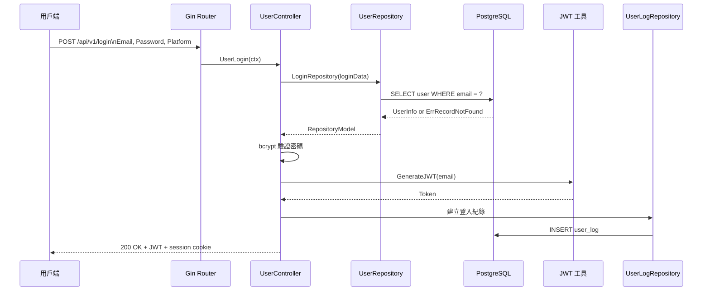
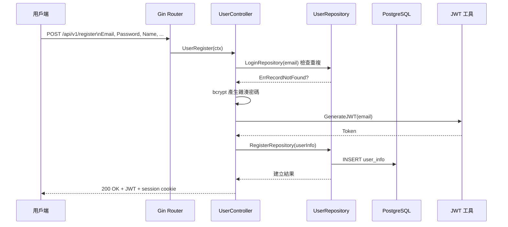
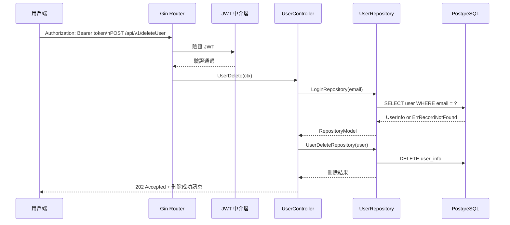
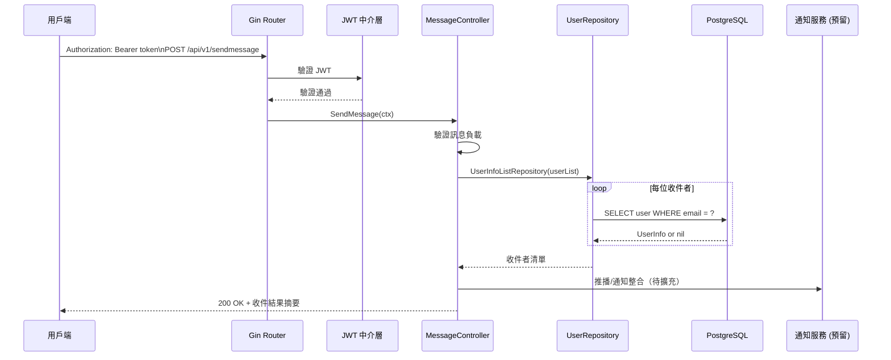

# Community Notification System

Community Notification System 是以 Gin + GORM 打造的 RESTful 服務，提供社區使用者帳號管理與推播通知能力，並內建 JWT、Cookie Session、CORS 等安全與體驗需求。主程式位於 `main.go`，啟動時會載入環境變數、初始化資料庫、註冊版本化路由與 Swagger 介面。

## 專案亮點
- 採 `controller / repository / model` 分層，降低路由、商業邏輯與資料存取耦合度。
- 透過環境變數配置 PostgreSQL 連線，啟動時自動檢查並建立必要資料表。
- 中介層覆蓋 JWT 驗證、CORS、Cookie 解析，可快速擴充額外安全策略。
- Swagger (`/swagger/index.html`) 自動反映註解變更，方便檢視與測試 API。
- 內建登入整合測試，範例化 SQLite in-memory + Gin 測試流程。

## 版本資訊
| 元件 | 版本 | 說明 | 安裝指令 |
| --- | --- | --- | --- |
| Go | `go 1.23`（toolchain `go1.24.1`） | 於 `go.mod` 指定，建議使用 Go 1.23 以上版本開發 | `macOS: brew install go@1.23`<br>`Linux: wget https://go.dev/dl/go1.23.0.linux-amd64.tar.gz && sudo tar -C /usr/local -xzf go1.23.0.linux-amd64.tar.gz` |
| Gin | `v1.10.0` | HTTP Web Framework，負責路由與中介層 | `go mod download github.com/gin-gonic/gin@v1.10.0` |
| GORM | `v1.30.0` | ORM 連線 PostgreSQL 與 SQLite（測試使用） | `go mod download gorm.io/gorm@v1.30.0` |
| gorm.io/driver/postgres | `v1.5.11` | PostgreSQL 驅動程式 | `go mod download gorm.io/driver/postgres@v1.5.11` |
| gorm.io/driver/sqlite | `v1.6.0` | 測試專用 SQLite 驅動 | `go mod download gorm.io/driver/sqlite@v1.6.0` |
| github.com/golang-jwt/jwt | `v3.2.2` | JWT token 生成與驗證 | `go mod download github.com/golang-jwt/jwt@v3.2.2+incompatible` |
| github.com/swaggo/swag | `v1.16.4` | Swagger 註解解析工具 | `go install github.com/swaggo/swag/cmd/swag@v1.16.4` |
| github.com/swaggo/gin-swagger | `v1.6.0` | Swagger UI Gin middleware | `go mod download github.com/swaggo/gin-swagger@v1.6.0` |
| Air | 建議 `v1.51.0+` | 熱重載開發工具（需自行安裝） | `go install github.com/cosmtrek/air@v1.51.0` |
| PostgreSQL | 建議 `14+` | 正式環境資料庫 | `macOS: brew install postgresql@14`<br>`Ubuntu/Debian: sudo apt-get install -y postgresql postgresql-contrib` |

## 系統模組概觀
- **main.go**：載入設定 → 初始化資料庫 → 套用中介層 → 掛載 `/api/v1`、`/api/v2` 路由與 Swagger UI。
- **middlewares/**：實作 CORS、JWT 驗證、Cookie 解析，未帶 JWT 的受保護端點將被拒絕。
- **app/controller/v1/**：依功能拆分 `user` 與 `message` 控制器，負責請求驗證與呼叫 repository。
- **app/repositories/**：封裝資料庫操作，回傳帶狀態的泛型結果模型。
- **database/**：集中初始化邏輯與各資料表 schema，啟動時自動建表。
- **utils/**：目前提供 JWT 簽發工具，從 `JWTPASSWORD` 讀取密鑰。

## 檔案結構
```text
Community_Notification_System/
├─ main.go                         # 服務進入點，載入設定、中介層與路由
├─ go.mod / go.sum                 # 依賴與模組設定
├─ app/
│  ├─ controller/
│  │  └─ v1/
│  │     ├─ v1.go                 # 控制器工廠，提供 Message/User 實例
│  │     ├─ message/
│  │     │  ├─ Message_Controller.go
│  │     │  └─ Message_SendMessage.go
│  │     └─ user/
│  │        ├─ User_Controller.go
│  │        ├─ User_Login.go
│  │        ├─ User_Login_test.go
│  │        ├─ User_Register.go
│  │        ├─ User_Delete.go
│  │        └─ User_Update.go (預留)
│  ├─ models/
│  │  ├─ account/                  # 登入/註冊請求與回應模型
│  │  ├─ message/                  # 訊息推播請求模型
│  │  ├─ model/                    # 共用錯誤與訊息結構
│  │  └─ repository/               # 泛型回傳包裝器
│  └─ repositories/
│     ├─ user/                     # 使用者 CRUD、登入紀錄、查詢列表
│     ├─ message/                  # 訊息相關查詢（預留）
│     └─ home/                     # 住戶相關 repository（預留）
├─ configs/
│  └─ config.go                    # 載入 .env
├─ database/
│  ├─ db.go                        # 建立 GORM 連線並自動建表
│  ├─ User_DB/                     # 使用者資料表 schema 與建表邏輯
│  ├─ UserLog_DB/                  # 使用者操作紀錄表
│  ├─ Message_DB/                  # 訊息資料表（預留）
│  └─ Home_DB/                     # 住戶資料表（預留）
├─ middlewares/
│  ├─ cors_middleware.go
│  ├─ jwt_middleware.go
│  └─ cookie_middleware.go
├─ routers/
│  ├─ router.go                    # 註冊 /api/v1、/api/v2
│  └─ api/
│     ├─ v1/v1.go                  # v1 路由：登入、註冊、刪除、發送訊息
│     └─ v2/v2.go                  # 目前共用 v1 控制器
├─ utils/
│  └─ Jwt_Token.go                 # JWT 簽發工具
├─ docs/                           # Swag 產生的 Swagger 定義（勿手動修改）
├─ pkg/common/                     # 共用建表工具
├─ tmp/                            # air 熱重載暫存（保持忽略）
├─ AGENTS.md, GEMINI.md            # 專案補充說明
└─ README.md                       # 本文件
```

## 核心功能時序圖

### 使用者登入 (`POST /api/v1/login`)


### 使用者註冊 (`POST /api/v1/register`)


### 刪除使用者 (`POST /api/v1/deleteUser`)


### 傳送訊息 (`POST /api/v1/sendmessage`)


> 註：訊息推播目前完成收件者查詢流程，實際派送邏輯可在 `app/repositories/message` 或整合外部服務時補強。

## 環境安裝指南

### macOS (Homebrew)
1. 安裝必要工具：
   ```bash
   brew update
   brew install go@1.23 postgresql@14
   brew install air
   go install github.com/swaggo/swag/cmd/swag@v1.16.4
   ```
2. 設定 PATH（若尚未設定）：
   ```bash
   echo 'export PATH="/opt/homebrew/opt/go@1.23/bin:$PATH"' >> ~/.zshrc
   source ~/.zshrc
   ```
3. 啟動 PostgreSQL 並建立資料庫/使用者：
   ```bash
   brew services start postgresql@14
   createdb db_community
   createuser --interactive --pwprompt postgres
   ```
4. 取得專案並安裝依賴：
   ```bash
   git clone <repo-url>
   cd Community_Notification_System
   go mod tidy
   ```
5. 建立 `.env`：
   ```bash
   cat <<'ENV' > .env
   PORT=:9080
   DB_HOST=127.0.0.1
   DB_USER=postgres
   DB_PASSWORD=your_password
   DB_NAME=db_community
   DB_PORT=5432
   DB_TIMEZONE=Asia/Taipei
   JWTPASSWORD=your_jwt_secret
   ENV
   ```
6. 啟動服務：
   ```bash
   go run main.go
   # 或
   air
   ```

### Ubuntu / Debian Linux
1. 安裝 Go 1.23（官方壓縮包）：
   ```bash
   wget https://go.dev/dl/go1.23.0.linux-amd64.tar.gz
   sudo rm -rf /usr/local/go
   sudo tar -C /usr/local -xzf go1.23.0.linux-amd64.tar.gz
   echo 'export PATH="/usr/local/go/bin:$HOME/go/bin:$PATH"' >> ~/.bashrc
   source ~/.bashrc
   ```
2. 安裝 PostgreSQL 與建置資料庫：
   ```bash
   sudo apt update
   sudo apt install -y postgresql postgresql-contrib build-essential
   sudo -u postgres psql -c "CREATE USER postgres WITH PASSWORD 'your_password';"
   sudo -u postgres createdb db_community -O postgres
   ```
3. 安裝開發工具：
   ```bash
   go install github.com/cosmtrek/air@latest
   go install github.com/swaggo/swag/cmd/swag@v1.16.4
   ```
4. 取得程式碼並安裝依賴：
   ```bash
   git clone <repo-url>
   cd Community_Notification_System
   go mod tidy
   ```
5. 建立 `.env` 並啟動：
   ```bash
   cat <<'ENV' > .env
   PORT=:9080
   DB_HOST=127.0.0.1
   DB_USER=postgres
   DB_PASSWORD=your_password
   DB_NAME=db_community
   DB_PORT=5432
   DB_TIMEZONE=Asia/Taipei
   JWTPASSWORD=your_jwt_secret
   ENV

   go run main.go
   ```

### Windows 11/10 (PowerShell)
1. 安裝必要工具（需管理員權限執行 PowerShell）：
   ```powershell
   winget install -e --id GoLang.Go
   winget install -e --id PostgreSQL.PostgreSQL
   go install github.com/cosmtrek/air@latest
   go install github.com/swaggo/swag/cmd/swag@v1.16.4
   ```
2. 透過 `psql` 建立資料庫：
   ```powershell
   "CREATE USER postgres WITH PASSWORD 'your_password';" | psql -U postgres
   createdb -U postgres db_community
   ```
3. 取得專案並安裝依賴：
   ```powershell
   git clone <repo-url>
   Set-Location Community_Notification_System
   go mod tidy
   ```
4. 建立 `.env`：
   ```powershell
   @'
   PORT=:9080
   DB_HOST=127.0.0.1
   DB_USER=postgres
   DB_PASSWORD=your_password
   DB_NAME=db_community
   DB_PORT=5432
   DB_TIMEZONE=Asia/Taipei
   JWTPASSWORD=your_jwt_secret
   '@ | Out-File -Encoding utf8 .env
   ```
5. 啟動服務：
   ```powershell
   go run main.go
   # 或
   air
   ```

> 若需要使用 `air`，請確保 `air` 可執行檔位於 `GOBIN` 或 `PATH`（`go env GOPATH`）中。

### Docker 快速啟動 PostgreSQL
若僅需臨時啟動 PostgreSQL 伺服器，可透過 Docker 一鍵起一個預設資料庫容器：
```bash
docker run --name postgres \
  -e POSTGRES_PASSWORD=mysecretpassword \
  -p 5432:5432 \
  -d postgres
```
- 預設帳號為 `postgres`，密碼為 `mysecretpassword`，埠號對應本機 `5432`。
- 建議首次啟動後手動建立 `db_community` 資料庫或修改環境變數指向欲使用的資料庫名稱。
- 如需持久化資料，請額外掛載 volume（例：`-v pgdata:/var/lib/postgresql/data`）。

## 常用開發指令
- `go mod tidy`：同步依賴版本並清理未使用模組。
- `go run main.go`：啟動一次性本地伺服器。
- `air`：啟動熱重載開發流程（需 `.air.toml`）。
- `swag init -g main.go`：更新 Swagger 文件（變更註解後執行）。
- `go test ./...`：執行全部測試套件。

## 測試與品質保證
- `app/controller/v1/user/User_Login_test.go` 展示使用 Gin 測試環境、SQLite in-memory 與 JWT mock 進行整合測試。
- 建議新增功能時採表格驅動測試並覆蓋錯誤情境，測試檔與套件放置於相同目錄。
- 在提交 PR 前執行 `go test ./... -v` 確認所有測試通過。

## Swagger 文件
- Swagger 註解位於控制器檔案內，執行 `swag init -g main.go` 後會更新 `docs/` 內容。
- 開發時請勿手動修改 `docs/` 檔案，並於 API 契約變更後提供最新文件。
- 本地預設可透過 `http://localhost:9080/swagger/index.html` 進行互動測試。
- 造訪根路徑 `/` 時會自動導向 Swagger UI，方便快速檢視所有 API。

## 資料庫表格概觀
- `user_info`：基本使用者資料（Email、加密密碼、權限、平台、Session）。
- `user_log`：記錄登入等操作行為，包含時間戳與動作描述。
- `message_info`、`home_info`：預留表格，啟動時若不存在將自動建立。
- 建表邏輯集中於 `database/`，調整 schema 時請同步更新對應模型與自動遷移流程。

## 中介層與安全性
- `middlewares/jwt_middleware.go`：預設保護除登入/註冊/Swagger 外之 API，驗證失敗回傳 401。
- `middlewares/cors_middleware.go`：允許跨域請求與憑證傳送，若需限制來源可調整 `Access-Control-Allow-Origin`。
- `middlewares/cookie_middleware.go`：讀取 `session_id` 供後續流程使用，可擴充為 session 驗證。
- 請於部署前確認 `.env` 中的 `JWTPASSWORD`、資料庫密碼與 HTTPS 配置。

## 貢獻流程
- Fork 專案並建立功能分支，遵守 conventional commits（例：`feat: add message sender`）。
- 完成功能後執行 `go test ./...`、必要時更新 Swagger。
- 提交 PR 時附上功能說明、測試方式、若為 API 變更請提供 cURL 或截圖。
- `tmp/` 目錄為 air 產物，請保持於 `.gitignore` 清單內。

歡迎透過 Issue 或 PR 回報問題、提案或協助實作訊息推播整合，讓 Community Notification System 更臻完善！
