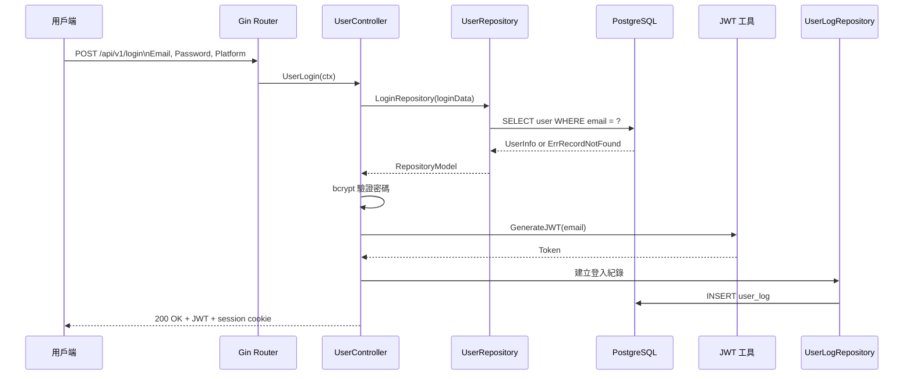
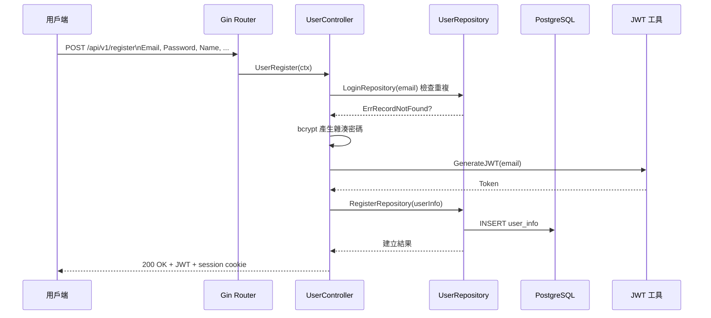
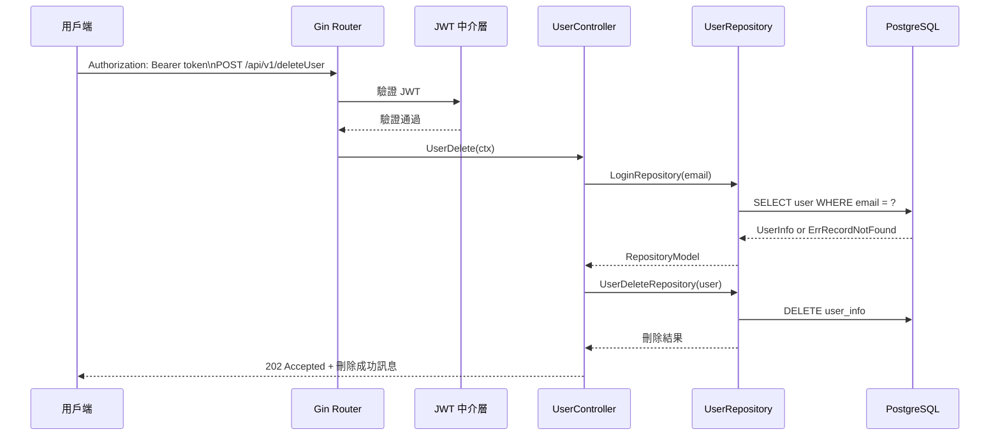
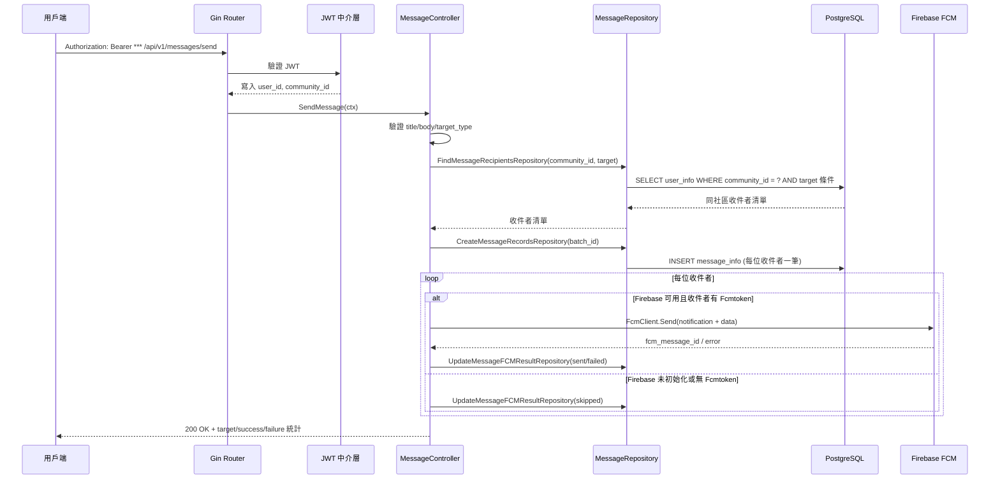
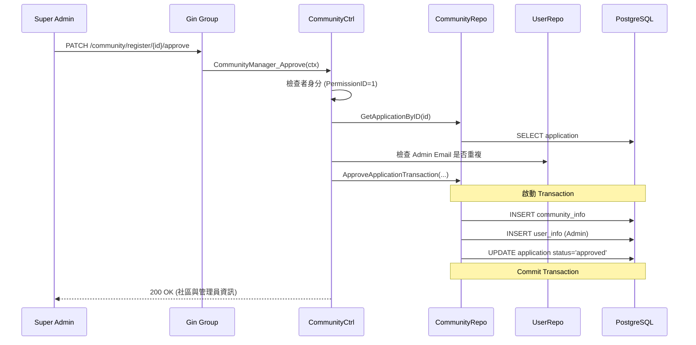
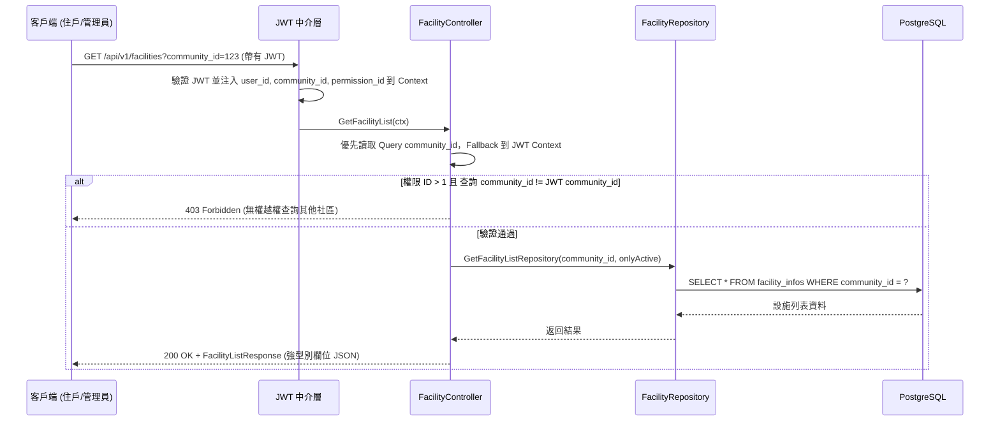
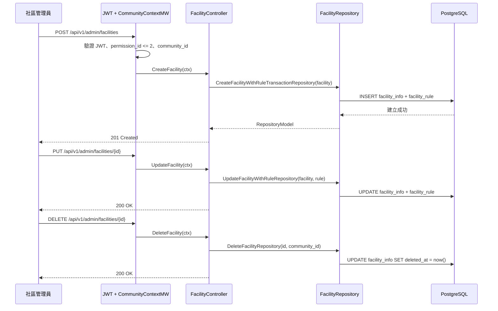
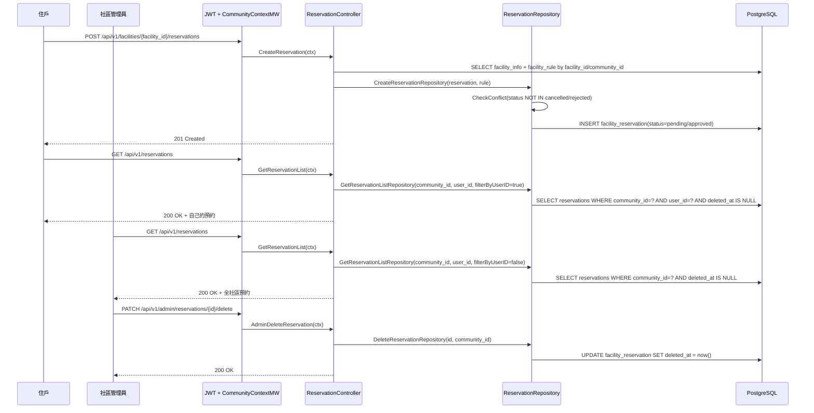
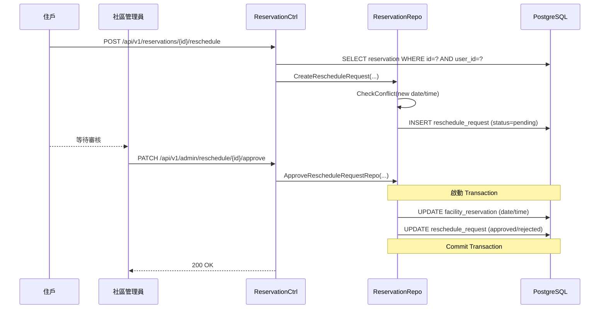
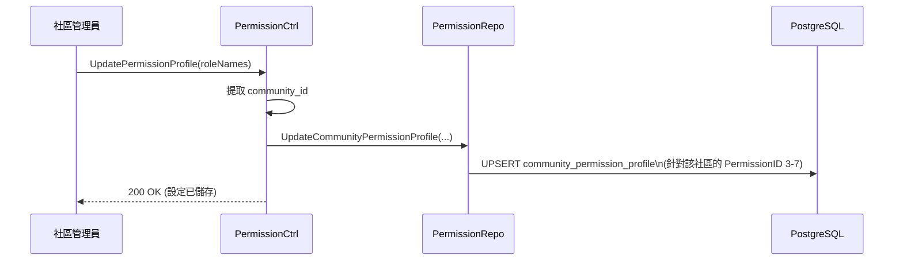

# Community Notification System

Community Notification System 是以 Gin + GORM 打造的 RESTful 服務，提供社區使用者帳號管理與推播通知能力，並內建 JWT、Cookie Session、CORS 等安全與體驗需求。主程式位於 `main.go`，啟動時會載入環境變數、初始化資料庫、註冊版本化路由與 Swagger 介面。

## 專案亮點
- 採 `controller / repository / model` 分層，降低路由、商業邏輯與資料存取耦合度.
- 透過環境變數配置 PostgreSQL 連線，啟動時自動檢查並建立必要資料表.
- 中介層覆蓋 JWT 驗證、CORS、Cookie 解析，可快速擴充額外安全策略。
- `CommunityContextMiddleware` 會把登入者所屬 `community_id` 與權限資訊寫入請求上下文，設施、預約、訊息與包裹等 API 皆受社區範圍限制。
- **設施查詢安全升級**：`/api/v1/facilities` 與 `/api/v1/facilities/:id` 支援 Query 參數 `community_id` 與 JWT Fallback 雙重校驗，並實作了防越權檢驗 (Horizontal Privilege Escalation Prevention)。
- **強型別 API 契約**：設施查詢 API 引入強型別 `FacilityListResponse` 與 `FacilityDetailResponse` 回應模型，在 Swagger 中完整展示欄位細節。
- Swagger (`/swagger/index.html`) 自動反映註解變更，方便檢視與測試 API。
- 內建登入整合測試，範例化 SQLite in-memory + Gin 測試流程。

## 版本資訊
| 元件 | 版本 | 說明 | 安裝指令 |
| --- | --- | --- | --- |
| Go | `go 1.23`（toolchain `go1.24.1`，Docker 使用 `go1.26.1`） | 於 `go.mod` 指定，Docker debug 基底已更新為官方最新穩定版 Go 1.26.1（2026-03-05） | `macOS: brew install go`<br>`Linux: wget https://go.dev/dl/go1.26.1.linux-amd64.tar.gz && sudo tar -C /usr/local -xzf go1.26.1.linux-amd64.tar.gz` |
| Gin | `v1.10.0` | HTTP Web Framework，負責路由與中介層 | `go mod download github.com/gin-gonic/gin@v1.10.0` |
| GORM | `v1.30.0` | ORM 連線 PostgreSQL 與 SQLite（測試使用） | `go mod download gorm.io/gorm@v1.30.0` |
| gorm.io/driver/postgres | `v1.5.11` | PostgreSQL 驅動程式 | `go mod download gorm.io/driver/postgres@v1.5.11` |
| gorm.io/driver/sqlite | `v1.6.0` | 測試專用 SQLite 驅動 | `go mod download gorm.io/driver/sqlite@v1.6.0` |
| github.com/golang-jwt/jwt | `v3.2.2` | JWT token 生成與驗證 | `go mod download github.com/golang-jwt/jwt@v3.2.2+incompatible` |
| github.com/swaggo/swag | `v1.16.4` | Swagger 註解解析工具 | `go install github.com/swaggo/swag/cmd/swag@v1.16.4` |
| github.com/swaggo/gin-swagger | `v1.6.0` | Swagger UI Gin middleware | `go mod download github.com/swaggo/gin-swagger@v1.6.0` |
| Air | `v1.61.7` | 熱重載開發工具；Docker debug 映像固定此版本以相容 Go 1.24 | `go install github.com/air-verse/air@v1.61.7` |
| Delve | `v1.24.2` | Go 遠端偵錯工具；供 Docker attach debug 使用 | `go install github.com/go-delve/delve/cmd/dlv@v1.24.2` |
| PostgreSQL | 建議 `14+` | 正式環境資料庫 | `macOS: brew install postgresql@14`<br>`Ubuntu/Debian: sudo apt-get install -y postgresql postgresql-contrib` |

## 系統模組概觀
- **main.go**：載入設定 → 初始化資料庫 → 套用中介層 → 掛載 `/api/v1`、`/api/v2` 路由與 Swagger UI。
- **middlewares/**：實作 CORS、JWT 驗證、Cookie 解析，並規劃新增 `CommunityContextMiddleware`，統一建立社區上下文。
- **app/controller/v1/**：依功能拆分 `user` 與 `message` 控制器，負責請求驗證與呼叫 repository。
- **docs/features/community_management/**：社區管理大項功能資料夾，集中管理社區建立與社區查詢等文件。
- **docs/features/facility_booking/**：設施預約大項功能資料夾，集中管理新增設施、預約設計、改期與取消等文件。
- **docs/features/parcel_management/**：包裹管理功能資料夾，包含管理員代收錄入與住戶領取流程。
- **app/repositories/**：封裝資料庫操作，回傳帶狀態的泛型結果模型。
- **database/**：集中初始化邏輯與各資料表 schema，啟動時自動建表。IOT 相關資料表已預留，但目前非開發重點。
- **utils/**：目前提供 JWT 簽發工具，從 `JWTPASSWORD` 讀取密鑰。

## 檔案結構
```text
Community_Notification_System/
├─ main.go                         # 服務進入點，載入設定、中介層與路由
├─ go.mod / go.sum                 # 依賴與模組設定
├─ app/
│  ├─ controller/
│  │  └─ v1/
│  │     ├─ v1.go                 # 控制器工廠，提供各模組實例
│  │     ├─ communityManager/
│  │     │  ├─ CommunityManager_Controller.go
│  │     │  ├─ CommunityManager_add.go
│  │     │  ├─ CommunityManager_GetList.go
│  │     │  ├─ CommunityManager_Approve.go
│  │     │  └─ CommunityManager_Reject.go
│  │     ├─ facility/
│  │     │  └─ Facility_Controller.go
│  │     ├─ reservation/
│  │     │  └─ Reservation_Controller.go
│  │     ├─ permission/
│  │     │  └─ CommunityPermission_Controller.go
│  │     ├─ platform/
│  │     │  ├─ Platform_Controller.go
│  │     │  └─ Platform_GetList.go
│  │     ├─ message/
│  │     │  ├─ Message_Controller.go
│  │     │  ├─ Message_SendMessage.go
│  │     │  ├─ Message_SendMessage_test.go
│  │     │  └─ Message_ListAndRead.go
│  │     └─ user/
│  │        ├─ User_Controller.go
│  │        ├─ User_Login.go
│  │        ├─ User_Login_test.go
│  │        ├─ User_Register.go
│  │        ├─ User_Delete.go
│  │        └─ User_Update.go
│  ├─ models/
│  │  ├─ account/                  # 登入/註冊請求與回應模型
│  │  ├─ community/                # 社區與申請單模型
│  │  ├─ facility/                 # 設施主檔模型
│  │  ├─ reservation/              # 預約與改期模型
│  │  ├─ permission/               # 權限角色 Profile 模型
│  │  ├─ platform/                 # 平台清單模型
│  │  ├─ message/                  # 訊息推播模型
│  │  ├─ model/                    # 共用錯誤與訊息結構
│  │  └─ repository/               # 泛型回傳包裝器
│  └─ repositories/
│     ├─ user/                     # 使用者 CRUD
│     ├─ community/                # 社區申請與審核
│     ├─ facility/                 # 設施管理
│     ├─ reservation/              # 預約邏輯
│     ├─ permission/               # 權限 Profile 管理
│     ├─ platform/                 # 平台查詢
│     ├─ message/                  # 訊息相關
│     └─ home/                     # 住戶相關
├─ configs/
│  └─ config.go                    # 載入 .env
├─ database/
│  ├─ db.go                        # 建立 GORM 連線並自動建表
│  ├─ Community_DB/                # 社區與申請單 Schema
│  ├─ Facility_DB/                 # 設施、規則、預約與改期 Schema
│  ├─ Permission_DB/               # 權限與角色名稱 Schema
│  ├─ Platform_DB/                 # 平台 Schema
│  ├─ User_DB/                     # 使用者資料表 Schema
│  ├─ UserLog_DB/                  # 使用者操作紀錄表
│  ├─ Message_DB/                  # 訊息資料表
│  └─ Home_DB/                     # 住戶資料表
├─ middlewares/
│  ├─ cors_middleware.go
│  ├─ jwt_middleware.go
│  ├─ cookie_middleware.go
│  ├─ community_context_middleware.go # 解析社區 ID 上下文
│  └─ permission_middleware.go        # 權限等級驗證
├─ routers/
│  ├─ router.go                    # 註冊 /api/v1、/api/v2
│  └─ api/
│     ├─ v1/v1.go                  # v1 路由定義
│     └─ v2/v2.go                  # 目前共用 v1 控制器
├─ utils/
│  └─ Jwt_Token.go                 # JWT 簽發工具
├─ docs/
│  ├─ docs.go / swagger.json / swagger.yaml # swag init 產生之 Swagger 文件
│  └─ api/                         # Swagger 輔助模型與 API 相關文件
├─ /Users/kent/Library/Mobile Documents/iCloud~md~obsidian/Documents/Community_Notification_System_docs/
│  ├─ README.md                    # 文件中心總索引
│  ├─ facility/                    # 設施 CRUD、預約設計，含 [facility_get_list_update.md]
│  ├─ message/                     # 訊息、FCM 與已讀狀態文件
│  ├─ system_architecture/         # 全域架構、權限與路由契約
│  └─ planning/                    # 規劃、稽核、commit summary 與歷史紀錄
├─ pkg/
│  ├─ common/                      # 共用建表工具
│  └─ firebase/                    # Firebase FCM 初始化
├─ scripts/
│  └─ install_dependencies.sh      # 環境安裝腳本
├─ tmp/                            # air 熱重載暫存
├─ AGENTS.md, GEMINI.md            # 專案補充說明
└─ README.md                       # 本文件
```

## 核心功能時序圖

### 使用者登入 (`POST /api/v1/login`)


```mermaid
sequenceDiagram
    participant Client as 用戶端
    participant Gin as Gin Router
    participant Ctrl as UserController
    participant Repo as UserRepository
    participant DB as PostgreSQL
    participant JWT as JWT 工具
    participant LogRepo as UserLogRepository
    Client->>Gin: POST /api/v1/login\nEmail, Password, Platform
    Gin->>Ctrl: UserLogin(ctx)
    Ctrl->>Repo: LoginRepository(loginData)
    Repo->>DB: SELECT user WHERE email = ?
    DB-->>Repo: UserInfo or ErrRecordNotFound
    Repo-->>Ctrl: RepositoryModel
    Ctrl->>Ctrl: bcrypt 驗證密碼
    Ctrl->>JWT: GenerateJWT(email)
    JWT-->>Ctrl: Token
    Ctrl->>LogRepo: 建立登入紀錄
    LogRepo->>DB: INSERT user_log
    Ctrl-->>Client: 200 OK + JWT + session cookie
```

### 使用者註冊 (`POST /api/v1/register`)


```mermaid
sequenceDiagram
    participant Client as 用戶端
    participant Gin as Gin Router
    participant Ctrl as UserController
    participant Repo as UserRepository
    participant DB as PostgreSQL
    participant JWT as JWT 工具
    Client->>Gin: POST /api/v1/register\nEmail, Password, Name, ...
    Gin->>Ctrl: UserRegister(ctx)
    Ctrl->>Repo: LoginRepository(email) 檢查重複
    Repo-->>Ctrl: ErrRecordNotFound?
    Ctrl->>Ctrl: bcrypt 產生雜湊密碼
    Ctrl->>JWT: GenerateJWT(email)
    JWT-->>Ctrl: Token
    Ctrl->>Repo: RegisterRepository(userInfo)
    Repo->>DB: INSERT user_info
    Repo-->>Ctrl: 建立結果
    Ctrl-->>Client: 200 OK + JWT + session cookie
```

### 刪除使用者 (`POST /api/v1/deleteUser`)


```mermaid
sequenceDiagram
    participant Client as 用戶端
    participant Gin as Gin Router
    participant JWTmw as JWT 中介層
    participant Ctrl as UserController
    participant Repo as UserRepository
    participant DB as PostgreSQL
    Client->>Gin: Authorization: Bearer token\nPOST /api/v1/deleteUser
    Gin->>JWTmw: 驗證 JWT
    JWTmw-->>Gin: 驗證通過
    Gin->>Ctrl: UserDelete(ctx)
    Ctrl->>Repo: LoginRepository(email)
    Repo->>DB: SELECT user WHERE email = ?
    DB-->>Repo: UserInfo or ErrRecordNotFound
    Repo-->>Ctrl: RepositoryModel
    Ctrl->>Repo: UserDeleteRepository(user)
    Repo->>DB: DELETE user_info
    Repo-->>Ctrl: 刪除結果
    Ctrl-->>Client: 202 Accepted + 刪除成功訊息
```

### 傳送訊息 (`POST /api/v1/messages/send`、相容 `POST /api/v1/sendmessage`)


```mermaid
sequenceDiagram
    participant Client as 用戶端
    participant Gin as Gin Router
    participant JWTmw as JWT 中介層
    participant Ctrl as MessageController
    participant Repo as MessageRepository
    participant DB as PostgreSQL
    participant FCM as Firebase FCM
    Client->>Gin: Authorization: Bearer *** /api/v1/messages/send
    Gin->>JWTmw: 驗證 JWT
    JWTmw-->>Gin: 寫入 user_id, community_id
    Gin->>Ctrl: SendMessage(ctx)
    Ctrl->>Ctrl: 驗證 title/body/target_type
    Ctrl->>Repo: FindMessageRecipientsRepository(community_id, target)
    Repo->>DB: SELECT user_info WHERE community_id = ? AND target 條件
    DB-->>Repo: 同社區收件者清單
    Repo-->>Ctrl: 收件者清單
    Ctrl->>Repo: CreateMessageRecordsRepository(batch_id)
    Repo->>DB: INSERT message_info (每位收件者一筆)
    loop 每位收件者
        alt Firebase 可用且收件者有 Fcmtoken
            Ctrl->>FCM: FcmClient.Send(notification + data)
            FCM-->>Ctrl: fcm_message_id / error
            Ctrl->>Repo: UpdateMessageFCMResultRepository(sent/failed)
        else Firebase 未初始化或無 Fcmtoken
            Ctrl->>Repo: UpdateMessageFCMResultRepository(skipped)
        end
    end
    Ctrl-->>Client: 200 OK + target/success/failure 統計
```

#### 傳送訊息 Request 範例
```json
{
  "title": "社區公告",
  "subtitle": "電梯維修通知",
  "body": "本週三下午 1:00 至 4:00 將進行電梯例行維護。",
  "target_type": "selected_users",
  "recipient_user_ids": ["user-uuid-1", "user-uuid-2"],
  "recipient_emails": ["user1@example.com"],
  "metadata": {
    "category": "announcement",
    "entity_type": "community",
    "entity_id": "notice-1",
    "click_action": "FLUTTER_NOTIFICATION_CLICK"
  }
}
```

支援的 `target_type`：
- `selected_users`：依 `recipient_user_ids` / `recipient_emails` / 舊欄位 `Userselect` 選取同社區收件者。
- `community`：發送給 JWT 所屬 `community_id` 的所有使用者。

#### 傳送訊息 Response 範例
```json
{
  "message": "訊息發送完成",
  "data": {
    "message_batch_id": "batch-uuid",
    "target_count": 2,
    "success_count": 1,
    "failure_count": 1,
    "created_message_ids": ["message-id-1", "message-id-2"],
    "fcm_results": [
      {
        "message_id": "message-id-1",
        "user_id": "user-uuid-1",
        "email": "user1@example.com",
        "success": true,
        "fcm_status": "sent",
        "fcm_message_id": "projects/demo/messages/xxx"
      },
      {
        "message_id": "message-id-2",
        "user_id": "user-uuid-2",
        "email": "user2@example.com",
        "success": false,
        "fcm_status": "skipped",
        "error": "收件者未註冊 FCM token"
      }
    ]
  }
}
```

### 社區註冊審核 (`PATCH /api/v1/community/register/:id/approve`)


```mermaid
sequenceDiagram
    participant Admin as Super Admin
    participant RG as Gin Group
    participant Ctrl as CommunityCtrl
    participant Repo as CommunityRepo
    participant URepo as UserRepo
    participant DB as PostgreSQL
    Admin->>RG: PATCH /community/register/{id}/approve
    RG->>Ctrl: CommunityManager_Approve(ctx)
    Ctrl->>Ctrl: 檢查者身分 (PermissionID=1)
    Ctrl->>Repo: GetApplicationByID(id)
    Repo->>DB: SELECT application
    Ctrl->>URepo: 檢查 Admin Email 是否重複
    Ctrl->>Repo: ApproveApplicationTransaction(...)
    Note over Repo, DB: 啟動 Transaction
    Repo->>DB: INSERT community_info
    Repo->>DB: INSERT user_info (Admin)
    Repo->>DB: UPDATE application status='approved'
    Note over Repo, DB: Commit Transaction
    Ctrl-->>Admin: 200 OK (社區與管理員資訊)
```

### 設施與預約 CRUD API 契約

| Method | Path | 權限範圍 | Controller | 說明 |
| --- | --- | --- | --- | --- |
| `POST` | `/api/v1/admin/facilities` | Admin Level 2 | `FacilityController.CreateFacility` | 建立設施與預設預約規則 |
| `GET` | `/api/v1/facilities` | Resident+ | `FacilityController.GetFacilityList` | 設施列表；住戶僅看 `active`，管理員可看同社區全部未刪除設施 |
| `GET` | `/api/v1/facilities/:id` | Resident+ | `FacilityController.GetFacilityDetail` | 設施詳情，受 `community_id` 隔離 |
| `PUT` | `/api/v1/admin/facilities/:id` | Admin Level 2 | `FacilityController.UpdateFacility` | 更新設施基本資料並同步更新 `facility_rule` |
| `DELETE` | `/api/v1/admin/facilities/:id` | Admin Level 2 | `FacilityController.DeleteFacility` | 以 `gorm.DeletedAt` 軟刪除設施 |
| `POST` | `/api/v1/facilities/:facility_id/reservations` | Resident+ | `ReservationController.CreateReservation` | 建立預約並檢查設施狀態、規則與時段衝突 |
| `GET` | `/api/v1/reservations` | Resident+ | `ReservationController.GetReservationList` | 預約列表；住戶僅看自己的預約，管理員可看同社區全部未刪除預約 |
| `GET` | `/api/v1/reservations/:id` | Resident+ | `ReservationController.GetReservationDetail` | 預約詳情；住戶需符合 `user_id`，管理員只受社區隔離 |
| `PATCH` | `/api/v1/reservations/:id/cancel` | Resident+ | `ReservationController.CancelReservation` | 住戶取消自己的預約並紀錄原因 |
| `POST` | `/api/v1/reservations/:id/reschedule` | Resident+ | `ReservationController.Reschedule` | 住戶送出改期申請 |
| `PATCH` | `/api/v1/admin/reservations/:id/delete` | Admin Level 2 | `ReservationController.AdminDeleteReservation` | 管理員強制取消/軟刪除同社區預約 |
| `PATCH` | `/api/v1/admin/reschedule/:id/approve` | Admin Level 2 | `ReservationController.AdminApproveReschedule` | 管理員核准或拒絕改期申請 |

### 設施管理 CRUD (`GET /api/v1/facilities`、`PUT/DELETE /api/v1/admin/facilities/:id`)

#### 取得設施列表與安全防禦流程 (`GET /api/v1/facilities`)

```mermaid
sequenceDiagram
    participant User as 客戶端 (住戶/管理員)
    participant MW as JWT 中介層
    participant Ctrl as FacilityController
    participant Repo as FacilityRepository
    participant DB as PostgreSQL

    User->>MW: GET /api/v1/facilities?community_id=123 (帶有 JWT)
    MW->>MW: 驗證 JWT 並注入 user_id, community_id, permission_id 到 Context
    MW->>Ctrl: GetFacilityList(ctx)
    Ctrl->>Ctrl: 優先讀取 Query community_id，Fallback 到 JWT Context
    alt 權限 ID > 1 且 查詢 community_id != JWT community_id
        Ctrl-->>User: 403 Forbidden (無權越權查詢其他社區)
    else 驗證通過
        Ctrl->>Repo: GetFacilityListRepository(community_id, onlyActive)
        Repo->>DB: SELECT * FROM facility_infos WHERE community_id = ?
        DB-->>Repo: 設施列表資料
        Repo-->>Ctrl: 返回結果
        Ctrl-->>User: 200 OK + FacilityListResponse (強型別欄位 JSON)
    end
```

#### 設施新增、更新與刪除流程

```mermaid
sequenceDiagram
    participant Admin as 社區管理員
    participant MW as JWT + CommunityContextMW
    participant Ctrl as FacilityController
    participant Repo as FacilityRepository
    participant DB as PostgreSQL

    Admin->>MW: POST /api/v1/admin/facilities
    MW->>MW: 驗證 JWT、permission_id <= 2、community_id
    MW->>Ctrl: CreateFacility(ctx)
    Ctrl->>Repo: CreateFacilityWithRuleTransactionRepository(facility)
    Repo->>DB: INSERT facility_info + facility_rule
    DB-->>Repo: 建立成功
    Repo-->>Ctrl: RepositoryModel
    Ctrl-->>Admin: 201 Created

    Admin->>MW: PUT /api/v1/admin/facilities/{id}
    MW->>Ctrl: UpdateFacility(ctx)
    Ctrl->>Repo: UpdateFacilityWithRuleRepository(facility, rule)
    Repo->>DB: UPDATE facility_info + facility_rule
    Ctrl-->>Admin: 200 OK

    Admin->>MW: DELETE /api/v1/admin/facilities/{id}
    MW->>Ctrl: DeleteFacility(ctx)
    Ctrl->>Repo: DeleteFacilityRepository(id, community_id)
    Repo->>DB: UPDATE facility_info SET deleted_at = now()
    Ctrl-->>Admin: 200 OK
```

### 設施預約與預約管理 (`POST /api/v1/facilities/:facility_id/reservations`、`GET /api/v1/reservations`)


```mermaid
sequenceDiagram
    participant User as 住戶
    participant Admin as 社區管理員
    participant MW as JWT + CommunityContextMW
    participant Ctrl as ReservationController
    participant Repo as ReservationRepository
    participant DB as PostgreSQL

    User->>MW: POST /api/v1/facilities/{facility_id}/reservations
    MW->>Ctrl: CreateReservation(ctx)
    Ctrl->>DB: SELECT facility_info + facility_rule by facility_id/community_id
    Ctrl->>Repo: CreateReservationRepository(reservation, rule)
    Repo->>Repo: CheckConflict(status NOT IN cancelled/rejected)
    Repo->>DB: INSERT facility_reservation(status=pending/approved)
    Ctrl-->>User: 201 Created

    User->>MW: GET /api/v1/reservations
    MW->>Ctrl: GetReservationList(ctx)
    Ctrl->>Repo: GetReservationListRepository(community_id, user_id, filterByUserID=true)
    Repo->>DB: SELECT reservations WHERE community_id=? AND user_id=? AND deleted_at IS NULL
    Ctrl-->>User: 200 OK + 自己的預約

    Admin->>MW: GET /api/v1/reservations
    MW->>Ctrl: GetReservationList(ctx)
    Ctrl->>Repo: GetReservationListRepository(community_id, user_id, filterByUserID=false)
    Repo->>DB: SELECT reservations WHERE community_id=? AND deleted_at IS NULL
    Ctrl-->>Admin: 200 OK + 全社區預約

    Admin->>MW: PATCH /api/v1/admin/reservations/{id}/delete
    MW->>Ctrl: AdminDeleteReservation(ctx)
    Ctrl->>Repo: DeleteReservationRepository(id, community_id)
    Repo->>DB: UPDATE facility_reservation SET deleted_at = now()
    Ctrl-->>Admin: 200 OK
```

### 預約改期申請 (`POST /api/v1/reservations/:id/reschedule`、`PATCH /api/v1/admin/reschedule/:id/approve`)


```mermaid
sequenceDiagram
    participant User as 住戶
    participant Admin as 社區管理員
    participant Ctrl as ReservationCtrl
    participant Repo as ReservationRepo
    participant DB as PostgreSQL
    User->>Ctrl: POST /api/v1/reservations/{id}/reschedule
    Ctrl->>DB: SELECT reservation WHERE id=? AND user_id=?
    Ctrl->>Repo: CreateRescheduleRequest(...)
    Repo->>Repo: CheckConflict(new date/time)
    Repo->>DB: INSERT reschedule_request (status=pending)
    User-->>Admin: 等待審核
    Admin->>Ctrl: PATCH /api/v1/admin/reschedule/{id}/approve
    Ctrl->>Repo: ApproveRescheduleRequestRepo(...)
    Note over Repo, DB: 啟動 Transaction
    Repo->>DB: UPDATE facility_reservation (date/time)
    Repo->>DB: UPDATE reschedule_request (approved/rejected)
    Note over Repo, DB: Commit Transaction
    Ctrl-->>Admin: 200 OK
```

### 權限角色自定義 (`PUT /api/v1/admin/permissions/profile`)


```mermaid
sequenceDiagram
    participant Admin as 社區管理員
    participant Ctrl as PermissionCtrl
    participant Repo as PermissionRepo
    participant DB as PostgreSQL
    Admin->>Ctrl: UpdatePermissionProfile(roleNames)
    Ctrl->>Ctrl: 提取 community_id
    Ctrl->>Repo: UpdateCommunityPermissionProfile(...)
    Repo->>DB: UPSERT community_permission_profile\n(針對該社區的 PermissionID 3-7)
    Ctrl-->>Admin: 200 OK (設定已儲存)
```

## 文件索引
- `docs/analysis/PRD_Dashboard.md`：首頁儀表板需求規格書。
- `docs/analysis/PRD_Smart_Access.md`：智慧通行與門禁訪客需求規格書。
- `docs/analysis/Business_Analysis.md`：專案整體業務邏輯與流程分析。
- `docs/management/Smart_Community_Roadmap.md`：智慧社區功能矩陣與未來發展藍圖。
- `docs/system/Database_Schema_Extended.md`：智慧社區 2.0 擴展資料庫設計 (門禁、維修、能耗) [未來規劃]。
- `docs/architecture/Activity_Diagram_Visitor_Pass.md`：智慧訪客系統流程圖。
- `docs/architecture/`：存放 UML、時序圖與類別圖。
- `docs/README.md`：`docs` 目錄總索引。

## 環境安裝指南

### macOS (Homebrew)
1. 安裝必要工具：
   ```bash
   brew update
   brew install go@1.23 postgresql@14
   brew install air
   go install github.com/swaggo/swag/cmd/swag@v1.16.4
   ```
2. 設定 PATH（若尚未設定）：
   ```bash
   echo 'export PATH="/opt/homebrew/opt/go@1.23/bin:$PATH"' >> ~/.zshrc
   source ~/.zshrc
   ```
3. 啟動 PostgreSQL 並建立資料庫/使用者：
   ```bash
   brew services start postgresql@14
   createdb db_community
   createuser --interactive --pwprompt postgres
   ```
4. 取得專案並安裝依賴：
   ```bash
   git clone <repo-url>
   cd Community_Notification_System
   go mod tidy
   ```
5. 建立 `.env`：
   ```bash
   cat <<'ENV' > .env
   PORT=:9080
   DB_HOST=127.0.0.1
   DB_USER=postgres
   DB_PASSWORD=your_password
   DB_NAME=db_community
   DB_PORT=5432
   DB_TIMEZONE=Asia/Taipei
   JWTPASSWORD=community_dev_jwt_secret_2026
   ENV
   ```
6. 啟動服務：
   ```bash
   go run main.go
   # 或
   air
   ```

### Docker Debug
1. 建置並啟動 PostgreSQL + API + Delve：
   ```bash
   docker compose up --build
   ```
2. API 預設對外埠：
   ```text
   http://127.0.0.1:9080
   ```
3. Delve 遠端偵錯埠：
   ```text
   127.0.0.1:40000
   ```
4. VS Code 請使用 `Docker: Remote Debug` 設定 attach，服務輸出 `Listening and serving HTTP on` 後會自動開啟 Swagger 網頁。
5. 偵錯中斷或 attach 失敗時不會自動刪除容器，避免反覆重建。需要停止並移除容器時，請執行 VS Code Task `docker-compose: down`。
6. 若 Docker build 失敗，先確認映像內 Air 版本不是 `latest`；本專案已固定 `v1.61.7`。Delve 已固定 `v1.27.0`，避免 Go 1.26.1 遠端偵錯時因版本過舊造成 attach 後連線中斷。
7. 若未提供 `serviceAccountKey.json` 或 Firebase Project 設定，API 仍可啟動，但推播相關端點會回傳 `503 Service Unavailable`。

### Ubuntu / Debian Linux
1. 安裝 Go 1.23（官方壓縮包）：
   ```bash
   wget https://go.dev/dl/go1.23.0.linux-amd64.tar.gz
   sudo rm -rf /usr/local/go
   sudo tar -C /usr/local -xzf go1.23.0.linux-amd64.tar.gz
   echo 'export PATH="/usr/local/go/bin:$HOME/go/bin:$PATH"' >> ~/.bashrc
   source ~/.bashrc
   ```
2. 安裝 PostgreSQL 與建置資料庫：
   ```bash
   sudo apt update
   sudo apt install -y postgresql postgresql-contrib build-essential
   sudo -u postgres psql -c "CREATE USER postgres WITH PASSWORD 'your_password';"
   sudo -u postgres createdb db_community -O postgres
   ```
3. 安裝開發工具：
   ```bash
   go install github.com/cosmtrek/air@latest
   go install github.com/swaggo/swag/cmd/swag@v1.16.4
   ```
4. 取得程式碼並安裝依賴：
   ```bash
   git clone <repo-url>
   cd Community_Notification_System
   go mod tidy
   ```
5. 建立 `.env` 並啟動：
   ```bash
   cat <<'ENV' > .env
   PORT=:9080
   DB_HOST=127.0.0.1
   DB_USER=postgres
   DB_PASSWORD=your_password
   DB_NAME=db_community
   DB_PORT=5432
   DB_TIMEZONE=Asia/Taipei
   JWTPASSWORD=community_dev_jwt_secret_2026
   ENV

   go run main.go
   ```

### Windows 11/10 (PowerShell)
1. 安裝必要工具（需管理員權限執行 PowerShell）：
   ```powershell
   winget install -e --id GoLang.Go
   winget install -e --id PostgreSQL.PostgreSQL
   go install github.com/cosmtrek/air@latest
   go install github.com/swaggo/swag/cmd/swag@v1.16.4
   ```
2. 透過 `psql` 建立資料庫：
   ```powershell
   "CREATE USER postgres WITH PASSWORD 'your_password';" | psql -U postgres
   createdb -U postgres db_community
   ```
3. 取得專案並安裝依賴：
   ```powershell
   git clone <repo-url>
   Set-Location Community_Notification_System
   go mod tidy
   ```
4. 建立 `.env`：
   ```powershell
   @'
   PORT=:9080
   DB_HOST=127.0.0.1
   DB_USER=postgres
   DB_PASSWORD=your_password
   DB_NAME=db_community
   DB_PORT=5432
   DB_TIMEZONE=Asia/Taipei
   JWTPASSWORD=community_dev_jwt_secret_2026
   '@ | Out-File -Encoding utf8 .env
   ```
5. 啟動服務：
   ```powershell
   go run main.go
   # 或
   air
   ```

> 若需要使用 `air`，請確保 `air` 可執行檔位於 `GOBIN` 或 `PATH`（`go env GOPATH`）中。

### Docker 快速啟動 PostgreSQL
若僅需臨時啟動 PostgreSQL 伺服器，可透過 Docker 一鍵起一個預設資料庫容器：
```bash
docker run --name postgres \
  -e POSTGRES_PASSWORD=mysecretpassword \
  -p 5432:5432 \
  -d postgres
```
- 預設帳號為 `postgres`，密碼為 `mysecretpassword`，埠號對應本機 `5432`。
- 建議首次啟動後手動建立 `db_community` 資料庫或修改環境變數指向欲使用的資料庫名稱。
- 如需持久化資料，請額外掛載 volume（例：`-v pgdata:/var/lib/postgresql/data`）。

## 常用開發指令
- `go mod tidy`：同步依賴版本並清理未使用模組。
- `go run main.go`：啟動一次性本地伺服器。
- `air`：啟動熱重載開發流程（需 `.air.toml`）。
- `swag init -g main.go`：更新 Swagger 文件（變更註解後執行）。
- `go test ./...`：執行全部測試套件。

## 文件資源
- **文件中心總索引**：`/Users/kent/Library/Mobile Documents/iCloud~md~obsidian/Documents/Community_Notification_System_docs/README.md` 提供所有子目錄分類與新增文件指引。
- **設施模組開發文件**：`/Users/kent/Library/Mobile Documents/iCloud~md~obsidian/Documents/Community_Notification_System_docs/facility/facility_get_list_update.md` 詳細分析了設施列表的動態社區 ID 查詢與強型別 DTO 設計。
- **Commit 摘要**：`/Users/kent/Library/Mobile Documents/iCloud~md~obsidian/Documents/Community_Notification_System_docs/commit_summaries/commit_summary_2026_05.md` 維護逐月變更紀錄（按時間新到舊排序），記錄了最新的 `feat(facility)` 逐行分析。

## 測試與品質保證
- `app/controller/v1/user/User_Login_test.go` 展示使用 Gin 測試環境、SQLite in-memory 與 JWT mock 進行整合測試。
- 建議新增功能時採表格驅動測試並覆蓋錯誤情境，測試檔與套件放置於相同目錄。
- 在提交 PR 前執行 `go test ./... -v` 確認所有測試通過。

## Swagger 文件
- Swagger 註解位於控制器檔案內，執行 `swag init -g main.go` 後會更新 `docs/` 內容。
- 開發時請勿手動修改 `docs/` 檔案，並於 API 契約變更後提供最新文件。
- 本地預設可透過 `http://localhost:9080/swagger/index.html` 進行互動測試。
- 造訪根路徑 `/` 時會自動導向 Swagger UI，方便快速檢視所有 API。

## 資料庫表格概觀
- `user_info`：基本使用者資料（Email、加密密碼、權限、平台、Session）。
- `user_log`：記錄登入等操作行為，包含時間戳與動作描述。
- `message_info`：所有寄出訊息都會留下每位收件者一筆紀錄；核心欄位包含 `user_id`、`email`、`sender_id`、`community_id`、`batch_id`、`target_type`、`title`、`subtile`、`detail`、`category`、`entity_type`、`entity_id`、`fcm_status`、`fcm_message_id` , `fcm_error` , `is_read`, `create_time`。
- `home_info`：住戶資料表，啟動時若不存在將自動建立。
- `community_info` 與 `community_register_application`：社區基礎資料表與註冊審核表。
- `facility_infos`、`facility_rules`、`facility_reservations` 與 `reschedule_requests`：位於 `database/Facility_DB`，完整定義公用設施主檔、預約規則、預約紀錄與改期申請 Schema，啟動時透過 GORM 自動建表。
- 建表邏輯集中於 `database/`，調整 schema 時請同步更新對應模型與自動遷移流程。


## 中介層與安全性
- `middlewares/jwt_middleware.go`：預設保護除登入/註冊/Swagger 外之 API，驗證失敗回傳 401。
- `middlewares/cors_middleware.go`：允許跨域請求與憑證傳送，若需限制來源可調整 `Access-Control-Allow-Origin`。
- `middlewares/cookie_middleware.go`：讀取 `session_id` 供後續流程使用，可擴充為 session 驗證。
- `middlewares/community_context_middleware.go`：規劃中。負責從 JWT claims、Header、Path 或 Query 解析 `community_id`，並驗證該請求只能操作所屬社區資料。
- 後續所有社區型資料查詢與異動都應以 `community_id` 做資料隔離，避免跨社區操作。
- 請於部署前確認 `.env` 中的 `JWTPASSWORD`、資料庫密碼與 HTTPS 配置。

## 貢獻流程
- Fork 專案並建立功能分支，遵守 conventional commits（例：`feat: add message sender`）。
- 完成功能後執行 `go test ./...`、必要時更新 Swagger。
- 提交 PR 時附上功能說明、測試方式、若為 API 變更請提供 cURL 或截圖。
- `tmp/` 目錄為 air 產物，請保持於 `.gitignore` 清單內。

歡迎透過 Issue 或 PR 回報問題、提案或協助實作訊息推播整合，讓 Community Notification System 更臻完善！
