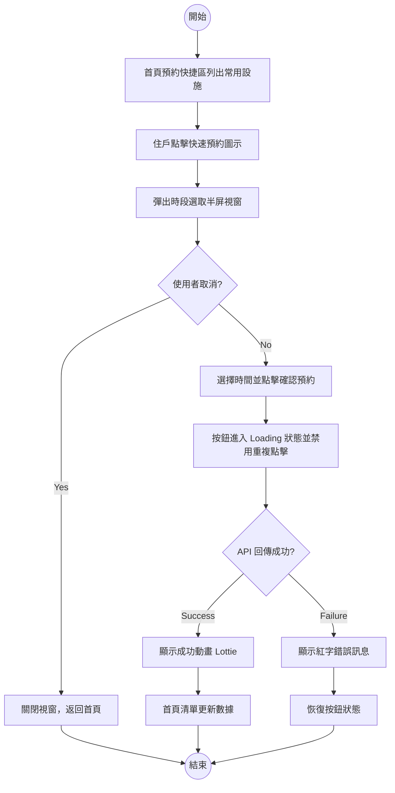
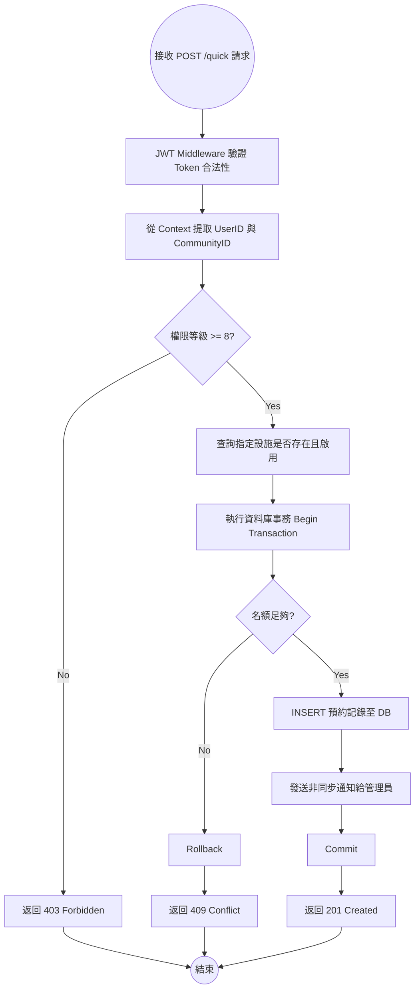
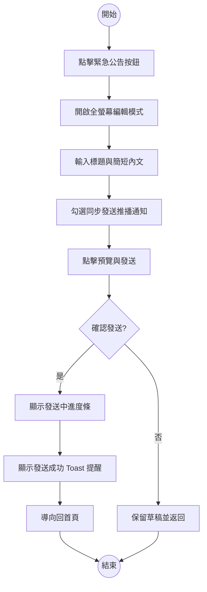
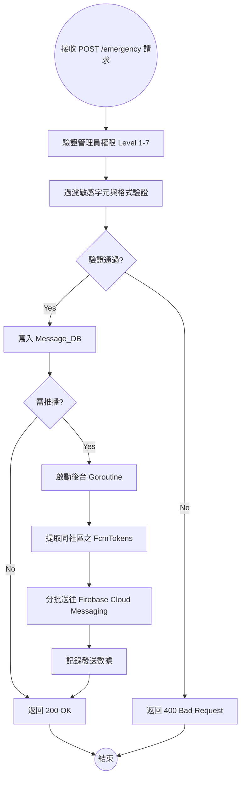
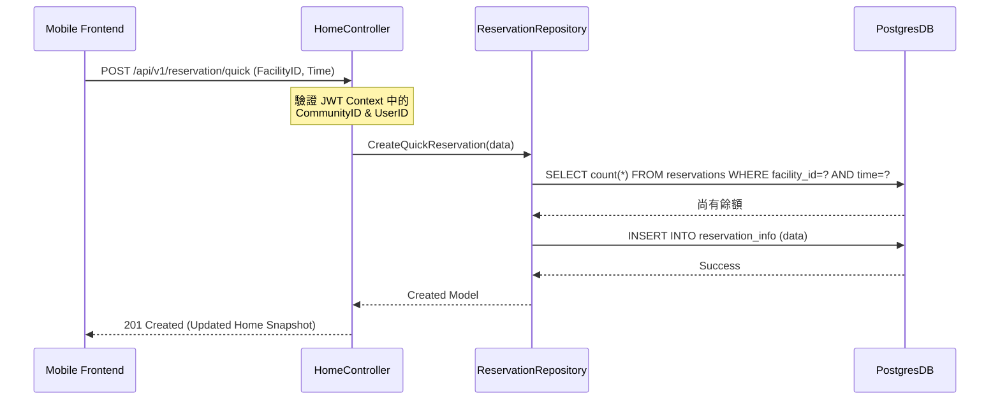
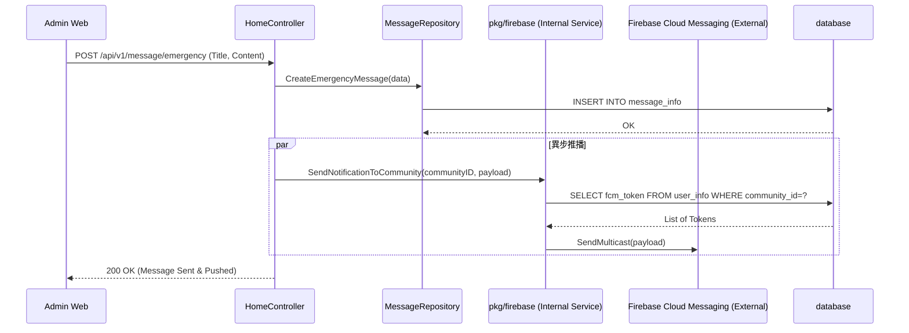
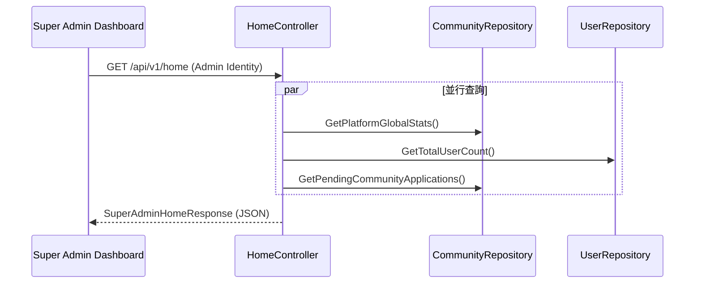
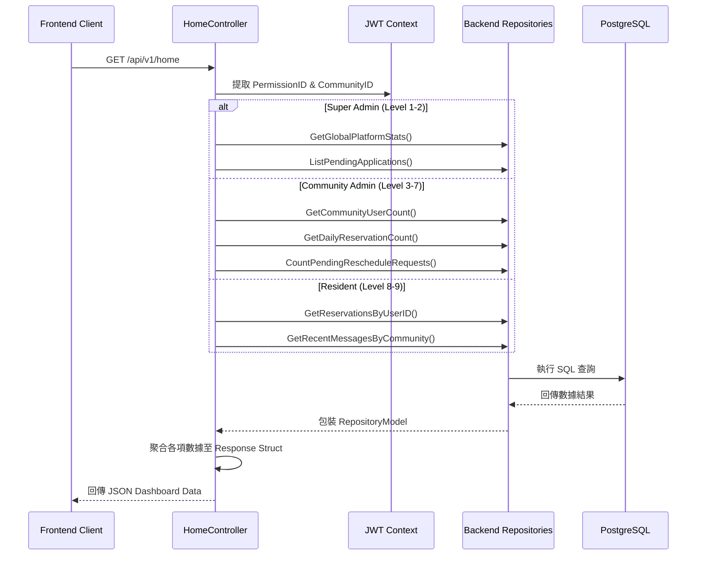

# Dashboard Design Specification (首頁儀表板設計規格)

## 1. 概述
本文件定義「社區通知系統」首頁儀表板的資訊架構與資料聚合邏輯。目標是根據使用者的權限等級 (Permission Level)，提供即時、相關且具備行動導向的數據摘要。

## 2. 角色與資訊權限映射
系統目前將使用者分為三種核心首頁視圖：

| 角色 | 權限等級 (Level) | 核心需求 | 呈現資訊 |
| :--- | :--- | :--- | :--- |
| **超級管理員** | 1-2 | 監控全平台運作狀況 | 全平台社區/住戶總數、待審核社區申請單 |
| **社區管理員** | 3-7 | 管理社區日常庶務 | 社區住戶總數、今日設施預約數、待處理改期單 |
| **住戶** | 8-9 | 個人行程與重要公告 | 個人即將到來的預約、社區最新公告 |

---

## 3. 資訊架構 (Information Architecture)

### 3.1 住戶 (Resident)
*   **即將到來的預約 (Upcoming Reservations)**: 顯示使用者未來三日內已核准的設施使用時段。
*   **最新公告 (Recent Messages)**: 顯示所屬社區發布的最新 5 則公告，確保重要資訊不遺漏。

## 角色資訊架構與 API 規範 (v1/home)

根據身份權限 (PermissionID) 返回對應的儀表板數據。

### 1. 住戶 (PermissionID: 8-9)
**核心價值**：自我服務、即時通知、設施預約。

#### JSON 欄位定義
| 欄位名 | 型態 | 範例值 | 說明 |
| :--- | :--- | :--- | :--- |
| `upcoming_reservations` | `Array` | `[...]` | 最近 3 筆未來的設施預約 |
| `recent_messages` | `Array` | `[...]` | 最近 5 筆社區公告或個人訊息 |
| `maintenance_status` | `Object` | `{...}` | 若有報修，顯示進度摘要 |

#### JSON 範例
```json
{
  "role": "resident",
  "data": {
    "upcoming_reservations": [
      {
        "id": 101,
        "facility_name": "健身房",
        "date": "2026-04-21",
        "start_time": "18:00",
        "end_time": "19:00",
        "status": "confirmed"
      }
    ],
    "recent_messages": [
      {
        "id": 2001,
        "title": "電梯定期保養通知",
        "content": "本週三 A 棟電梯將進行保養...",
        "create_time": "2026-04-20 10:00",
        "category": "announcement"
      }
    ]
  }
}
```

---

### 2. 社區管理員 (PermissionID: 3-7)
**核心價值**：營運效率、異常監控、申請審核。

#### JSON 欄位定義
| 欄位名 | 型態 | 範例值 | 說明 |
| :--- | :--- | :--- | :--- |
| `stats` | `Object` | `{...}` | 包含：今日預約數、待審核申請數、住戶總數 |
| `urgent_notices` | `Array` | `[...]` | 需要立即處理的事項（如：逾期報修） |
| `recent_activities` | `Array` | `[...]` | 最近發生的操作日誌摘要 |

#### JSON 範例
```json
{
  "role": "community_admin",
  "data": {
    "stats": {
      "resident_count": 150,
      "pending_applications": 5,
      "today_reservations": 12
    },
    "urgent_notices": [
      {
        "id": 501,
        "type": "application",
        "description": "林先生 申請加入社區",
        "time": "2 小時前"
      }
    ]
  }
}
```

---

### 3. 超級管理員 (PermissionID: 1-2)

**核心價值**：全平台監控、系統健康度、商務統計。

#### JSON 欄位定義

| 欄位名 | 型態 | 範例值 | 說明 |
| :--- | :--- | :--- | :--- |
| `platform_stats` | `Object` | `{...}` | 總社區數、總用戶數、今日推播總量 |
| `pending_communities` | `Array` | `[...]` | 待審核的社區註冊申請單 |

---

## 核心功能活動流程 (Activity Diagrams)

為了銜接前後端開發，以下將核心功能拆分為「UI 操作流」與「後端業務流」。

### 1. 住戶端：快速預約流程 (Quick Booking)

#### [UI 操作] 活動圖



#### [後端處理] 活動圖



---

### 2. 管理員端：緊急公告與推播 (Instant Announcement)

#### [UI 操作] 活動圖


#### [後端處理] 活動圖


---

## 核心功能互動流程 (Interactions)

#### 時序圖：後端聚合實作


---

### 2. 管理員度：緊急公告與 FCM 推播 (Instant Announcement)

此功能確保管理員能快速發布資訊並強制推播至住戶手機。

#### 活動圖：發送流程
```mermaid
activityDiagram
    start
    :管理員首頁點擊「緊急公告」按鈕;
    :輸入標題與簡短內文;
    :確認發布;
    fork
        :後端持久化至 Message_DB;
    fork again
        :異步調用 Firebase 核心組件;
        :依照 CommunityID 查詢登錄的 FcmTokens;
        :下發 FCM Push Notification;
    end fork
    :顯示「發送成功」並更新首頁公告看板;
    stop
```

#### 時序圖：跨服務調度


---

### 3. 超級管理員：系統監控彙整 (System Health)

#### 時序圖：數據聚合


---

## 核心功能模組 (Feature Modules)

首頁儀表板不僅是數據展示，更是關鍵功能的「快速入口」。

### 1. 住戶端功能模組
*   **快速預約 (Quick Booking)**：在即將到來的預約下方，提供「新增預約」按鈕，直接跳轉至最常使用的設施。
*   **包裹管理 (Parcel Tracking)**：若有待領取包裹，在儀表板中央顯示「待領包裹：2 份」紅色提醒，並附上領取 QRCode 按鈕。
*   **繳費中心 (Billing Hub)**：顯示當月管理費狀態。若未繳費，顯示「立即繳費」快捷導向。
*   **報修進度 (Maintenance Tracking)**：提供「我要報修」快捷鍵，並顯示最近一筆報修單的即時狀態（如：派工中、已完工）。

---

### 2. 社區管理員功能模組
*   **審核工作台 (Approval Workbench)**：集中顯示「待審核住戶」、「待審核預約」之數字標籤，點擊直接進入對應清單。
*   **群發通知 (Instant Announcement)**：提供「發送緊急公告」快捷按鈕，整合標題與簡短內文輸入，一鍵推播至全社區。
*   **設施看板 (Facility Dashboard)**：提供各設施當前使用率與清消進度，並具備「一鍵禁用」功能（應用於維修突發狀況）。

---

### 3. 超級管理員功能模組
*   **平台警報 (System Alerts)**：若有 API 回應延遲或 Firebase 推播失敗率過高，在首頁置頂顯示系統警告。
*   **入駐進度 (Onboarding Status)**：地圖式或清單式顯示各社區的活躍度，並提供「待審核社區」名單。

---

## Swagger 產生規範

為了讓 Swagger UI 正確顯示這些聚合結構，必須在 Controller 與 Model 中定義特定的註解。

### 1. Go Struct 定義範例
```go
// HomeResponse 首頁聚合回應結構
type HomeResponse struct {
    Role string      `json:"role" example:"resident"`
    Data interface{} `json:"data"` // 根據角色動態裝載
}

// ResidentDashboard 住戶視圖
type ResidentDashboard struct {
    UpcomingReservations []Reservation `json:"upcoming_reservations"`
}
```

### 2. Controller 註解範例 (進階：使用 Model Composition)
在 `app/controller/v1/home/Home_Controller.go` 的方法上方加入：

```go
// GetHomeDashboard 取得首頁儀表板
// @Summary 取得首頁儀表板資訊
// @Description 根據目前登入者的權限，聚合回傳對應的統計數據、預約清單與訊息。
// @Tags Home
// @Produce json
// @Success 200 {object} HomeResponse{data=ResidentDashboard} "住戶身份：成功返回儀表板數據"
// @Success 200 {object} HomeResponse{data=AdminDashboard} "管理員身份：成功返回統計與待辦"
// @Failure 401 {object} model.ErrorRequest "權限不足"
// @Router /api/v1/home [get]
// @Security BearerAuth
func (h *HomeController) GetHomeDashboard(ctx *gin.Context) { ... }
```
> [!TIP]
> 使用 `HomeResponse{data=SpecificStruct}` 語法能動態替換結構中的 `interface{}` 欄位型態，使 Swagger UI 能渲染出正確的 JSON schema 而非單純的 `object`。

### 3. 如何產生 Swagger 文件
1.  **安裝工具**：`go install github.com/swaggo/swag/cmd/swag@latest`
2.  **執行產生指令**：
    ```bash
    swag init -g main.go
    ```
    這會掃描 `main.go` 與所有引用的 package 註解，並更新 `docs/swagger.json`。
3.  **預覽網址**：`http://localhost:9080/swagger/index.html`

---

## 4. 資料聚合邏輯 (Sequence Diagram)

為了減少前端請求次數，首頁採「聚合式 API」設計。以下為資料聚合流向圖：



---

## 5. API 規格定義 (規劃中)

### 5.1 Endpoint
`GET /api/v1/home`

### 5.2 預期回傳結構節錄
*   **住戶模式**: `{"upcoming_reservations": [...], "recent_messages": [...]}`
*   **管理員模式**: `{"total_residents": 120, "today_reservation_count": 15, "pending_reschedule_count": 3}`

---

## 6. 後續開發指南
1. **Repository 層**: 需擴充各模組的查詢方法，建議使用 GORM 的 `Count` 與 `Limit` 進行優化。
2. **安全性**: 嚴格檢查 `JWT` 內的 `community_id` 與 `permission_id`，禁止越權查詢他區或其他權限之數據。
