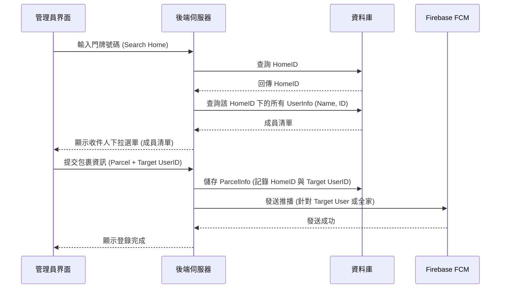

# PRD: 家庭群組與包裹通知優化

## 1. 背景與目的
目前社區系統已具備基本的包裹代收功能，但缺乏「家庭」的概念。實務上，一個門牌（住戶單元）通常由多位家庭成員組成。當管理員代收包裹時，若能直接根據門牌篩選出該戶的所有成員，並精確標記包裹收件人，將能大幅提升通知的精準度與住戶體驗。

## 2. 核心概念：家庭群組 (Family Group)
- **定義**：在系統中，一個「門牌住戶 (Home Unit)」即為一個「家庭群組」。
- **關聯機制**：
    - `user_info` 表中的 `home_id` 欄位用於將用戶關聯至特定住戶。
    - 擁有相同 `home_id` 的用戶自動歸類為同一個家庭群組。
- **管理邏輯**：
    - 住戶（家庭成員）可以透過邀請或由管理員綁定的方式加入 `home_id`。
    - 包裹通知將以 `home_id` 為基礎進行派送，但可指定特定成員收件。

## 3. 功能需求

### 3.1 門牌住戶資料維護 (Home Unit Management)
- 管理員可預先建立社區的門牌資料（樓層、號碼、側別）。
- 每個門牌擁有唯一的 `home_id`。

### 3.2 家庭成員綁定
- 用戶註冊或更新資料時，可選擇所屬社區與門牌。
- 系統支援「下拉選單」讓用戶選擇現有的門牌進行綁定。

### 3.3 包裹代收流程優化 (Parcel Intake Flow)
1. **輸入門牌**：管理員代收包裹時，先輸入門牌號碼（或從下拉選單選擇）。
2. **自動載入成員**：系統根據 `home_id` 自動檢索該住戶下的所有已註冊成員。
3. **指定收件人**：提供下拉選單顯示成員姓名，管理員可選擇「特定成員」或「全家（預設）」。
4. **發送通知**：
    - 若指定特定成員：僅該成員收到 FCM 通知。
    - 若指定全家：該 `home_id` 下的所有成員皆收到通知。

### 3.4 下拉選單邏輯 (Dropdown Logic)
- **門牌選單**：`GET /api/v1/community/homes` (需帶 community_id)。
- **成員選單**：`GET /api/v1/homes/:home_id/members`。

## 4. 技術設計 (Technical Design)

### 4.1 資料庫異動
- 現有 `user_home` (Table `user_home`) 與 `user_info` 已有 `home_id` 關聯。
- 需確保 `home_id` 欄位型態一致（目前 `user_info` 為 `string`，`user_home` 為 `uint64`，建議統一）。

### 4.2 介面邏輯 (Mermaid)

## 5. 預計影響模組
- `app/models/community`: 增加 Home 相關 Model。
- `app/controller/v1/parcel`: 修改 `CreateParcel` 接收 `target_user_id`。
- `app/repositories/user`: 增加按 `home_id` 查詢用戶的方法。
- `routers/api/v1`: 增加 Home 成員查詢路由。

## 6. 後續計畫
1. 統一 `home_id` 資料型態。
2. 實作 `GetHomeMembers` API。
3. 更新 `ParcelInfo` 欄位以支援指定收件人（選填）。
