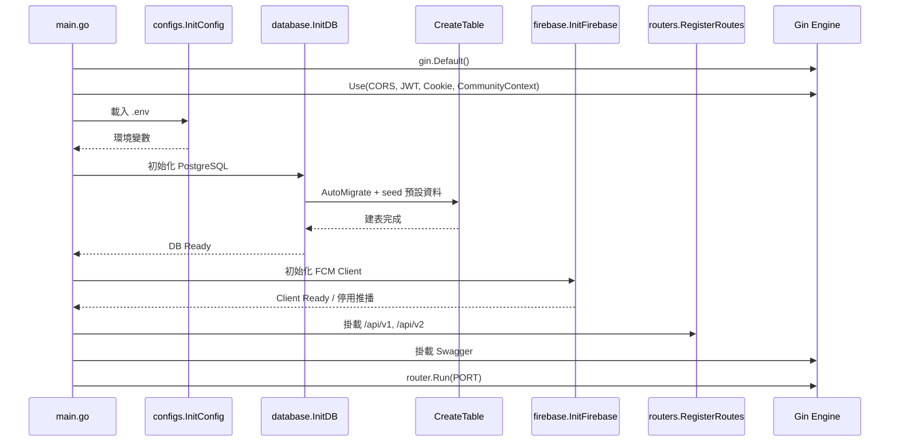
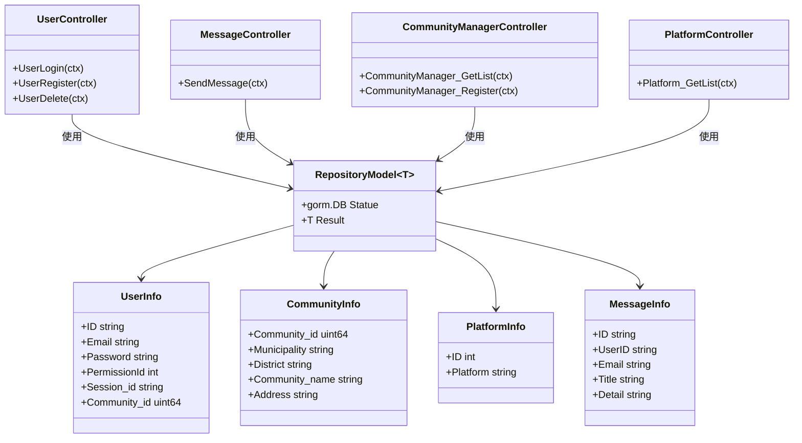

# 專案分析文件

## 文件目的

本文件針對 `Community_Notification_System` 目前程式碼狀態進行盤點，整理系統進入點、分層架構、路由、資料表、中介層與現況風險，作為後續功能文件與維護文件的基礎。

## 1. 專案定位

`Community_Notification_System` 是一套以 `Gin + GORM + PostgreSQL + Firebase Cloud Messaging` 為基礎的社區通知後端服務，核心目標包含：

- 使用者註冊、登入、刪除
- 社區基本資料維護與查詢
- 社區送出申請，由 `Super admin` 審核核可後建立社區與初始社區管理員
- 平台清單提供
- 以 Firebase FCM 發送通知
- 以 JWT 與 Cookie 管理登入狀態

目前程式結構以 `controller / repository / database schema` 為主，已接近分層式設計，但尚未完整落實 clean architecture 的 usecase / interface 邊界。

## 2. 執行進入點與啟動流程

系統進入點位於 `main.go`，啟動順序如下：

1. 建立 Gin Router。
2. 掛載 CORS、JWT、Cookie 與社區上下文 middleware。
3. 載入 `.env` 與系統環境變數。
4. 初始化 PostgreSQL 連線。
5. 自動建立資料表與預設資料。
6. 初始化 Firebase Messaging Client。
7. 掛載 `/api/v1`、`/api/v2` 路由。
8. 掛載 Swagger UI。
9. 依 `PORT` 啟動 HTTP Server。

## 3. 分層架構分析

### 3.1 Router 層

負責版本化 API 分流。

- `routers/router.go`：建立 `/api/v1`、`/api/v2`
- `routers/api/v1/v1.go`：v1 路由註冊
- `routers/api/v2/v2.go`：v2 路由註冊，目前沿用 v1 controller

### 3.2 Controller 層

負責：

- 請求參數綁定
- 輸入驗證
- 呼叫 repository
- 組裝 HTTP 回應

目前控制器模組：

- `app/controller/v1/user`：登入、註冊、刪除、更新預留
- `app/controller/v1/message`：推播通知
- `app/controller/v1/communityManager`：社區查詢、新增
- `app/controller/v1/platform`：平台清單查詢

### 3.3 Repository 層

負責資料存取邏輯與 GORM 操作。

- `app/repositories/user/User_repository.go`
- `app/repositories/community/community_repository.go`
- `app/repositories/platform/Platform_repository.go`
- `app/repositories/message/Message_repository.go`

目前 repository 的回傳型態使用 `RepositoryModel[T]` 統一封裝 `gorm.DB` 狀態與結果資料。

### 3.4 Database Schema 層

`database/` 底下依資料表分類 schema 與建表初始化邏輯：

- `User_DB`
- `UserLog_DB`
- `Message_DB`
- `Community_DB`
- `Platform_DB`
- `Permission_DB`
- `Home_DB`

### 3.5 Middleware 層

- `cors_middleware.go`：跨網域設定
- `jwt_middleware.go`：JWT 驗證與路由白名單控制
- `cookie_middleware.go`：讀取 `session_id` cookie
- `community_context_middleware.go`：規劃中，建立請求所屬 `community_id`，並限制後續資料操作範圍

### 3.6 外部整合

- `pkg/firebase/firebase.go`：初始化 Firebase App 與 FCM Client
- `utils/Jwt_Token.go`：JWT 產生

## 4. 目前 API 功能總覽

| 模組 | 方法 | 路徑 | 功能 | 是否需 JWT |
| --- | --- | --- | --- | --- |
| User | POST | `/api/v1/login` | 使用者登入 | 否 |
| User | POST | `/api/v1/register` | 使用者註冊 | 否 |
| User | POST | `/api/v1/deleteUser` | 刪除使用者 | 是 |
| Message | POST | `/api/v1/sendmessage` | 發送 FCM 推播 | 是 |
| Community | GET | `/api/v1/community/getlist` | 查詢社區清單 | 是 |
| Community | POST | `/api/v1/community/register` | 社區送出申請 | 否或依產品策略 |
| Community | PATCH | `/api/v1/community/register/:id/approve` | Super admin 核可申請並建立社區與初始 admin | 是 |
| Platform | GET | `/api/v1/platform/getlist` | 查詢平台清單 | 否 |

## 5. 資料模型分析

### 5.1 `user_info`

主要儲存：

- 帳號資訊：`Email`、`Password`
- 身分資訊：`PermissionId`、`Community_id`、`Home_id`
- 登入資訊：`Token`、`Session_id`、`Fcmtoken`
- 個人資訊：`Name`、`Birthdaytime`

### 5.2 `user_log`

記錄登入等操作時間。

### 5.3 `community_info`

儲存社區基本地址結構與社區名稱。

### 5.3.1 新增社區流程的新設計

後續「新增社區」應改成租戶開通流程，而不是單純建立一筆社區主檔。建議流程如下：

1. 社區申請人呼叫社區申請 API
2. 系統建立申請單，狀態為 `pending`
3. `Super admin` 審核申請
4. 核可時再次驗證社區資料與初始管理員帳號是否重複
5. 建立 `community_info`
6. 建立該社區的第一個 `user_info`，角色為 `Admin`
7. 將 `user_info.Community_id` 綁定新建立的社區
8. 更新申請單狀態為 `approved`
9. 以 transaction 保證正式資料與核可結果一致成功或一致失敗

### 5.7 社區上下文模型

系統目前的資料模型已具備社區隔離的基礎欄位：

- `user_info.Community_id`
- `home_info.Community_id`
- 後續設施與預約資料表也將全面帶入 `community_id`

因此後續所有受保護 API 建議統一走「社區上下文」模式：

1. JWT claims 帶入 `community_id`
2. middleware 解析並驗證 `community_id`
3. controller 從 `Context` 讀取 `community_id`
4. repository 查詢與異動一律加上 `WHERE community_id = ?`

### 5.4 `platform_info`

儲存平台名稱，啟動時預設建立 `web`、`App`、`Desktop`。

### 5.5 `permission_info`

儲存系統角色，例如系統管理員、社區管理員、保全、住戶等。

### 5.6 `message_info`

設計上應保存已送出的訊息，但目前 `SendMessage` controller 尚未呼叫 `MessageRepository` 寫入資料庫。

## 6. 整體請求處理 Activity Diagram

```mermaid
flowchart TD
    A[Client 發送 HTTP Request] --> B[Gin Router 接收請求]
    B --> C[CORS Middleware]
    C --> D{是否為白名單路由}
    D -- 是 --> F[Cookie Middleware]
    D -- 否 --> E[JWT Middleware 驗證 Token]
    E -->|成功| F[Cookie Middleware]
    E -->|失敗| X[回傳 401 Unauthorized]
    F --> G[Community Context Middleware]
    G --> H{是否為社區型請求}
    H -- 否 --> I[/api 路由群組]
    H -- 是 --> J[建立 community_id 上下文]
    J --> I
    I --> K[/v1 或 /v2 路由]
    K --> L[Controller 綁定參數與驗證]
    L --> M[Repository 存取資料]
    M --> N[(PostgreSQL)]
    L --> O{是否需要外部服務}
    O -- 是 --> P[Firebase FCM]
    O -- 否 --> Q[組裝 JSON Response]
    P --> Q
    N --> Q
    Q --> R[回傳 HTTP Response]
```

## 7. 整體啟動 Sequence Diagram



## 8. 主要類別關係圖



## 9. 功能成熟度觀察

### 已具備的能力

- 使用者登入含密碼雜湊驗證
- 使用者註冊含 JWT 與 Session Cookie
- 社區資料查詢與新增
- 平台列表查詢
- FCM 單次推播發送
- 自動建表與預設資料 seed

### 尚未完整落地的部分

- `v2` 路由尚未真正獨立版本化
- `UserUpdate` 尚未實作
- `sendmessage` 雖有 `message_info` schema 與 repository，但 controller 未落庫
- JWT middleware 白名單以字串比對，Swagger 路由比對較脆弱
- 尚未建立 `CommunityContextMiddleware`，目前缺少「請求屬於哪一個社區」的統一判斷機制
- repository 多數仍未全面以 `community_id` 做查詢隔離，後續新增預約與設施功能時需優先補齊
- `community/register` 目前仍只建立社區主檔，尚未支援申請單、`Super admin` 審核與核可後建立該社區初始 admin
- `CORSMiddleware` 設定 `Allow-Origin: *` 與 `Allow-Credentials: true` 併用，瀏覽器端存在規格風險
- 專案命名為 clean architecture，但目前尚屬分層式 MVC / Repository 結構

## 10. 建議後續整理方向

- 將 controller 與 repository 之間補上 usecase/service 層，逐步靠近 clean architecture。
- 優先實作 `CommunityContextMiddleware`，將 `community_id` 寫入 `Context`，並讓所有社區型查詢與異動統一受控。
- 將 `community/register` 升級為「送出申請 -> `Super admin` 審核 -> 建立社區 + 建立初始社區 admin」流程。
- 將 `sendmessage` 的資料寫入與 FCM 派送結果整合成單一流程。
- 為 `community`、`platform`、`message` 補齊測試。
- 將權限與 JWT claims 進一步整合，避免只有登入驗證、沒有授權控制。
- 將 middleware 錯誤格式統一為 `model.ErrorRequest`。

## 11. 文件對應

- 功能細節請見 `docs/features/feature_specification.md`
- 路由處理補充請見 `docs/architecture/router_flow.md`
