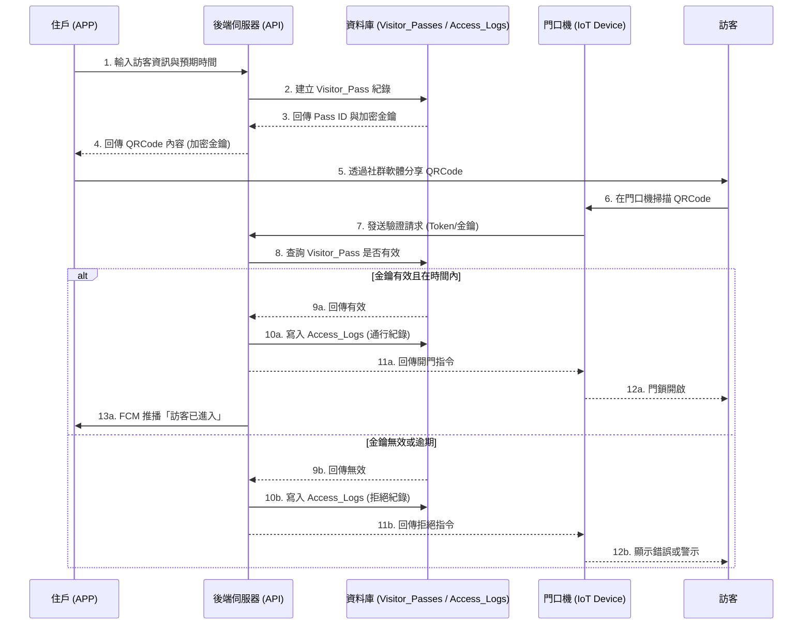

# 智慧訪客系統流程圖 (Activity Diagram: Visitor Pass)

本文件描述智慧訪客系統 (Visitor Management 2.0) 的活動流程。

## 流程圖

## 關鍵技術節點說明
1. **QRCode 安全性**：金鑰中應包含 `PassID` 與 `Signature`，避免被輕易竄改。
2. **時效性檢查**：後端驗證時，必須嚴格檢查 `StartTime` 與 `EndTime`。
3. **單次/多次使用**：若為單次使用，後端在回傳開門指令前，需同步將 `Visitor_Pass` 標記為 `IsUsed = true`。
4. **推播通知**：當訪客成功刷入，系統調用現有的 FCM 服務發送通知給發出邀請的 `OwnerID`。
