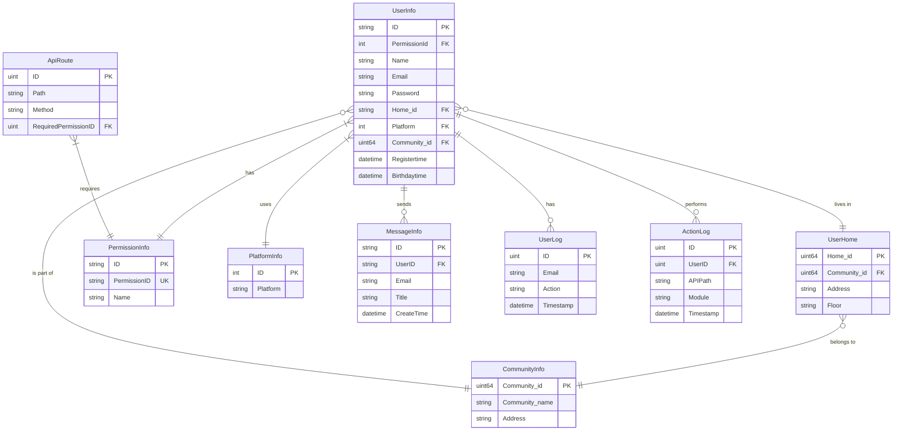

# Entity-Relationship Diagram (ERD)

以下是本系統的實體關係圖，以 Mermaid 語法表示。

```mermaid
erDiagram
    UserInfo {
        string ID PK
        int PermissionId FK
        string Name
        string Email
        string Password
        string Home_id FK
        int Platform FK
        uint64 Community_id FK
        datetime Registertime
        datetime Birthdaytime
    }

    UserHome {
        uint64 Home_id PK
        uint64 Community_id FK
        string Address
        string Floor
    }

    CommunityInfo {
        uint64 Community_id PK
        string Community_name
        string Address
    }

    PermissionInfo {
        string ID PK
        string PermissionID UK
        string Name
    }

    PlatformInfo {
        int ID PK
        string Platform
    }

    MessageInfo {
        string ID PK
        string UserID FK
        string Email
        string Title
        datetime CreateTime
    }

    UserLog {
        uint ID PK
        string Email
        string Action
        datetime Timestamp
    }

    ActionLog {
        uint ID PK
        uint UserID FK
        string APIPath
        string Module
        datetime Timestamp
    }

    ApiRoute {
        uint ID PK
        string Path
        string Method
        uint RequiredPermissionID FK
    }

    UserInfo ||--o{ MessageInfo : "sends"
    UserInfo ||--o{ ActionLog : "performs"
    UserInfo ||--o{ UserLog : "has"
    UserInfo }|--|| PermissionInfo : "has"
    UserInfo }|--|| PlatformInfo : "uses"
    UserInfo }o--|| UserHome : "lives in"
    UserHome }o--|| CommunityInfo : "belongs to"
    UserInfo }o--|| CommunityInfo : "is part of"
    ApiRoute }|--|| PermissionInfo : "requires"

```
