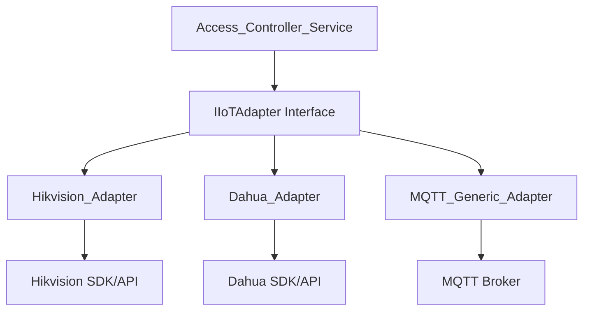

# 智慧物聯網適配器模式設計 (IoT Adapter Design)

> [!WARNING]
> **規劃中並非當前實作範圍**：本案僅作為技術預留設計。

本文件描述系統如何透過 **Adapter Pattern (適配器模式)** 接入不同廠商的門禁與物聯網設備，確保系統具備高度的供應商中立性與擴展性。

## 1. 架構概念

為了避免後端業務邏輯與硬體 SDK (如海康威視 Hikvision, 大華 Dahua) 強耦合，我們引入抽象層：



## 2. 介面定義 (Go Interface)

```go
// IIoTAdapter 統一硬體操作介面
type IIoTAdapter interface {
    OpenDoor(deviceID string) (bool, error)        // 觸發開門
    CloseDoor(deviceID string) (bool, error)       // 強制關門
    GetStatus(deviceID string) (string, error)     // 取得設備狀態 (Online/Offline/Open)
    SyncUser(user UserInfo) error                 // 同步使用者白名單至設備
}
```

## 3. 設備註冊與選擇邏輯

當管理員新增設備時，需指定 `AdapterType`。系統會根據該類型實例化正確的適配器。

| 廠商 | AdapterType | 通訊協定 | 備註 |
| :--- | :--- | :--- | :--- |
| 海康威視 | `hikvision` | ISAPI (HTTP) | 支援臉部辨識同步 |
| 大華 | `dahua` | NETSDK (TCP) | 支援影像對講整合 |
| 自研設備 | `mqtt_generic` | MQTT | 適用於自建 ESP32 控制器 |

## 4. 錯誤處理與自癒 (Self-healing)

適配器必須實現「斷線重連」機制：
1. **Heartbeat**: 每 10 秒發送 Ping 指令。
2. **Offline Mode**: 若檢測到設備離線，自動將 `/api/v1/access/status` 設定為離線，並通知管理員。
3. **Queueing**: 指令下發失敗時，進入 3 次重試隊列。
