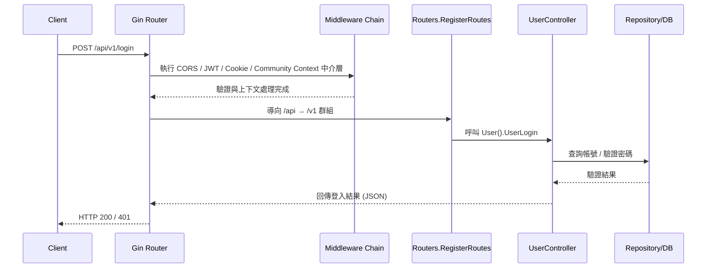

# Router 流程說明

## 檔案位置概觀
- `main.go`：建立 Gin 引擎、套用跨域 / JWT / Cookie 中介層、初始化設定與資料庫，並掛載 `/api` 路由群組及 Swagger。
- `routers/router.go`：提供 `RegisterRoutes`，將版本化路由群組 (`/v1`、`/v2`) 綁定到實際的路由設定函式。
- `routers/api/v1/v1.go`：定義 v1 API 底下的實際路由與控制器綁定。
- `routers/api/v2/v2.go`：定義 v2 API，當前與 v1 共用控制器實作，方便之後獨立演進。
- `app/controller/v1/*.go`：各路由對應的控制器方法，處理商業邏輯並呼叫資料庫層。

## 請求處理流程
1. 客戶端發送請求至對應的 API，例如 `POST /api/v1/login`。
2. `main.go` 中的 Gin 引擎接收請求並依序執行已註冊的中介層：
   - `middlewares.CORSMiddleware()`：設定跨域標頭。
   - `middlewares.JWTAuthMiddleware()`：驗證 JWT，並將驗證資訊存放於 `Context`。
   - `middlewares.CookieMiddleware()`：處理 Cookie（讀取 / 寫入）。
   - `middlewares.CommunityContextMiddleware()`：解析並驗證 `community_id` 上下文，確保多租戶資料隔離。
   - `middlewares.PermissionMiddleware()`：驗證使用者權限等級。
3. 請求進入 `/api` 路由群組後，由 `routers.RegisterRoutes` 將路徑導向對應版本（`/v1` 或 `/v2`）。
4. 在版本化路由群組內（例如 `routers/api/v1/v1.go`），依 HTTP 方法與路徑綁定到控制器。
5. 控制器執行對應的商業流程：從 `Context` 取得 `community_id`、驗證輸入、呼叫 Repository。
6. Repository 執行資料存取時，必須將 `community_id` 作為必要條件，避免跨租戶操作。
7. Gin 將控制器的回應序列化為 JSON，並送回客戶端。

## 社區上下文規則
- 住戶與社區管理員登入後，JWT 應帶入 `community_id`。
- `CommunityContextMiddleware()` 優先從 JWT claims 取得 `community_id`。
- 一般住戶不可任意指定其他社區，社區管理員只能操作所屬社區。
- 平台管理員若進行跨社區操作，需明確指定目標 `community_id` 並通過權限驗證。
- 免除社區上下文驗證的路由：`/login`、`/register`、`/platform/getlist`、`/community/getlist`、`/community/register`、Swagger。

## 主要路由總覽
| 版本 | 方法 | 路徑 | 控制器方法 | 說明 |
|------|------|------|------------|------|
| v1 | POST | `/login` | `UserLogin` | 登入 |
| v1 | POST | `/register` | `UserRegister` | 註冊 |
| v1 | PATCH | `/community/register/:id/approve` | `CommunityManager_Approve` | 審核社區申請 |
| v1 | POST | `/admin/facilities` | `CreateFacility` | 建立設施 |
| v1 | POST | `/facilities/:id/reservations` | `CreateReservation` | 預約設施 |
| v1 | PATCH | `/reservations/:id/cancel` | `CancelReservation` | 取消預約 |
| v1 | POST | `/reservations/:id/reschedule` | `Reschedule` | 申請改期 |

> 註：v2 目前共用 v1 控制器實作，若未來版本差異化，只需在 `routers/api/v2` 建立獨立控制器綁定即可。

## 時序圖：`POST /api/v1/login`

## 擴充建議
- 新增 API 時，優先決定版本號並在對應的 `routers/api/{version}` 檔案中註冊，必要時建立新的控制器。
- 若新增中介層，請在 `main.go` 中統一掛載，維持一致的安全與日誌策略。
- 所有社區型 API 都應先定義 `community_id` 來源與驗證方式，再進入 controller 與 repository 設計。
- 建議為關鍵路由撰寫表單驗證與整合測試，確保版本演進時行為一致。
