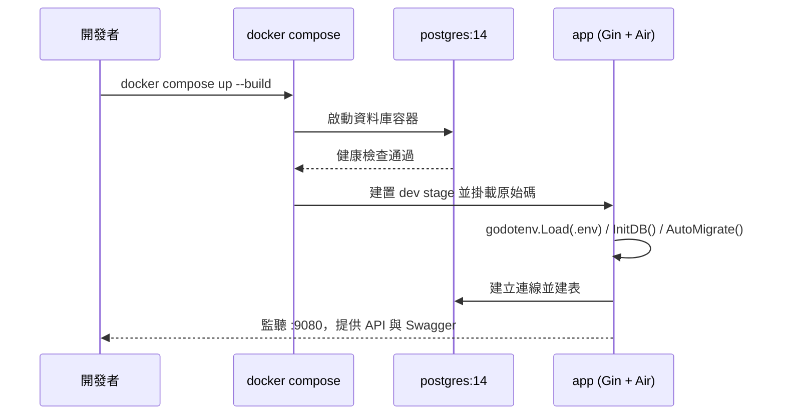
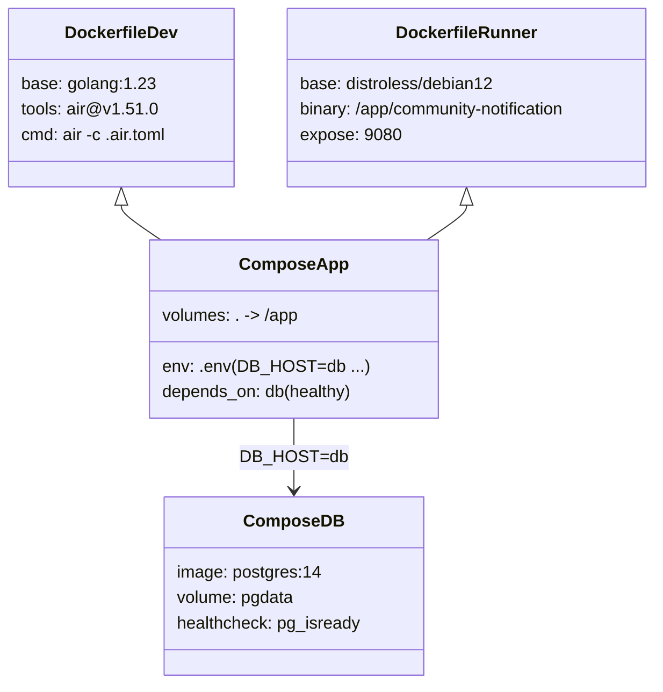

# Docker 開發環境指南

此文件說明如何使用 Docker 與 docker-compose 建立本專案的開發環境，並描述容器之間的協作流程與資源配置。

## 目標
- 提供一鍵啟動的 Gin + PostgreSQL 開發環境，透過 `air` 進行熱重載。
- 使用 `Dockerfile` 的 `dev`/`runner` 階段分離開發與精簡執行映像。
- 保留資料庫持久化與健康檢查，方便重複啟停與資料校驗。

## 容器組成
- `app`：由 `Dockerfile` 的 `dev` 階段建置，預先安裝 `air` 並掛載原始碼，啟動時讀取 `.env` 後連線資料庫並自動建表。
- `db`：`postgres:14`，使用 `pgdata` volume 保存資料，透過 `pg_isready` 健康檢查提供 `depends_on` 判斷。

## 使用步驟
1. 建立環境變數檔（必要）：`cp .env.docker.example .env`，並依需求調整 `JWTPASSWORD`、資料庫密碼等值。
2. 啟動開發環境：`docker compose up --build`（首次建置會下載 Go 依賴與 Postgres 映像）。
3. 服務入口：
   - API/Swagger：`http://localhost:9080/swagger/index.html`
   - Postgres：`localhost:5432`，帳密預設 `postgres/postgres`，資料庫 `db_community`
4. 停止服務：`docker compose down`；若需清空資料庫則執行 `docker compose down -v` 一併移除 volume。
5. Firebase 憑證：若需啟用 FCM，請將 `serviceAccountKey.json` 放在專案根目錄，容器會透過 volume 直接讀取；未提供時會在啟動記錄中提示但不會阻止服務啟動。

## Mermaid 時序圖：開發啟動流程

## Mermaid Class 圖：容器與設定關係

## 常見問題
- `無法載入 .env 文件`：確認已依步驟 1 建立 `.env` 並位於專案根目錄（容器會掛載整個目錄）。
- `資料庫連線失敗`：檢查 `DB_HOST=db`、`DB_PORT=5432` 是否與 `docker-compose.yml` 相符，或確認 `pg_isready` 健康檢查是否通過。
- 映像重建過慢：確保 `go.mod`/`go.sum` 無不必要的變動，Docker 會快取依賴下載；若仍慢，可考慮啟用 Docker BuildKit。
