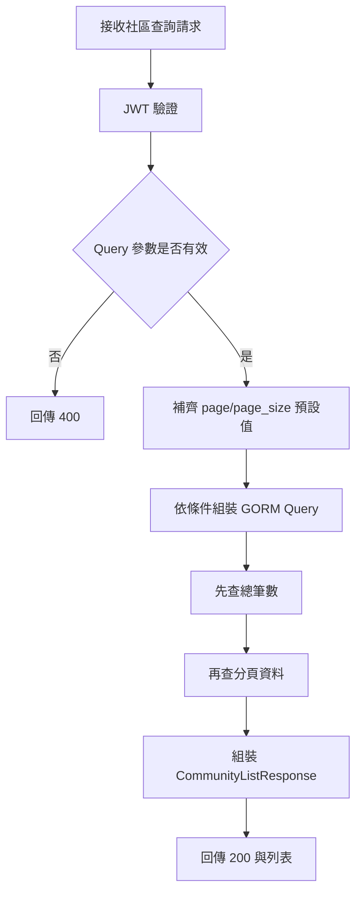
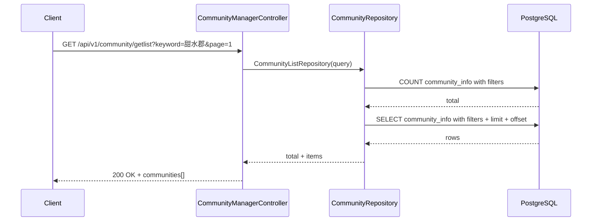

# 社區列表查詢

## 功能目標
依條件查詢社區基本資料，支援縣市、行政區、郵遞區號、關鍵字與分頁。

## API
- 方法：`GET`
- 路徑：`/api/v1/community/getlist`
- 是否需要 JWT：是

## 社區上下文規則
- 此 API 主要用於社區搜尋與選擇，建議列為 `CommunityContextMiddleware` 白名單或唯讀例外。
- 不應因登入者自身 `community_id` 而把公開社區列表查詢錯誤地限制成單一社區。
- 若未來區分公開查詢與內部管理查詢，建議拆成兩支 API。

## 查詢參數
| 參數 | 說明 |
| --- | --- |
| `municipality` | 縣市 |
| `district` | 行政區 |
| `postal_code` | 郵遞區號 |
| `keyword` | 社區名稱或地址關鍵字 |
| `page` | 頁碼，預設 1 |
| `page_size` | 每頁筆數，預設 20，最大 100 |

## 回傳格式

### 成功回傳 `200 OK`
```json
{
  "total": 1,
  "communities": [
    {
      "community_id": 1,
      "postal_code": 251,
      "municipality": "新北市",
      "district": "淡水區",
      "road_name": "濱海路一段",
      "lane_number": 306,
      "alley_number": 0,
      "community_name": "甜水郡社區",
      "address": "251新北市淡水區濱海路一段306巷"
    }
  ]
}
```

### 錯誤回傳
`400 Bad Request`
```json
{
  "code": 400,
  "status": "Bad Request",
  "error": "請求參數錯誤"
}
```

`401 Unauthorized`
```json
{
  "error": "缺少 Authorization header"
}
```

`500 Internal Server Error`
```json
{
  "code": 500,
  "status": "Internal Server Error",
  "error": "取得社區資料失敗"
}
```

## Activity Diagram


## Sequence Diagram


## 實作備註
- 預設資料中會自動 seed 一筆「甜水郡社區」。
- 關鍵字會比對 `community_name` 與 `address`，使用 `ILIKE`。
- 若後續出現社區內部專用查詢需求，應另建社區型 API，並套用 `community_id` 上下文限制。
