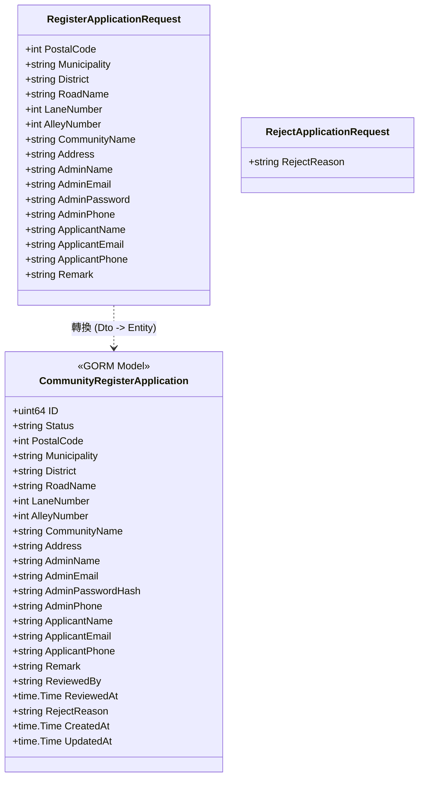
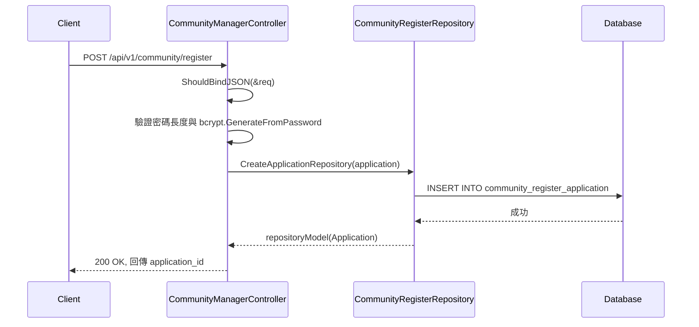
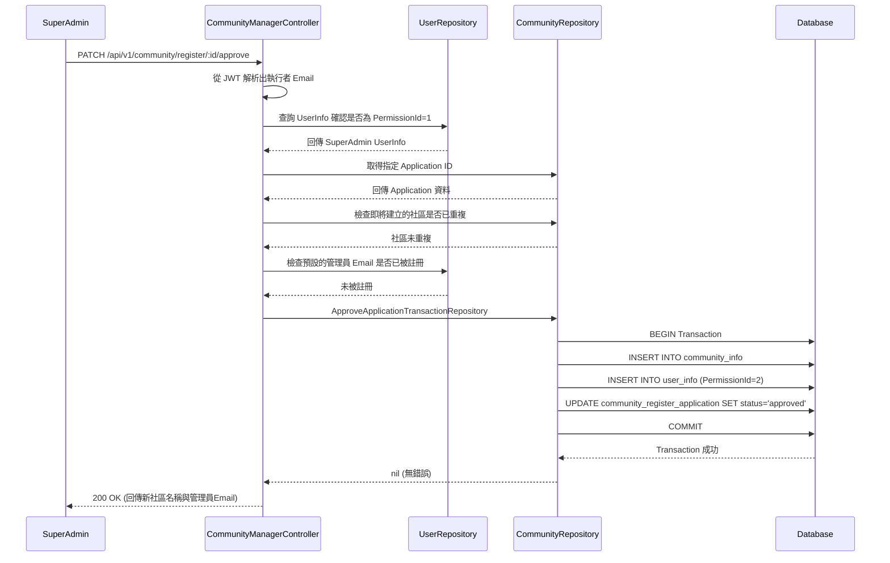

# 新增社區與審核實作分析與知識點 (Implementation & Knowledge Points)

## 類別圖 (Class Diagram)

## 時序圖 (Sequence Diagram)

### 社區送出申請 (Controller: Register)

### 核可社區申請 (Controller: Approve)

## 程式碼逐行分析 (Line-by-Line Analysis)

### 1. `database/Community_DB/CommunityRegisterApplication_Schema.go` 
- `type CommunityRegisterApplication struct`: 定義資料庫模型結構。
- `ID uint64 ...`: 記錄申請單的主鍵。
- `Status string ...`: 管理狀態，包含了 `pending`、`approved` 以及 `rejected`。
- `AdminPasswordHash string ...`: 從 Request 接過來的密碼將會直接經過 Hash 再儲存，確保即使申請單外洩也不會發生密碼外洩。
- `ReviewedBy *string`: 參照到審查人員的 ID，這對應了 `UserInfo.ID`（字串格式 uuid）。

### 2. `app/repositories/community/CommunityRegisterApplication.go`
- `func CreateApplicationRepository(...)`: 單純接受 `CommunityRegisterApplication` Entity 並進行 `database.DB.Create(application)` 新增申請表。
- `func GetApplicationByIDRepository(id uint64)`: 以 ID 查詢出這筆申請單資料，確保之後 approve 和 reject 時能正確撈取狀態。
- `func UpdateApplicationStatusRepository(...)`: 使用 `Updates(map[string]interface{})` 寫入審查人 ID、時間、拒絕原因以及狀態的變更。
- `func ApproveApplicationTransactionRepository(...)`: 最關鍵的知識點，使用 `database.DB.Transaction(func(tx *gorm.DB) error {...})` 的閉包結構。
  - 第一步：`tx.Create(communityInfo)`，並將回傳的 `Community_id` 設定到下一階段的 User 身上。
  - 第二步：`tx.Create(userInfo)` 新增這位預設權限為 `2` 的社區管理員。
  - 第三步：`tx.Model(...).Updates(...)` 變更該申請為 `approved`。
  - **知識點**：Transaction 區塊內若有任何一個 `return error`，GORM 將會自動執行資料庫 Rollback 返回上一狀態。

### 3. `app/controller/v1/communityManager/CommunityManager_Approve.go`
- `idStr := ctx.Param("id")`: 從路徑取得欲通過之申請單 ID。
- `currentUserEmail := ctx.GetString("username")`: 透過 JWT Middleware，這時我們可以取得發出 Request 的 Admin 的 Email，以驗證他的權限。
- `currentUserInfo := userRepository.LoginRepository(...)`: 由於設計上必須透過 UserRepository 將 email 轉成 UserInfo 來查看是否有 `PermissionId != 1` 的情況以阻擋非法核可。
- `if appRes.Result.Status != "pending"`: 防止重複審核。
- **知識點**：透過一連串的「尋找、驗證、防呆」過後才會調用 Repository 的 Transaction 寫入庫內，符合分層架構的精神。
