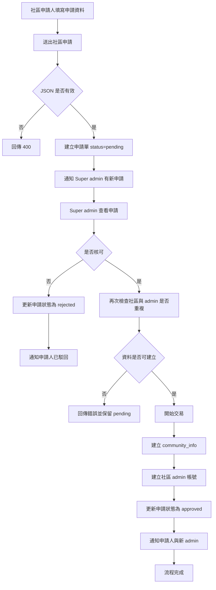
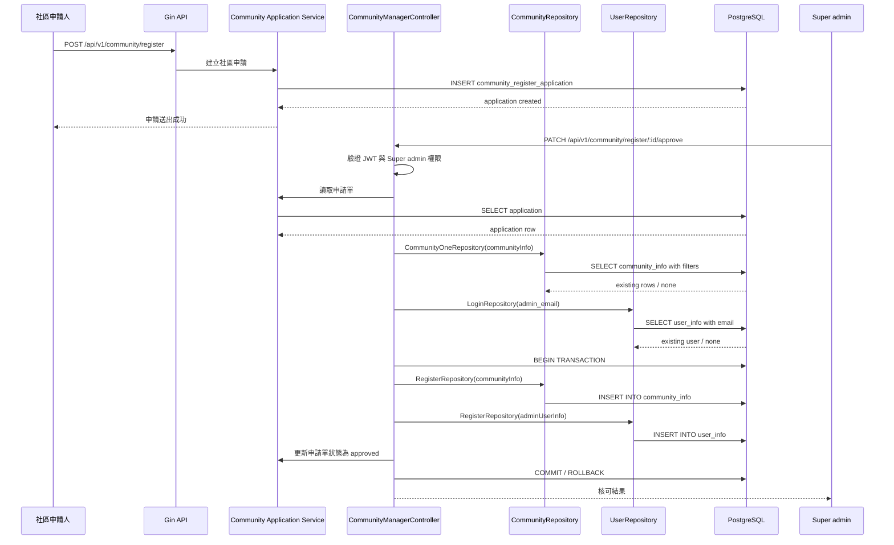

# 新增社區

## 功能目標
讓欲加入系統的社區先填寫申請資料送出，由 `Super admin` 負責審核是否核可。只有在審核通過後，系統才會正式建立該社區資料，並依照申請時填入的管理員資料建立該社區第一個 `Admin` 帳號。

## 角色定義
- `社區申請人`：填寫社區申請資料與初始管理員資料的人
- `Super admin`：負責審核社區申請、核可或駁回
- `Community admin`：申請核可後自動建立的社區管理員，僅能管理所屬社區

## 功能說明
此功能不是直接建立 `community_info`，而是分成兩段流程：

1. 社區送出申請
2. `Super admin` 審核申請

當 `Super admin` 核可後，系統才會正式執行：
- 建立 `community_info`
- 建立對應的 `Admin user_info`
- 指派 `PermissionID = 2`
- 綁定新社區的 `community_id`

若審核未通過，則保留申請紀錄，但不建立正式社區與 admin 帳號。

## 建議 API

### 1. 社區送出申請
- 方法：`POST`
- 路徑：`/api/v1/community/register`
- 是否需要 JWT：否或依產品策略決定

### 2. `Super admin` 審核申請
- 方法：`PATCH`
- 路徑：`/api/v1/community/register/:id/approve`
- 是否需要 JWT：是

### 3. `Super admin` 駁回申請
- 方法：`PATCH`
- 路徑：`/api/v1/community/register/:id/reject`
- 是否需要 JWT：是

## 社區上下文規則
- 社區申請階段尚未有正式 `community_id`，因此申請 API 應列為 `CommunityContextMiddleware` 白名單。
- `Super admin` 審核階段也不依附既有社區上下文，而是針對申請單進行核可或駁回。
- 只有審核核可後，才會產生正式的 `community_id` 與後續社區上下文。

## 輸入欄位建議

### 社區資料
| 欄位 | 型別 | 必填 | 說明 |
| --- | --- | --- | --- |
| `postal_code` | int | 是 | 郵遞區號 |
| `municipality` | string | 是 | 縣市 |
| `district` | string | 是 | 行政區 |
| `road_name` | string | 是 | 路名 |
| `lane_number` | int | 是 | 巷號 |
| `alley_number` | int | 是 | 弄號，無則填 0 |
| `community_name` | string | 是 | 社區名稱 |
| `address` | string | 是 | 完整地址 |

### 初始社區管理員資料
| 欄位 | 型別 | 必填 | 說明 |
| --- | --- | --- | --- |
| `admin_name` | string | 是 | 初始社區管理員姓名 |
| `admin_email` | string | 是 | 初始社區管理員登入帳號 |
| `admin_password` | string | 是 | 初始社區管理員初始密碼 |
| `admin_phone` | string | 否 | 聯絡電話 |

### 申請人資料
| 欄位 | 型別 | 必填 | 說明 |
| --- | --- | --- | --- |
| `applicant_name` | string | 是 | 申請人姓名 |
| `applicant_email` | string | 是 | 申請人聯絡信箱 |
| `applicant_phone` | string | 否 | 聯絡電話 |
| `remark` | string | 否 | 補充說明 |

## 權限規則
- 送出申請者不需要是 `Super admin`
- 只有 `Super admin` 可審核申請
- 核可後建立的初始管理員預設角色應為 `Admin`
- 初始管理員的 `PermissionID` 必須固定為 `2`
- 建立完成後，該 `Community admin` 的 `community_id` 必須綁定新建立的社區

## 狀態設計
- `pending`：待審核
- `approved`：已核可
- `rejected`：已駁回

## 交易規則
申請送出時只建立申請單，不直接建立正式社區資料。

當 `Super admin` 核可時，以下動作建議包成同一個 DB transaction：

1. 再次檢查社區是否重複
2. 再次檢查 `admin_email` 是否已存在
3. 建立 `community_info`
4. 建立 `user_info`
5. 指派 `PermissionId = 2`
6. 更新申請單狀態為 `approved`

任何一步失敗，都應 rollback。

## 回傳格式

### 送出申請成功 `200 OK`
```json
{
  "message": "社區申請已送出",
  "data": {
    "application_id": 1,
    "status": "pending"
  }
}
```

### 核可成功 `200 OK`
```json
{
  "message": "社區申請核可成功",
  "data": {
    "community_id": 1,
    "community_name": "甜水郡社區",
    "admin_email": "admin@community.com",
    "status": "approved"
  }
}
```

### 駁回成功 `200 OK`
```json
{
  "message": "社區申請已駁回",
  "data": {
    "application_id": 1,
    "status": "rejected"
  }
}
```

### 錯誤回傳
`400 Bad Request`
```json
{
  "code": 400,
  "status": "Bad Request",
  "error": "Invalid input"
}
```

其他可能的 `400` 訊息：
- `社區已經存在`
- `管理員帳號已存在`
- `管理員密碼長度不足`
- `申請狀態不可重複審核`

`401 Unauthorized`
```json
{
  "error": "缺少 Authorization header"
}
```

`403 Forbidden`
```json
{
  "code": 403,
  "status": "Forbidden",
  "error": "僅 Super admin 可審核社區申請"
}
```

`500 Internal Server Error`
```json
{
  "code": 500,
  "status": "Internal Server Error",
  "error": "處理社區申請失敗"
}
```

## Activity Diagram


## Sequence Diagram


## 資料設計建議
此流程建議至少影響三張資料表：

1. `community_register_application`
2. `community_info`
3. `user_info`

### `community_register_application`
建議欄位：
- `id`
- `status`
- `postal_code`
- `municipality`
- `district`
- `road_name`
- `lane_number`
- `alley_number`
- `community_name`
- `address`
- `admin_name`
- `admin_email`
- `admin_password_hash` 或加密保存欄位
- `admin_phone`
- `applicant_name`
- `applicant_email`
- `applicant_phone`
- `remark`
- `reviewed_by`
- `reviewed_at`
- `reject_reason`
- `created_at`
- `updated_at`

## 狀態與結果
核可成功後，建議回傳：
- 新社區 `community_id`
- 社區名稱
- 初始社區管理員帳號
- 申請狀態 `approved`
- 是否需要首次登入改密碼

## 後續流程建議
建立成功後可延伸這些動作：
- 發送申請送出通知給 `Super admin`
- 發送核可或駁回通知給申請人
- 發送初始帳號啟用通知給 `Community admin`
- 強制初始管理員首次登入修改密碼
- 建立該社區預設資料，例如預設公告分類、預設權限配置、預設設施類別

## 實作備註
- 目前程式實作仍只有單純建立 `community_info`，尚未包含申請單、`Super admin` 審核與核可後建立 admin 的流程。
- 現有權限種子資料中的 `系統管理員` 可視為 `Super admin` 對應角色。
- 若後續導入共用權限模型，建議 `1 = Super admin`、`2 = Admin`、`3 ~ 7 = 社區自訂角色`。
- 正式實作時建議將「送出申請」與「審核核可建立社區」拆成兩個 use case / service。
