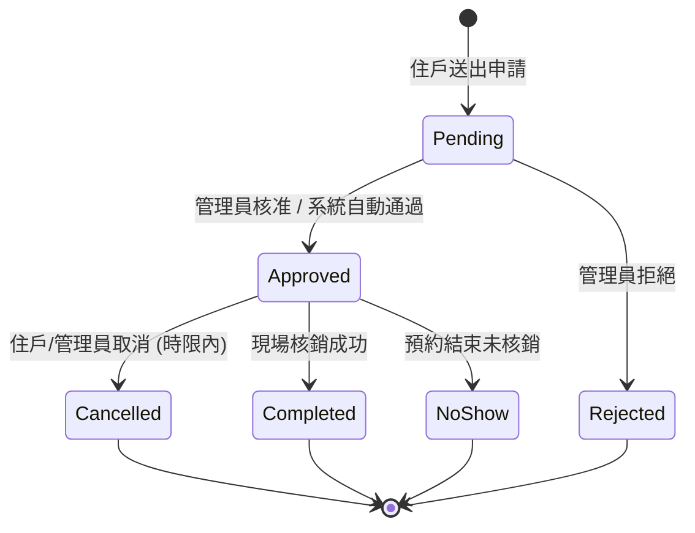
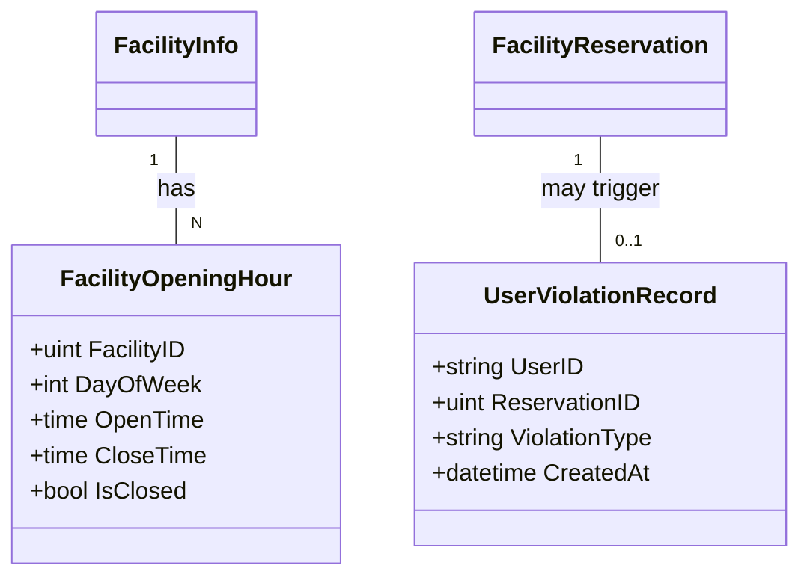

# 社區設施預約系統：詳細設計與開發規劃

## 1. 系統目標
本文件旨在銜接基礎設施規劃，針對「時段衝突檢查」、「容量控管」、「違規停權」等核心邏輯提供詳細的實作導引，確保系統具備高度的防呆能力與公平性。

## 2. 進階資料模型優化 (Enhanced Data Models)

### 2.1 設施開放時段表 (Facility Opening Hours)
目前的 `FacilityInfo` 僅有全域的 `open_time`，建議拆分出此表以支援「週一至週日不同時段」或「國定假日關閉」。

| 欄位 | 型別 | 說明 |
| --- | --- | --- |
| `facility_id` | bigint | 關聯設施 |
| `day_of_week` | int | 0-6 (週日至週六) |
| `open_time` | time | 開始營業時間 |
| `close_time` | time | 結束營業時間 |
| `is_closed` | bool | 該日是否固定不開放 |

### 2.2 設施容量規則 (Capacity Rules)
支援「包場型」(如 KTV) 與「共享型」(如 泳池) 設施。

*   **單次預約上限 (`MaxPerBooking`)**: 一次最多帶幾個人。
*   **時段總容納量 (`MaxTotalCapacity`)**: 該設施同一時間點能容納的總人數。

---

## 3. 核心業務邏輯 (Core Logic)

### 3.1 預約衝突檢查演算法 (Conflict Detection)
在建立預約 (`POST /api/v1/reservations`) 時，必須執行以下檢查：

1.  **營運時間檢查**：預約時段必須落在 `FacilityOpeningHours` 定義的範圍內。
2.  **重疊檢查 (Overlap Check)**：
    *   查詢 `facility_reservation` 中，狀態為 `pending` 或 `approved` 且時段重疊的紀錄。
    *   **包場型設施**：若存在任何一筆重疊紀錄，則拒絕預約。
    *   **共享型設施**：計算 `SUM(people_count)` + `當前申請人數`，若超過 `MaxTotalCapacity`，則拒絕預約。
3.  **個人限制檢查**：檢查該 User 在該週/該日是否已達到預約次數上限。

### 3.2 違規與停權機制 (Violation & Blacklist)
為了維護公平性，系統需自動追蹤住戶行為。

*   **No-show 判定**：預約時間結束後，若狀態仍為 `approved` 且無核銷紀錄，系統排程自動標記為 `no_show`。
*   **自動停權觸發**：
    *   當 `Violation` 表中，該住戶在過去 30 天內累積 `no_show` 達 3 次。
    *   系統自動在 `User` 狀態或 `Permission` 標註 `is_facility_banned = true`。
    *   停權期限屆滿後（如 7 天），系統自動解除。

---

## 4. 預約核銷流程 (Check-in Flow)

為了確保預約者真的有到場，規劃 QR Code 核銷流程：

1.  **產生憑證**：預約成功後，住戶 App/網頁 產生一個內含 `ReservationID` 的動態加密 Token (QR Code)。
2.  **現場核銷**：
    *   **管理員端**：管理員使用行動裝置掃描住戶 QR Code。
    *   **系統端**：驗證 Token 時效與 ID，將 `Reservation` 狀態更新為 `completed`。
3.  **自動結案**：核銷成功即視為有效使用，不計入違規。

---

## 5. API 擴充規劃

### 5.1 住戶端
*   `GET /api/v1/facility/:id/availability?date=YYYY-MM-DD`
    *   回傳該日所有可選時段及其剩餘容量。

### 5.2 管理端
*   `POST /api/v1/admin/facility/:id/maintenance`
    *   緊急標註維護時段，系統自動取消該時段已存在的預約並發送通知。
*   `PATCH /api/v1/admin/users/:id/unban`
    *   管理員手動解除住戶的預約停權。

---

## 6. Mermaid 狀態圖 (State Diagram)

## 7. Class Diagram (Updated)

---

## 8. UI/UX 介面設計規劃 (UI Elements)

### 8.1 住戶端 (Resident App/Web)

#### A. 設施列表頁 (Facility List)
*   **設施卡片**：設施照片、名稱、類型標籤（如：KTV、健身房）、當前狀態（開放中/維修中）。
*   **快速資訊**：容納人數、所在位置簡述。

#### B. 設施詳情與預約頁 (Facility Detail & Booking)
*   **詳細資訊**：設施完整描述、使用規章、地點說明。
*   **日期選擇器**：標註哪些日期已額滿或不開放。
*   **時段選擇器 (Time Slots)**：
    *   以圖形化方塊顯示時段。
    *   **顏色區分**：`可預約 (綠/白)`、`已額滿 (灰)`、`維修中 (紅)`、`已選取 (品牌色)`。
    *   **剩餘容量顯示**：若是共享設施，需顯示「剩餘 3 位」。
*   **預約表單**：預約人數選擇、備註欄（如：需要特定設備）。

#### C. 我的預約紀錄 (My Reservations)
*   **清單資訊**：設施名稱、預約日期、起訖時間、當前狀態標籤（待審核/已確認/已完成）。
*   **互動功能**：
    *   **核銷憑證**：顯示「點擊顯示 QR Code」按鈕。
    *   **變更/取消**：在時限內顯示「申請改期」或「取消預約」按鈕。
    *   **違規提示**：若有未到場紀錄，顯示醒目的提示與停權剩餘天數。

### 8.2 管理端 (Admin/Manager Dashboard)

#### A. 預約審核工作台 (Reservation Review)
*   **待辦清單**：列出所有 `pending` 預約。
*   **審核面板**：顯示預約人資訊（姓名、房號）、預約用途備註、歷史違規紀錄（參考用）。
*   **操作按鈕**：一鍵核准、拒絕並填寫原因。

#### B. 設施控管中心 (Facility Management)
*   **狀態切換**：緊急停用設施（一鍵設為維修中）。
*   **規則設定介面**：視覺化調整開放時段、修改預約權限天數。

#### C. 現場核銷與監控 (Check-in & Monitor)
*   **掃碼介面**：啟動相機掃描住戶憑證。
*   **當日預約清單**：顯示今日所有時段的預約狀況與到場情形。
*   **核銷結果回饋**：成功跳出綠色勾勾，失敗顯示錯誤原因（如：時段未到、已失效）。

