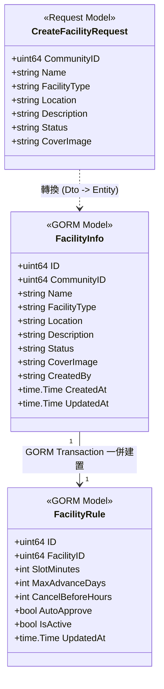
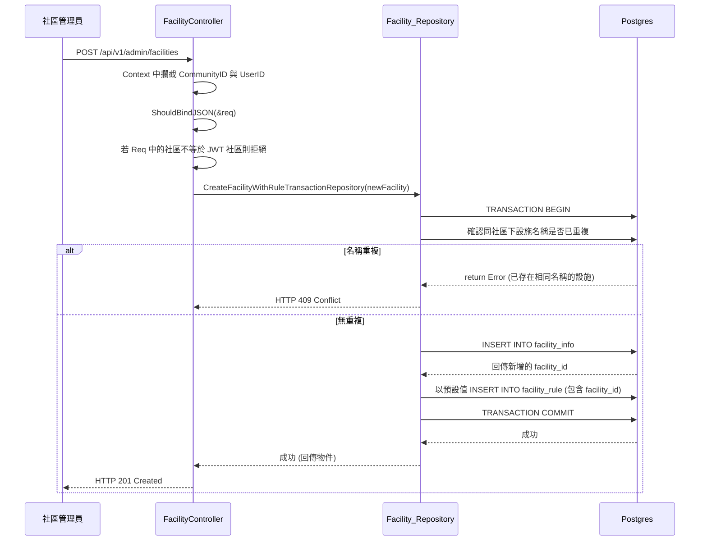

# 新增預約設施功能實作分析與知識點 (Implementation & Knowledge Points)

## 類別圖 (Class Diagram)

## 時序圖 (Sequence Diagram)

### 新增設施與規則綁定流程

## 程式碼逐行分析 (Line-by-Line Analysis)

### 1. 設施與規則雙表格設計 (`Facility_Schema.go` 與 `FacilityRule_Schema.go`)
- **`FacilityInfo` 表格**：作為公共設施的屬性主檔，利用 `gorm:"uniqueIndex:idx_community_facility_name"` 對 `CommunityID` 與 `Name` 建立複合唯一索引，這表示「A社區與B社區可以都有叫做健身房的設施，但同一個A社區不能有兩個叫健身房的資料」。屬性欄位囊括了地點、狀態與照片等。
- **`FacilityRule` 表格**：負責記錄該設施可被「排程預約」的條件約束。其中設定了大量如 `default:60`、`default:7` 的預防設計，這樣一來若管理員未來開通此設施預約權限時，系統不至於因為找不到規則檔而報錯。`FacilityID` 作為關聯的外鍵使用。

### 2. 資料庫操作的交易機制 (`Facility_Repository.go`)
- `func CreateFacilityWithRuleTransactionRepository(...)`：核心的儲存邏輯。
- 首先進行手動的名稱重複驗證 `tx.Where("community_id = ? AND name = ?",...).First()`：這可以在資料庫觸發獨特索引拋錯前給出更直觀可讀的回應（"該社區已存在相同名稱的設施"）。
- 第二步寫入主檔後，會自動取得分配到的主鍵 `facility.ID`。
- 第三步宣告預設狀態的 `FacilityRule`（包含預約單位 60 分鐘、提前 7 天、無需審核但未開通等），利用同一個 Transaction (`tx`) 來完成寫入，確保主檔跟規則永遠一對一綁定存活。

### 3. API 控制器防呆保護 (`Facility_Controller.go`)
- `communityID, exists := ctx.Get("community_id")`：從上一階段實作的 `CommunityContextMiddleware` 中取得該連線安全的範圍限制。
- `if req.CommunityID != cID { c.Abort() }`：雙重確認 API 在進行 POST 時，不管 Request Payload 亂填別社區的代號，都會因該 JWT 的所屬範圍而被強行阻擋。這是多租戶隔離極為重要的安全實踐。
- `res.Statue.Error.Error() == "該社區已存在相同名稱的設施"`：當捕獲該錯誤時，直接由 API 以 HTTP 409 Conflict 錯誤碼拋回前端顯示提示。
