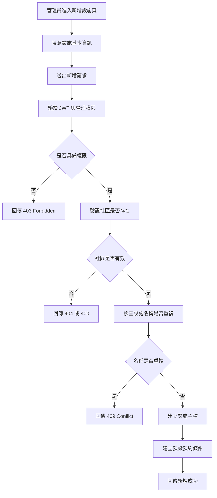
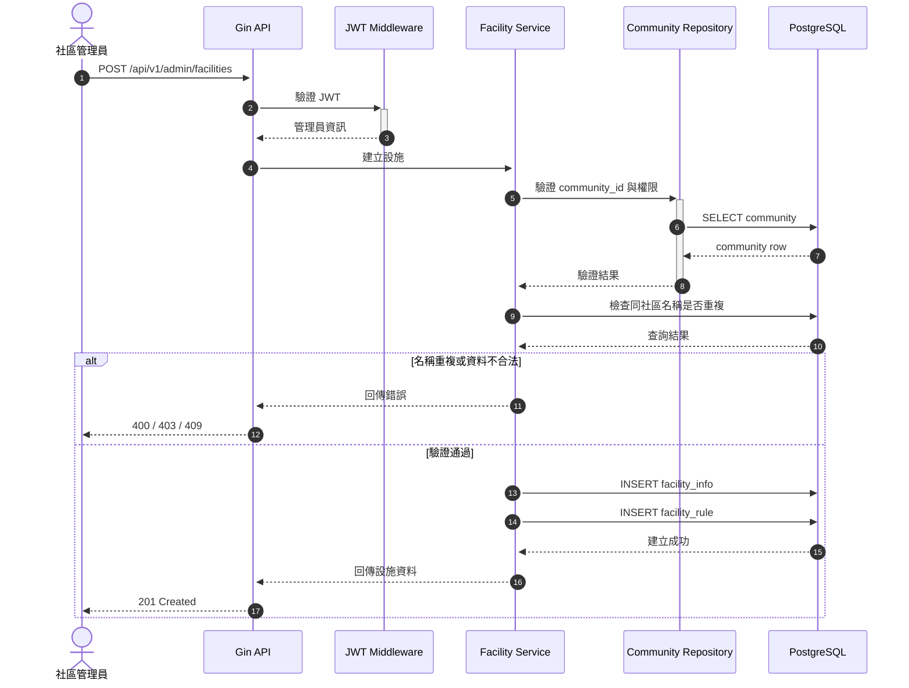

# 新增預約設施

## 功能目標
提供社區管理員建立可供住戶預約的公共設施，作為後續預約時段查詢、預約申請、審核與通知流程的基礎資料來源。

## 適用角色
- 社區管理員
- 平台管理員

## 功能說明
本功能專注於「建立設施主檔」，不直接處理住戶預約動作。建立完成後，系統可再搭配預約條件設定，決定此設施是否能正式對住戶開放預約。

## 涉及模組
- `app/controller/v1/facility/`：處理新增設施 API
- `app/models/facility/`：設施請求與回應模型
- `app/repositories/facility/`：設施資料寫入與查詢
- `database/Facility_DB/`：設施主表與規則表 schema
- `app/repositories/community/`：驗證社區存在與權限

## 輸入欄位建議
| 欄位 | 型別 | 必填 | 說明 |
| --- | --- | --- | --- |
| `community_id` | uint | 是 | 所屬社區 ID |
| `name` | string | 是 | 設施名稱 |
| `facility_type` | string | 是 | 設施類型，例如會議室、泳池、健身房 |
| `location` | string | 否 | 設施位置 |
| `description` | string | 否 | 設施說明 |
| `status` | string | 是 | 初始狀態，建議 `draft` 或 `active` |
| `cover_image` | string | 否 | 封面圖片或附件路徑 |

## 預設建立內容
新增設施時，系統可一併建立預設規則，避免後台建立後無法立即管理。

建議預設值：
- `slot_minutes = 60`
- `max_advance_days = 7`
- `cancel_before_hours = 24`
- `auto_approve = false`
- `is_active = false` 或 `status = draft`

## 驗證規則
- 僅具管理權限的使用者可建立設施
- `community_id` 必須存在
- 同一社區下設施名稱不可重複
- `name` 不可為空且長度需受限制
- `status` 必須為允許值：`draft`、`active`、`inactive`、`maintenance`

## 處理流程
1. 驗證 JWT 與管理員身份
2. 驗證 `community_id` 是否存在且屬於可管理範圍
3. 檢查同社區下設施名稱是否重複
4. 建立 `facility_info`
5. 建立預設 `facility_rule`
6. 回傳設施建立成功結果

## Activity Diagram


## Sequence Diagram


## API 草案
- 方法：`POST`
- 路徑：`/api/v1/admin/facilities`
- 是否需要 JWT：是

### Request Body
```json
{
  "community_id": 1,
  "name": "健身房",
  "facility_type": "gym",
  "location": "A 棟 1 樓",
  "description": "提供住戶健身使用",
  "status": "draft",
  "cover_image": "/uploads/facility/gym.png"
}
```

### Success Response `201 Created`
```json
{
  "message": "設施新增成功",
  "data": {
    "id": 1,
    "community_id": 1,
    "name": "健身房",
    "facility_type": "gym",
    "status": "draft"
  }
}
```

## 資料表關聯
- `facility_info`：設施主檔
- `facility_rule`：預約條件主檔

新增設施時建議由同一交易建立：
1. `facility_info`
2. `facility_rule`

避免只建立主檔卻沒有規則資料。

## 後續關聯功能
- [社區基本設施預約](/Users/kent/project/Community_Notification_System/docs/features/facility_booking/facility_reservation/README.md)

## 實作備註
- 建議新增後先預設為 `draft`，等管理員完成預約條件設定後再上架。
- 若後續需要圖片上傳，應再拆出媒體管理流程，不建議直接耦合在主 API 中。
