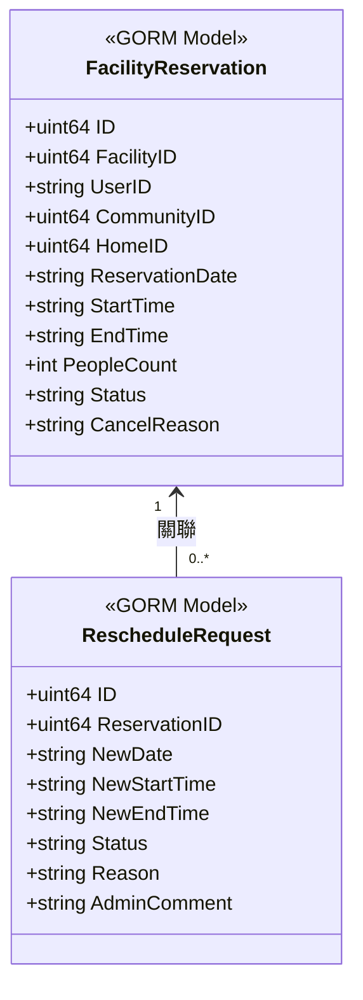
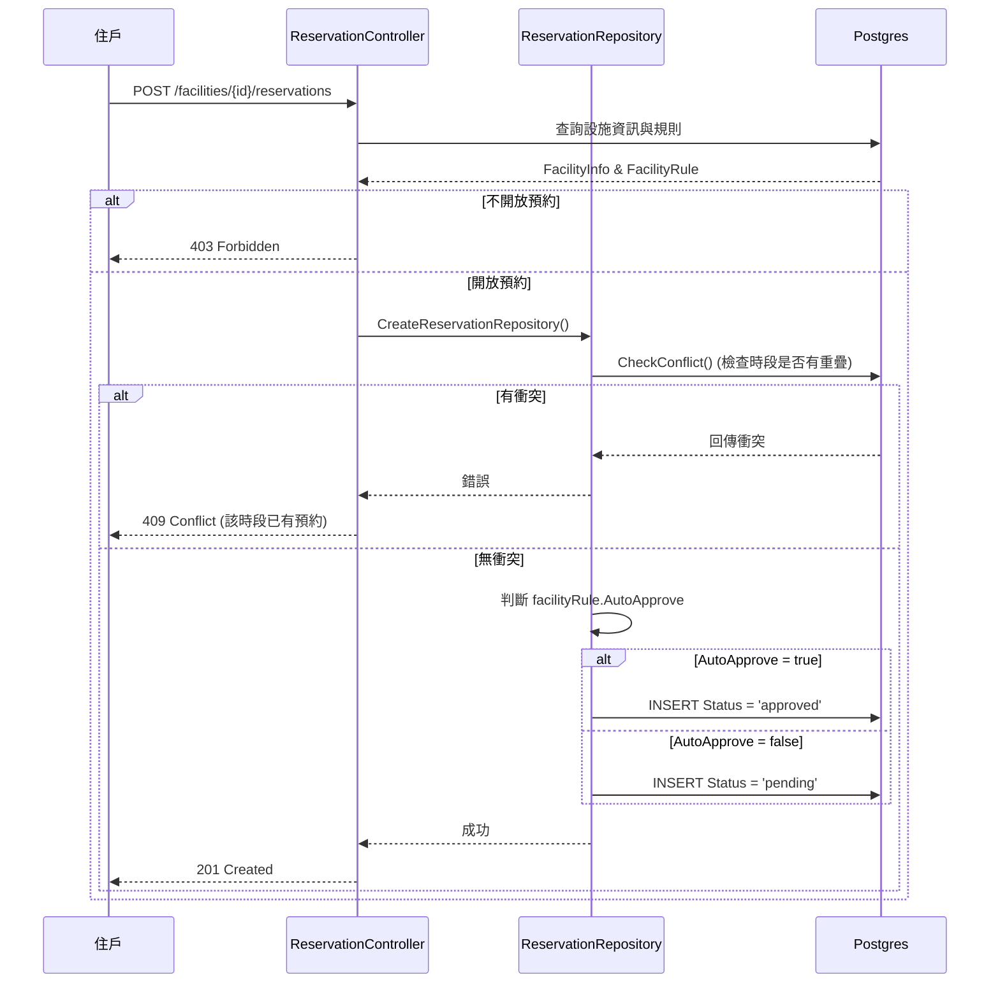
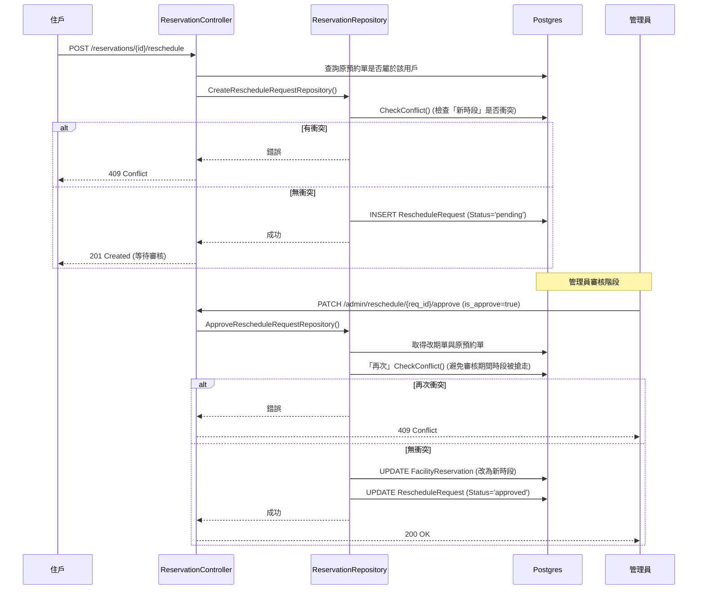

# 設施預約、取消與改期核心實作分析與知識點 (Implementation & Knowledge Points)

## 類別圖 (Class Diagram)

## 時序圖 (Sequence Diagram)

### 1. 預約建立與自動審核判定

### 2. 申請改期與管理員審核流程

## 程式碼逐行分析 (Line-by-Line Analysis)

### 1. 預約防衝突核心 (`Reservation_Repository.go` -> `CheckConflict`)
- `Where("start_time < ? AND end_time > ?", end, start)`: 這是一道經典的「時間不重疊定理」。假設資料庫內的預約為 `[db_start, db_end]`，而使用者想預約的時間為 `[req_start, req_end]`。我們只要判斷 `db_start < req_end` 且 `db_end > req_start`，就能準確揪出所有「有交集」的預約紀錄。避免了長短時段包絡所產生的死角。
- `Where("status IN ?", []string{"pending", "approved"})`: 我們只把還有效的訂單視為佔位，如果別人已經 `cancelled` 或是 `rejected`，那個時段就可以自動釋放出來給當前用戶搶！

### 2. 資料隔離與權限驗證 (`Reservation_Controller.go`)
- `communityID, _ := ctx.Get("community_id")` 與 `database.DB.Where("id = ? AND community_id = ?", facilityID, communityID)`: 住戶在預約時，我們強迫檢查該「設施 ID」是否真的是隸屬於他「當前登入查到的 CommunityID」。防止有心人士把 API 裡的 facilityID 改成其他豪宅的設施偷預約。
- `CancelReservation` 裡的 `if res.UserID != userID`: 只能取消「自己」的預約。

### 3. 改期的交易安全 (`ApproveRescheduleRequestRepository`)
- 第二次衝突檢查：在管理員點擊「Approve（核准）」的時候，程式進行了**二次 `CheckConflict`**。這是因為申請改期當下雖然時段是空的，但在這漫長的審核等待期間內，這個空時段有可能已經被其他的預約（如自動核准的設施）搶走了。因此在 UPDATE 寫入前再次驗證，可以 100% 避免「超賣/時段重疊」的 Race Condition。

### 結論
這三個 API（預約、取消、改期申請）展示了 SaaS 多租戶預約系統最厚重的領域邏輯：包含防止超賣的「時間重疊判定算法」、防跨租戶的「Token Community ID 注入防護」、以及針對特例場景所設計的「雙階確認防鎖死機制」。
