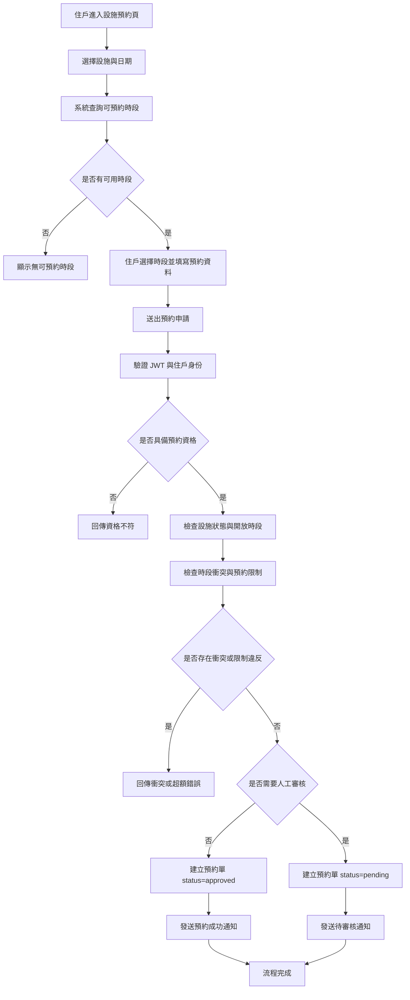
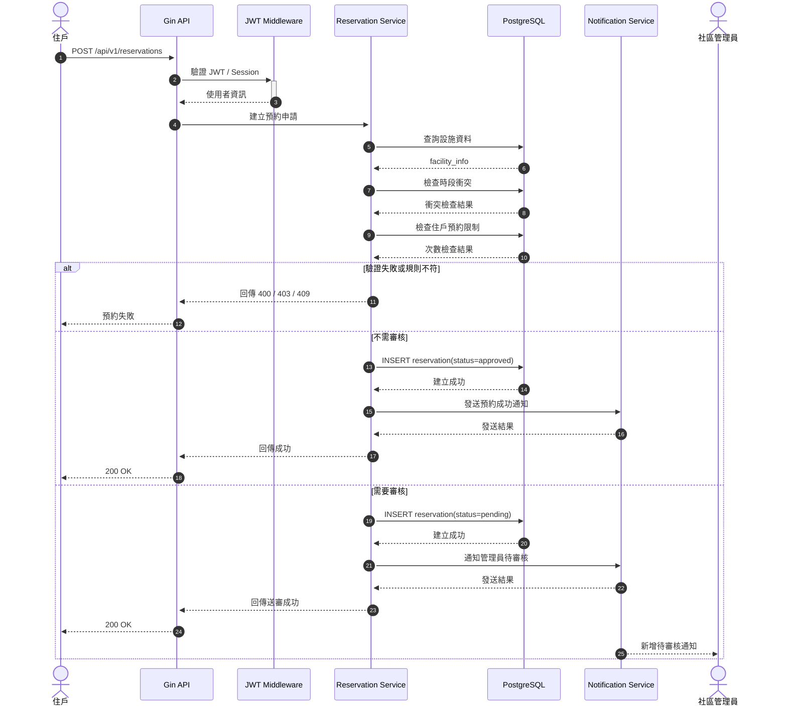
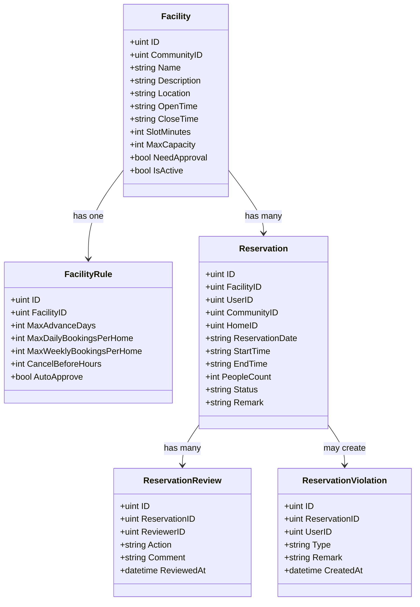

# 社區基本設施預約

## 功能目標
建立社區公共設施預約能力，讓住戶可以查詢可預約時段、送出預約申請、追蹤審核結果，並讓社區管理員維護設施與審核預約。此功能設計會延伸現有使用者、社區、戶別與通知模組，作為後續實作依據。

## 社區上下文規則
- 設施預約所有操作都必須屬於單一 `community_id`。
- `facility_info`、`facility_rule`、`facility_reservation`、`home_info` 等資料表應全面帶入 `community_id`。
- controller 不應直接信任 request body 內自帶的 `community_id`，應優先以 `CommunityContextMiddleware` 寫入的 context 為準。
- repository 查詢與異動應全面以 `community_id` 作為必要條件。

## 功能範圍
- 設施管理
- 可預約時段查詢
- 預約申請
- 預約審核
- 預約取消
- 使用後結案
- 推播通知與提醒

## 角色定義

### 住戶
- 查詢設施清單
- 查詢指定日期可預約時段
- 建立預約申請
- 查詢自己的預約紀錄
- 取消自己的預約

### 社區管理員
- 新增 / 編輯 / 停用設施
- 設定設施預約規則
- 查詢全部預約紀錄
- 審核待處理預約
- 標記完成、未到場或管理端取消

### 系統
- 驗證登入與社區歸屬
- 驗證時段合法性與衝突
- 驗證住戶預約限制
- 建立預約單與狀態流轉
- 發送通知與提醒

## 功能拆分

### 1. 設施管理模組
用途：由管理員維護社區可開放預約的公共設施。

子功能：
- 建立設施基本資料
- 編輯設施名稱、位置、描述與啟用狀態
- 設定開放時間與最小預約單位
- 設定人數上限與預約上限
- 設定是否需要人工審核
- 設定取消規則與預約視窗

#### 1.1 新增預約設施
此功能已獨立為功能資料夾，請參考：
- [facility_create/README.md](/Users/kent/project/Community_Notification_System/docs/features/facility_booking/facility_create/README.md)

在本文件中僅保留摘要：
- 建立設施主檔
- 驗證管理權限與社區歸屬
- 檢查同社區名稱重複
- 一併建立預設預約規則
- 預設建議以 `draft` 狀態建立

#### 1.2 設施基本資訊維護
用途：調整既有設施顯示資訊，不影響核心預約規則。

可維護欄位：
- 名稱
- 類型
- 描述
- 位置
- 顯示排序
- 啟用狀態
- 使用說明

#### 1.3 設施開放設定
用途：控制設施在什麼時間可被預約與使用。

可維護欄位：
- 開放星期
- 每日開放開始時間
- 每日開放結束時間
- 特殊關閉日期
- 維護停用區間

驗證規則：
- `open_time` 必須早於 `close_time`
- 特殊關閉日期不得與固定開放規則衝突未標記
- 停用期間內不可接受新預約

#### 1.4 設施容量設定
用途：控制單次預約的人數與資源上限。

可維護欄位：
- 單次最大人數
- 同時可成立預約筆數
- 是否允許多人共享同一時段

#### 1.5 設施顯示與上下架
用途：控制住戶端是否看得到此設施。

狀態建議：
- `draft`：草稿
- `active`：可預約
- `inactive`：停用
- `maintenance`：維護中

顯示規則：
- `draft` 不對住戶顯示
- `inactive` 不可新預約，但保留歷史紀錄
- `maintenance` 不可新預約，必要時可提示維護原因

### 2. 預約條件設定模組
用途：由管理員設定該設施的預約條件與限制規則。

#### 2.1 預約時段單位設定
用途：定義住戶一次可以切多長的時段。

設定欄位：
- 最小預約單位分鐘數，例如 `30`、`60`
- 單次最短預約時長
- 單次最長預約時長
- 是否允許連續時段預約

驗證規則：
- 最小預約單位必須大於 0
- 最短時長不得小於最小預約單位
- 最長時長不得小於最短時長

#### 2.2 提前預約條件
用途：限制住戶可提早多久預約。

設定欄位：
- 最多可提前預約天數
- 最少需提前預約小時數
- 是否允許當日預約

驗證規則：
- 預約日期不得超過最大可預約範圍
- 若不允許當日預約，系統需阻擋同日申請

#### 2.3 預約次數限制
用途：避免少數住戶過度占用公共資源。

設定欄位：
- 每戶每日最大預約次數
- 每戶每週最大預約次數
- 每人同時有效預約上限
- 同一設施每日可預約次數上限

驗證規則：
- 超過限制即拒絕建立預約
- 有效預約應包含 `pending` 與 `approved` 是否納入計算需明確定義

#### 2.4 審核條件設定
用途：決定預約建立後是直接通過還是進入人工審核。

設定欄位：
- 是否需要人工審核
- 特定時段是否必須審核
- 超過特定人數是否需審核
- 特定設施類型是否一律審核

決策結果：
- `auto_approve`
- `manual_review`

#### 2.5 取消條件設定
用途：規範住戶取消預約的期限與違規處理。

設定欄位：
- 使用前幾小時可取消
- 是否允許開始後取消
- 逾時取消是否記違規
- 管理員取消是否需要填原因

驗證規則：
- 超過可取消期限的住戶請求應被拒絕
- 強制取消需留下操作者與原因

#### 2.6 違規與停權條件
用途：將 no-show、逾時取消等行為轉為可管理的規則。

設定欄位：
- 幾次 `no_show` 後停權
- 幾次逾時取消後停權
- 停權天數
- 是否允許管理員人工解除

#### 2.7 通知條件設定
用途：控制系統在何時發送哪些通知。

設定欄位：
- 建立成功是否通知
- 待審核是否通知管理員
- 審核結果是否通知住戶
- 使用前提醒時間
- 取消後是否通知

### 3. 預約條件套用模組
用途：在住戶建立預約時，依序套用所有規則。

處理順序建議：
1. 驗證身份與社區歸屬
2. 驗證設施狀態是否可預約
3. 驗證日期是否在可預約範圍內
4. 驗證時段是否符合最小單位
5. 驗證是否與既有預約衝突
6. 驗證次數限制
7. 判斷是否進人工審核
8. 建立預約與發送通知

### 3.1 社區上下文套用
用途：確保所有設施預約操作都發生在當前請求所屬的社區範圍內。

處理規則：
- middleware 先建立 `community_id`
- controller 從 `Context` 讀取 `community_id`
- request body 若有 `community_id`，需驗證與 context 一致
- 設施、戶別、預約資料都必須屬於同一 `community_id`

### 4. 可預約時段查詢模組
用途：由住戶查詢某個設施在指定日期的可預約時段。

子功能：
- 依日期產生時段清單
- 扣除既有預約占用時段
- 檢查是否在開放時段內
- 檢查設施是否停用或暫停開放
- 回傳每個時段的可預約狀態與原因

### 5. 預約申請模組
用途：由住戶送出一筆新的設施預約。

子功能：
- 驗證 JWT 與使用者身份
- 驗證使用者是否屬於該社區
- 驗證戶別與預約資格
- 驗證時段、限制、衝突
- 建立預約單
- 根據規則決定 `pending` 或 `approved`

### 6. 預約審核模組
用途：由管理員審核待處理預約單。

子功能：
- 查詢待審核清單
- 檢視預約詳細資訊
- 核准預約
- 拒絕預約
- 記錄審核人、審核時間、備註
- 發送審核結果通知

### 7. 預約取消模組
用途：讓住戶或管理員取消既有預約。

子功能：
- 住戶取消自己的預約
- 管理員取消任意預約
- 驗證是否超過可取消時限
- 記錄取消原因
- 釋放預約時段
- 發送取消通知

### 8. 使用後結案模組
用途：管理實際使用後的最終狀態，作為違規與統計基礎。

子功能：
- 標記 `completed`
- 標記 `no_show`
- 建立違規次數統計基礎
- 作為後續黑名單與限制規則依據

### 9. 通知模組
用途：結合現有 message / FCM 能力，發送事件通知。

通知事件：
- 預約成功
- 已送出待審核
- 審核通過
- 審核拒絕
- 預約取消
- 即將使用提醒
- 未到場或違規通知

## 狀態設計

### 預約狀態
- `pending`：待審核
- `approved`：已核准
- `rejected`：已拒絕
- `cancelled`：已取消
- `completed`：已完成
- `no_show`：未到場

### 狀態流轉
```text
pending -> approved -> completed
pending -> approved -> no_show
pending -> rejected
pending -> cancelled
approved -> cancelled
```

## 規則拆分

### 資格規則
- 使用者必須已登入
- 使用者必須屬於該社區
- 使用者必須綁定有效戶別
- 如有違規停權則不可預約

### 時段規則
- 開始與結束時間必須落於設施開放時間
- 預約長度必須符合最小預約單位
- 同一設施同一時段不得重疊

### 次數規則
- 每戶每日最多預約次數
- 每戶每週最多預約次數
- 每位使用者同時有效預約數量上限

### 取消規則
- 使用前一定小時內不可取消
- 使用開始前 `1` 小時內，住戶不可直接取消
- 使用開始前 `1` 小時內，若仍要取消，必須送管理員審核
- 逾時取消可記錄違規
- 管理員可強制取消並記錄理由

### 改期規則
- 使用前一定小時內可直接改期
- 使用開始前 `1` 小時內，住戶不可直接改期
- 使用開始前 `1` 小時內，若仍要改期，必須送管理員審核
- 改期後的新時段仍需重新檢查衝突、次數限制與審核條件

### 審核規則
- 設施可設定是否需要人工審核
- 特定時段可保留人工審核
- 人數過多或特殊備註可進入人工審核流程

## Activity Diagram
以下流程圖描述住戶送出預約申請後，系統如何檢查資格、時段衝突與審核規則。



## Sequence Diagram
以下時序圖描述預約建立主流程，角色包含住戶、API、驗證中介層、預約服務、資料庫與通知模組。



## Class Diagram
以下類別圖描述第一版預計涉及的核心實體關係，可作為 model 與 schema 設計基礎。



## API 設計草案
以下為文件階段的 API 草案，供後續 Swagger 與 controller 實作時使用。

### 住戶端
- `GET /api/v1/facilities`
- `GET /api/v1/facilities/:id/slots?date=2026-04-09`
- `POST /api/v1/reservations`
- `GET /api/v1/reservations/me`
- `GET /api/v1/reservations/:id`
- `PATCH /api/v1/reservations/:id/cancel`

### 管理端
- `POST /api/v1/admin/facilities`
- `PATCH /api/v1/admin/facilities/:id`
- `GET /api/v1/admin/reservations`
- `PATCH /api/v1/admin/reservations/:id/approve`
- `PATCH /api/v1/admin/reservations/:id/reject`
- `PATCH /api/v1/admin/reservations/:id/complete`
- `PATCH /api/v1/admin/reservations/:id/no-show`

## 資料庫表設計草案
此區為第一版資料表規劃，尚未實作於 `database/` 與 GORM schema。

### 1. `facility_info`
用途：儲存社區設施基本資料。

| 欄位 | 型別 | 說明 |
| --- | --- | --- |
| `id` | bigint / uint | 主鍵 |
| `community_id` | bigint / uint | 所屬社區 ID |
| `name` | varchar(100) | 設施名稱 |
| `description` | text | 設施說明 |
| `location` | varchar(255) | 設施位置 |
| `open_time` | varchar(5) | 開放開始時間，例如 `09:00` |
| `close_time` | varchar(5) | 開放結束時間，例如 `22:00` |
| `slot_minutes` | int | 最小預約單位分鐘數 |
| `max_capacity` | int | 可容納人數 |
| `need_approval` | boolean | 是否需要人工審核 |
| `is_active` | boolean | 是否啟用 |
| `created_at` | timestamp | 建立時間 |
| `updated_at` | timestamp | 更新時間 |

建議索引：
- `idx_facility_community_id`
- `idx_facility_is_active`

### 2. `facility_rule`
用途：儲存設施預約規則，讓規則可獨立調整而不污染主表。

| 欄位 | 型別 | 說明 |
| --- | --- | --- |
| `id` | bigint / uint | 主鍵 |
| `facility_id` | bigint / uint | 對應設施 ID |
| `max_advance_days` | int | 最多可提前預約天數 |
| `max_daily_bookings_per_home` | int | 每戶每日最大預約次數 |
| `max_weekly_bookings_per_home` | int | 每戶每週最大預約次數 |
| `cancel_before_hours` | int | 使用前幾小時可取消 |
| `auto_approve` | boolean | 是否自動核准 |
| `created_at` | timestamp | 建立時間 |
| `updated_at` | timestamp | 更新時間 |

建議索引：
- `uk_facility_rule_facility_id`

### 3. `facility_reservation`
用途：儲存住戶的預約主資料。

| 欄位 | 型別 | 說明 |
| --- | --- | --- |
| `id` | bigint / uint | 主鍵 |
| `facility_id` | bigint / uint | 設施 ID |
| `user_id` | bigint / uint | 預約人 ID |
| `community_id` | bigint / uint | 社區 ID |
| `home_id` | bigint / uint | 戶別 ID |
| `reservation_date` | date | 預約日期 |
| `start_time` | varchar(5) | 開始時間 |
| `end_time` | varchar(5) | 結束時間 |
| `people_count` | int | 預約人數 |
| `status` | varchar(20) | 預約狀態 |
| `remark` | text | 備註 |
| `cancel_reason` | text | 取消原因 |
| `created_at` | timestamp | 建立時間 |
| `updated_at` | timestamp | 更新時間 |

建議索引：
- `idx_reservation_facility_date`
- `idx_reservation_user_id`
- `idx_reservation_home_id`
- `idx_reservation_status`
- 複合索引：`facility_id + reservation_date + start_time + end_time`

### 4. `facility_reservation_review`
用途：儲存人工審核歷程。

| 欄位 | 型別 | 說明 |
| --- | --- | --- |
| `id` | bigint / uint | 主鍵 |
| `reservation_id` | bigint / uint | 預約單 ID |
| `reviewer_id` | bigint / uint | 審核人 ID |
| `action` | varchar(20) | `approved` / `rejected` |
| `comment` | text | 審核備註 |
| `reviewed_at` | timestamp | 審核時間 |

建議索引：
- `idx_review_reservation_id`
- `idx_review_reviewer_id`

### 5. `facility_reservation_violation`
用途：紀錄未到場、逾時取消等違規資訊，作為後續停權基礎。

| 欄位 | 型別 | 說明 |
| --- | --- | --- |
| `id` | bigint / uint | 主鍵 |
| `reservation_id` | bigint / uint | 預約單 ID |
| `user_id` | bigint / uint | 使用者 ID |
| `violation_type` | varchar(30) | `late_cancel` / `no_show` |
| `remark` | text | 備註 |
| `created_at` | timestamp | 建立時間 |

建議索引：
- `idx_violation_user_id`
- `idx_violation_reservation_id`

## 第一版實作建議
- 先實作 `facility_info`、`facility_rule`、`facility_reservation`
- `review` 與 `violation` 可先建表，功能先保留 API 草案
- 通知先復用現有 `message` 流程，後續再接 FCM 歷程落庫

## 建議對應目錄
- `app/controller/v1/facility/`
- `app/controller/v1/reservation/`
- `app/models/facility/`
- `app/models/reservation/`
- `app/repositories/facility/`
- `app/repositories/reservation/`
- `database/Facility_DB/`
- `database/Reservation_DB/`

## 實作備註
- 本文件為設計文件，內容描述的是預計新增能力，不代表目前 API 已實作完成。
- 若後續導入付款或押金流程，建議額外拆出 `facility_payment` 模組，避免讓預約主表承擔過多責任。
- 若預約規則逐步複雜化，可將衝突檢查與資格檢查獨立成 service layer，貼近 clean architecture 的 use case 層。
