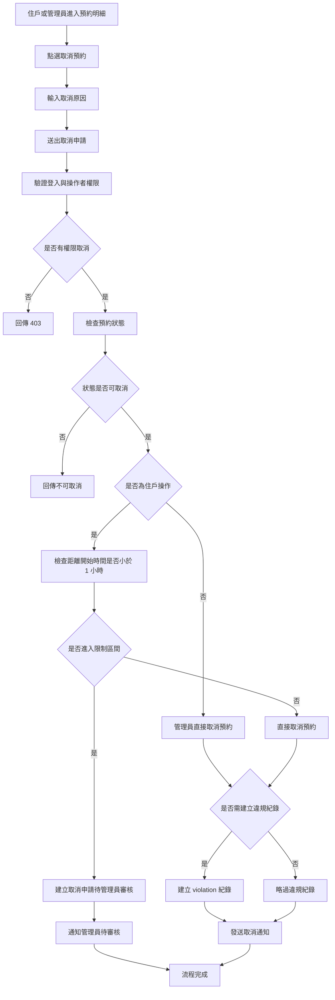
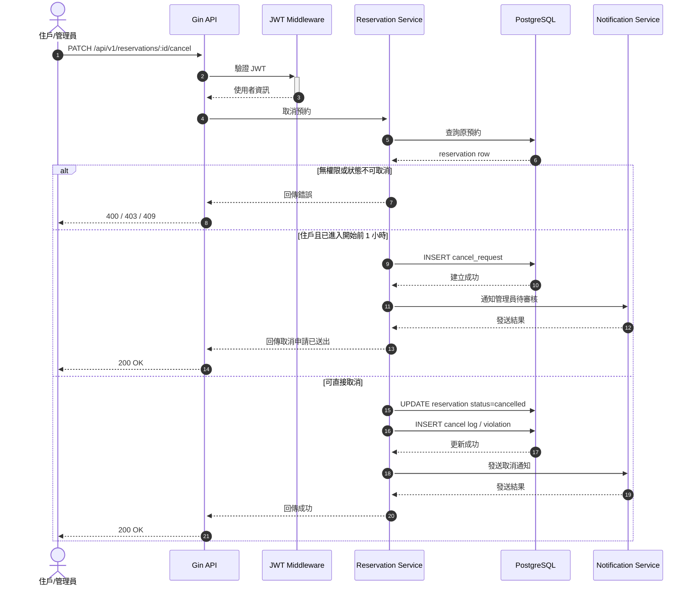

# 取消預約

## 功能目標
讓住戶或管理員取消既有預約，並依預約規則判斷是否允許取消、是否需記錄違規，以及是否需要通知相關人員。

## 適用角色
- 住戶
- 社區管理員

## 功能說明
取消預約是預約生命週期中的核心功能。此功能需明確區分「住戶自行取消」與「管理員取消」，兩者在權限、取消原因與通知對象上會有所不同。

本功能新增關鍵限制：
- 預約開始前 `1` 小時內，住戶不可直接取消
- 若住戶仍需取消，必須改為提交「取消申請」
- 取消申請需由管理員審核通過後，才可正式取消預約

## 涉及模組
- `app/controller/v1/reservation/`：處理取消 API
- `app/models/reservation/`：取消請求與回應模型
- `app/repositories/reservation/`：預約狀態更新
- `database/Reservation_DB/`：預約主表、違規表、取消紀錄
- `app/repositories/message/`：發送取消通知

## 前置條件
- 預約必須存在
- 預約狀態必須為 `pending` 或 `approved`
- 若由住戶取消，需符合取消期限

## 輸入欄位建議
| 欄位 | 型別 | 必填 | 說明 |
| --- | --- | --- | --- |
| `reservation_id` | uint | 是 | 預約單 ID |
| `cancel_reason` | string | 否 | 取消原因 |
| `operator_type` | string | 是 | `resident` 或 `manager` |

## 驗證規則
- 僅預約建立者或管理員可取消
- `cancelled`、`completed`、`rejected`、`no_show` 不可再次取消
- 住戶取消需檢查是否超過可取消期限
- 預約開始前 `1` 小時內，住戶不可直接取消
- 預約開始前 `1` 小時內，住戶若要取消，需改送管理員審核
- 管理員取消建議強制填寫原因
- 超過期限仍取消者，可依規則建立違規紀錄

## 處理流程
1. 驗證 JWT 與操作者身份
2. 查詢預約資料
3. 驗證預約是否存在且可取消
4. 驗證操作者是否有權限取消
5. 驗證是否已進入開始前 `1` 小時限制區間
6. 若已進入限制區間，建立取消申請並通知管理員
7. 若未進入限制區間，直接更新預約狀態為 `cancelled`
8. 視規則決定是否建立違規紀錄
9. 發送取消通知

## Activity Diagram


## Sequence Diagram


## API 草案
- 方法：`PATCH`
- 路徑：`/api/v1/reservations/:id/cancel`
- 是否需要 JWT：是

### Request Body
```json
{
  "cancel_reason": "行程異動",
  "operator_type": "resident"
}
```

### 建議補充 API
- `PATCH /api/v1/admin/reservations/:id/cancel-approve`
- `PATCH /api/v1/admin/reservations/:id/cancel-reject`

## 資料設計建議
第一版至少應補以下欄位或資料表：
- `facility_reservation.cancel_reason`
- `facility_reservation.cancelled_by`
- `facility_reservation.cancelled_at`
- `facility_reservation_violation`
- `facility_reservation_cancel_log` 或共用異動紀錄表
- `facility_reservation_cancel_request`

## 後續關聯功能
- [社區基本設施預約](/Users/kent/project/Community_Notification_System/docs/features/facility_booking/facility_reservation/README.md)

## 實作備註
- 若管理員取消預約，通知內容建議帶上取消原因。
- 若住戶於開始前 `1` 小時內提出取消，建議不要直接回傳「不可取消」，而是導入「待管理員審核」流程，使用體驗會比較完整。
- 若取消會影響候補機制，後續可再擴充釋出時段後自動通知候補住戶。
