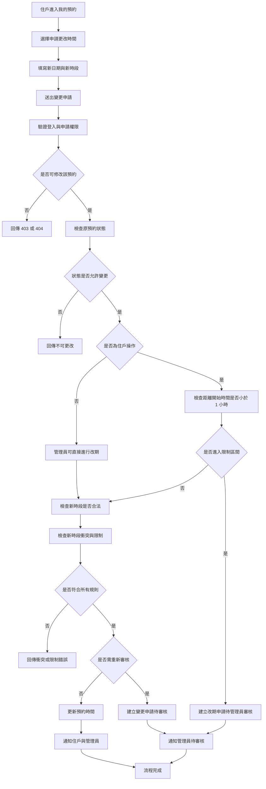
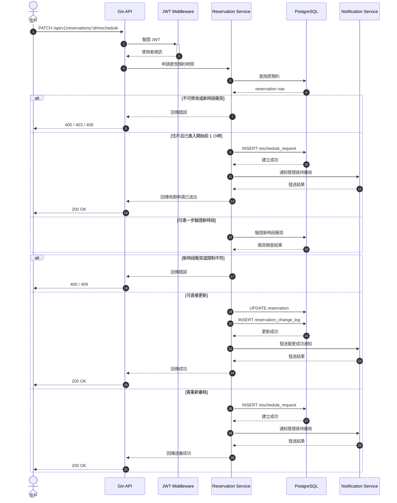

# 申請更改預約時間

## 功能目標
讓住戶對既有預約提出「更改預約時間」申請，由系統重新檢查新時段是否可用，並依設施規則決定直接生效或進入人工審核。

## 適用角色
- 住戶
- 社區管理員

## 功能說明
本功能不是直接修改資料，而是對既有預約提出一筆變更申請，避免原始預約紀錄被覆寫而失去追蹤能力。

本功能新增關鍵限制：
- 預約開始前 `1` 小時內，住戶不可直接改期
- 若住戶仍需改期，必須改為提交「改期申請」
- 改期申請需由管理員審核通過後，才可正式變更預約時間

## 涉及模組
- `app/controller/v1/reservation/`：處理變更申請 API
- `app/models/reservation/`：變更申請請求與回應模型
- `app/repositories/reservation/`：預約查詢、衝突檢查與更新
- `database/Reservation_DB/`：預約主表與異動紀錄表
- `app/repositories/message/`：通知住戶與管理員

## 前置條件
- 原預約必須存在
- 原預約狀態必須為 `pending` 或 `approved`
- 預約尚未開始，或仍在允許更改的時間範圍內

## 輸入欄位建議
| 欄位 | 型別 | 必填 | 說明 |
| --- | --- | --- | --- |
| `reservation_id` | uint | 是 | 原預約單 ID |
| `new_date` | string | 是 | 新預約日期 |
| `new_start_time` | string | 是 | 新開始時間 |
| `new_end_time` | string | 是 | 新結束時間 |
| `reason` | string | 否 | 更改原因 |

## 驗證規則
- 僅預約建立者或管理員可提出變更
- `cancelled`、`completed`、`rejected`、`no_show` 不可變更
- 新時段必須符合設施開放時間
- 新時段不得與其他預約衝突
- 新時段仍須符合次數限制與提前預約條件
- 超過「可更改期限」的申請應被拒絕
- 預約開始前 `1` 小時內，住戶不可直接改期
- 預約開始前 `1` 小時內，住戶若要改期，需改送管理員審核

## 處理流程
1. 驗證 JWT 與申請者身份
2. 查詢原預約資料
3. 驗證是否有權限修改該預約
4. 驗證原預約狀態是否允許變更
5. 驗證是否已進入開始前 `1` 小時限制區間
6. 驗證新時段是否合法
7. 檢查新時段是否衝突
8. 若已進入限制區間，建立改期申請並通知管理員
9. 若未進入限制區間，依設施規則決定直接更新或送審
10. 寫入變更紀錄
11. 發送通知

## Activity Diagram


## Sequence Diagram


## API 草案
- 方法：`PATCH`
- 路徑：`/api/v1/reservations/:id/reschedule`
- 是否需要 JWT：是

### Request Body
```json
{
  "new_date": "2026-04-15",
  "new_start_time": "20:00",
  "new_end_time": "21:00",
  "reason": "臨時有事，想改晚一點使用"
}
```

### 建議補充 API
- `PATCH /api/v1/admin/reservations/:id/reschedule-approve`
- `PATCH /api/v1/admin/reservations/:id/reschedule-reject`

## 資料設計建議
第一版可先採以下兩種方式擇一：

1. 簡化版
- 直接更新 `facility_reservation`
- 另建 `facility_reservation_change_log` 紀錄異動前後時間

2. 完整版
- 建立 `facility_reschedule_request`
- 管理員審核通過後再更新主預約表

## 後續關聯功能
- [社區基本設施預約](/Users/kent/project/Community_Notification_System/docs/features/facility_booking/facility_reservation/README.md)

## 實作備註
- 由於你目前的規則已明確要求「開始前 `1` 小時內不可直接改期」，因此第一版也建議直接採「完整版」。
- 改期與取消應共用相同的限制邏輯，避免住戶透過改期繞過取消限制。
- 至少需保留異動紀錄與審核紀錄，避免後續無法追蹤責任。
