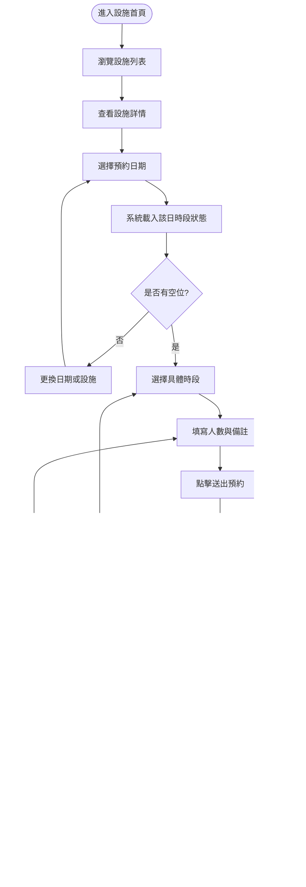
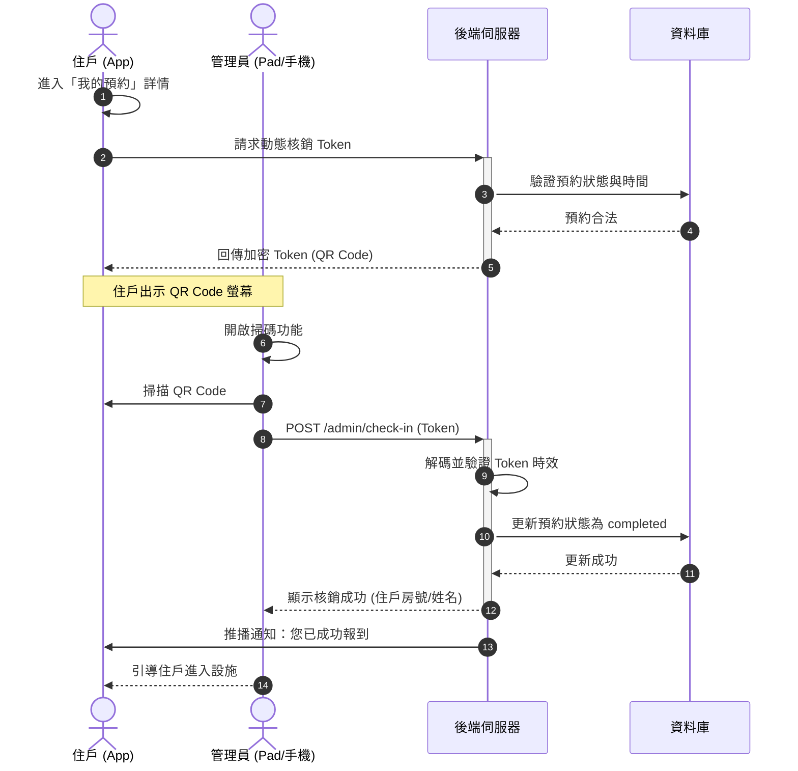
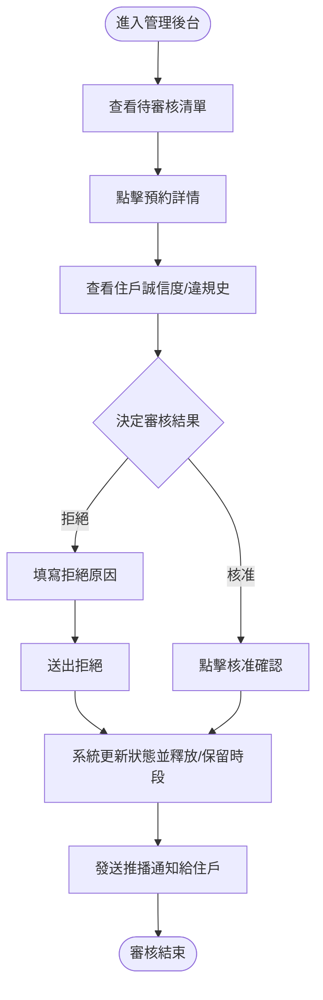
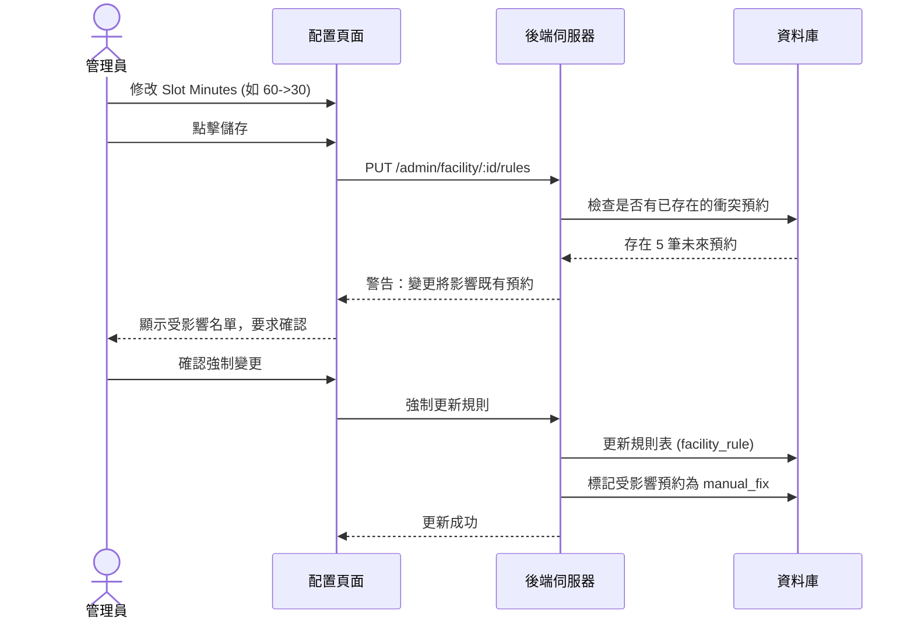

# 社區設施預約系統：UI/UX 介面功能與欄位詳細規劃

## 1. 系統目標與對象
本文件定義預約系統中，各功能頁面應呈現的詳細資訊、欄位清單及互動邏輯。
*   **住戶端 (Resident App/Web)**：直觀、快速預約、清晰的憑證顯示。
*   **管理端 (Admin/Manager Dashboard)**：高效審核、即時監控、規則靈活配置。

---

## 2. 住戶端功能頁面規劃 (Resident Pages)

### 2.1 設施探索頁 (Facility Exploration)
**核心目的**：展示社區內所有可供預約的設施。

| 區塊 | 顯示資訊 / 欄位 | 說明 |
| --- | --- | --- |
| **頂部搜尋** | 關鍵字搜尋框、分類標籤 (如：運動、育樂、會議) | 快速縮小範圍 |
| **設施卡片** | 設施圖片 (Cover Image) | 吸引視覺注意 |
| | 設施名稱 (Name) | 標題 |
| | 設施類型標籤 (Type) | 例如：`KTV`, `健身房`, `羽球場` |
| | 當前狀態標籤 (Status) | `開放中` (綠), `維修中` (紅), `今日額滿` (灰) |
| | 容納上限 (Capacity) | 顯示如 `最多 4 人` 或 `共享設施` |
| | 位置簡述 (Location) | 例如：`A 棟 B1` |

---

### 2.2 設施詳情與時段預約頁 (Facility Detail & Time Selection)
**核心目的**：讓住戶深入了解設施規則，並選擇具體預約時間。

| 區塊 | 顯示資訊 / 欄位 | 說明 |
| --- | --- | --- |
| **詳情區** | 設施描述 (Description) | 詳細介紹 (Text) |
| | 使用規章 (Rules) | 注意事項、清潔規範、違規說明 |
| **日期選擇** | 日曆組件 (Date Picker) | 僅限顯示 `max_advance_days` 內的日期 |
| **時段選擇** | **時段清單 (Time Slots Grid)** | **關鍵邏輯：** |
| | 時段標籤 (HH:mm - HH:mm) | 根據 `slot_minutes` 切分 |
| | 剩餘名額 (Available Slots) | 顯示 `(餘 N 位)` 或 `已預約` |
| | 時段狀態 (Slot Status) | `可選`, `已佔用`, `非營業時間` |
| **動作按鈕** | 「下一步：確認資訊」 | 點擊進入預約表單 |

---

### 2.3 預約資料填寫頁 (Booking Form)
**核心目的**：收集預約所需的額外資料並進行最後確認。

| 欄位名稱 | 類型 | 說明 / 驗證 |
| --- | --- | --- |
| **預約時間** | 唯讀文字 | 顯示 `2024-04-20 14:00 - 15:00` |
| **預約人數** | 數字輸入 (Number) | 驗證：1 <= X <= `MaxPerBooking` |
| **預約用途/備註** | 長文字 (TextArea) | 選填，例如：`練習羽球` |
| **同意規章** | 勾選框 (Checkbox) | **必填**，確認已閱讀使用規章 |
| **住戶資訊** | 唯讀文字 | 自動帶入 `UserID`, `HomeID` (棟別/房號) |

---

### 2.4 我的預約紀錄與核銷憑證 (My Reservations & Check-in)
**核心目的**：管理歷史預約，並提供到場核銷的依據。

| 區塊 | 顯示資訊 / 欄位 | 說明 |
| --- | --- | --- |
| **預約列表** | 狀態標籤 (Badge) | `待審核`, `已確認`, `已完成`, `已取消`, `未到場` |
| | 設施名稱 + 時間 | 列表主標題 |
| **核銷憑證** | **動態 QR Code** | **關鍵組件：** |
| | 倒數計時器 | QR Code 每 60 秒更新一次 (安全考量) |
| | 核銷按鈕 | 或是讓管理員掃描 |
| **管理動作** | 取消按鈕 | 僅在 `cancel_before_hours` 時限前顯示 |
| | 改期按鈕 | 僅在時限前顯示，跳轉至改期申請頁 |

---

## 3. 管理端功能頁面規劃 (Admin Pages)

### 3.1 預約審核工作台 (Review Dashboard)
**核心目的**：快速處理需要人工審核的申請。

| 欄位 / 資訊 | 顯示方式 | 說明 |
| --- | --- | --- |
| **申請人資訊** | 住戶姓名 + 房號 | 識別身分 |
| **申請內容** | 設施、日期、時間、人數 | 核心預約資料 |
| **住戶誠信度** | 歷史違規次數 (Violations) | 提示如：`過去 30 天內有 1 次未到場` |
| **備註** | 住戶填寫的備註 | 審核參考 |
| **操作** | 核准 (Approve) / 拒絕 (Reject) | 拒絕時強制要求填寫 `拒絕原因` |

---

### 3.2 設施配置管理 (Facility Configuration)
**核心目的**：調整設施運作規則。

| 區塊 | 欄位 / 功能 | 說明 |
| --- | --- | --- |
| **基本設定** | 名稱、描述、上傳封面圖、位置 | 顯示給住戶看的資訊 |
| **規則設定** | `Slot Minutes` (分鐘) | 定義時間片長度 (30, 60, 120) |
| | `Max Advance Days` (天) | 提早幾天開放 |
| | `Cancel Before` (小時) | 取消期限 |
| **時段配置** | **每週開放時間 (Weekly Scheduler)** | **具體實作：** |
| | 週一至週日開關 | 可個別勾選 `休息` |
| | 當日多段營運 | 例如：`09:00-12:00` 與 `14:00-21:00` |
| **緊急操作** | 「設施維修中」切換鍵 | 一鍵停用，並可輸入預定修復時間 |

---

### 3.3 現場核銷與監控頁 (Live Monitor & Check-in)
**核心目的**：掌握今日設施使用實況，並處理到場住戶。

| 區塊 | 功能 / 顯示資訊 | 說明 |
| --- | --- | --- |
| **掃碼核銷** | 相機掃描器 (Camera Scanner) | 掃描住戶 QR Code |
| **今日清單** | 設施即時狀態一覽表 | 哪些時段 `正在使用`, `即將開始`, `未到場` |
| **手動核銷** | 列表點擊「手動報到」 | 應對住戶沒帶手機的情境 |
| **異常統計** | 今日總預約數、取消數、No-show 數 | 運營統計 |

---

## 4. 錯誤處理與提示規劃 (Error & Toast Notifications)

*   **預約衝突**：`「很抱歉，此時段已被其他住戶預約，請選擇其他時段。」`
*   **資格不符**：`「您本週的預約次數已達上限 (3次)，請下週再試。」`
*   **停權中**：`「因您先前有多次未到場紀錄，預約功能暫停至 YYYY-MM-DD。」`
*   **逾時取消**：`「已超過可取消時間，若無法到場請聯繫管理室。」`

---

## 5. 流程圖與時序圖 (Flowcharts & Sequence Diagrams)

### 5.1 住戶預約活動圖 (Resident Booking Activity)
描述從探索設施到完成預約申請的 UI 邏輯。

### 5.2 現場掃碼核銷時序圖 (Check-in Sequence)
描述住戶出示憑證與管理員掃碼核銷的互動。

### 5.3 管理員審核活動圖 (Admin Review Activity)
描述管理員處理待審核預約的決策流程。

### 5.4 設施規則變更時序圖 (Rule Configuration)
描述管理員調整最小預約單位或開放時間的影響。

