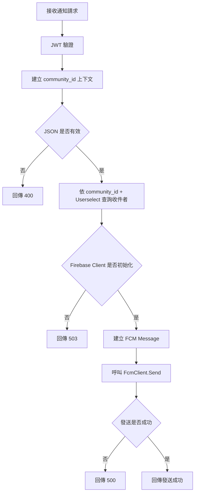
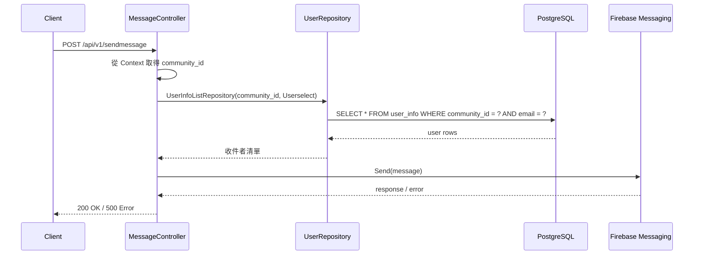

# 發送通知

## 功能目標
接收通知請求後，透過 Firebase Cloud Messaging 對指定裝置送出通知。

## API
- 方法：`POST`
- 路徑：`/api/v1/sendmessage`
- 是否需要 JWT：是

## 社區上下文規則
- 此 API 屬於社區型操作，應由 `CommunityContextMiddleware` 建立 `community_id`。
- `Userselect` 對應的收件者查詢應限制在相同 `community_id` 範圍內。
- 不可跨社區查詢收件者或發送社區通知，除非另有平台管理員特權流程。

## 輸入欄位
| 欄位 | 型別 | 說明 |
| --- | --- | --- |
| `deviceToken` | string | 目標裝置 token |
| `title` | string | 通知標題 |
| `body` | string | 通知內容 |
| `Userselect` | array | 被選取使用者 email 清單 |

## 回傳格式

### 成功回傳 `200 OK`
```json
{
  "message": "Successfully sent message",
  "response": "<firebase-message-id>"
}
```

### 錯誤回傳
`400 Bad Request`
```json
{
  "code": 400,
  "status": "Bad Request",
  "error": "無效的輸入資料"
}
```

`401 Unauthorized`
```json
{
  "error": "缺少 Authorization header"
}
```

`503 Service Unavailable`
```json
{
  "code": 503,
  "status": "Service Unavailable",
  "error": "Firebase 推播服務尚未初始化"
}
```

`500 Internal Server Error`
```json
{
  "error": "Failed to send message"
}
```

## Activity Diagram


## Sequence Diagram


## 實作備註
- 實作目前只對 `deviceToken` 送單一 FCM 通知。
- `Userselect` 目前只用於查詢使用者清單，沒有將查詢結果與 `deviceToken` 實際綁定。
- `message_info` repository 尚未在此流程中使用，因此目前沒有通知歷程落庫。
- 後續若導入社區隔離，此功能需優先補上 `community_id` 條件，避免跨社區選人與發送。
