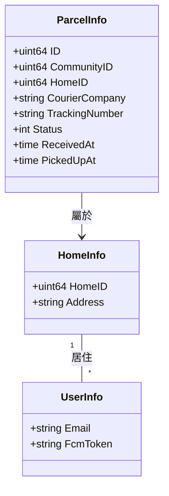

# 包裹管理 (Parcel Management)

## 功能目標
包裹管理模組旨在簡化社區管理員（保全）對代收包裹的行政流程，並提升住戶領取包裹的便利性。本模組分為「管理員代收」與「住戶領取」兩大核心場景。

## 子功能索引

### 1. [管理員代收包裹 (Parcel Receive)](parcel_receive/README.md)
描述管理員在收到物流公司包裹時，如何登錄資訊、查詢住戶並發送 FCM 推播通知。

### 2. [住戶領取包裹 (Parcel Pickup)](parcel_pickup/README.md)
描述管理員如何協助住戶領取包裹，包含查詢待領清單、確認身份與標記領取狀態。

## 資料庫實體關聯 (ERD)

## 共通權限規則
- **管理員 / 保全**：具備代收登錄、全社區包裹查詢、核銷領取之權限。
- **住戶**：僅具備查詢所屬 `HomeID` 之包裹狀態與歷史紀錄之權限。
