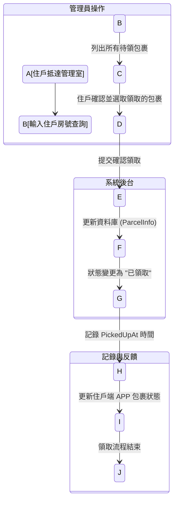
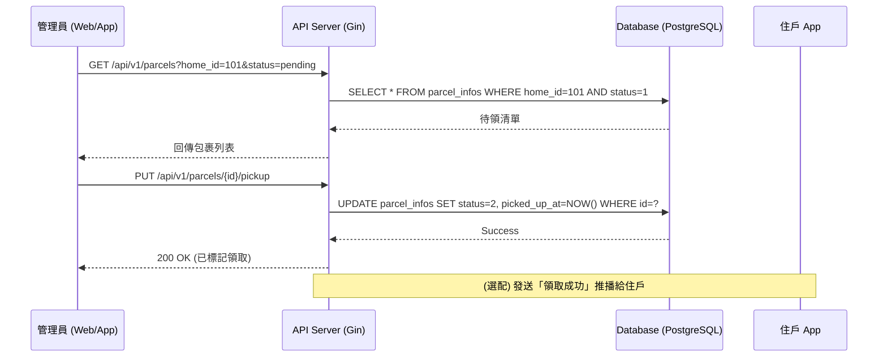

# 住戶領取包裹流程 (Parcel Pickup)

## 功能說明
當住戶親自前往管理室領取包裹時，管理員需核對資訊並在系統中將該包裹標記為「已領取」。這確保了包裹狀態的實時更新與領取紀錄的留存。

## 角色視角：管理員
1.  **查詢**：住戶提供樓層房號，管理員在系統中輸入以列出該戶「所有待領包裹」。
2.  **核對**：住戶確認包裹數量與內容物。
3.  **簽收**：管理員點擊「確認領取」，系統記錄領取時間，包裹從待領清單中消失。

## 流程圖

### 活動圖 (Activity Diagram)



### 時序圖 (Sequence Diagram)



## API 規格概要

### 1. 查詢特定住戶待領包裹
- **URL**: `GET /api/v1/parcels?home_id=101&status=1`
- **權限**: 管理員

### 2. 標記包裹為已領取
- **URL**: `PUT /api/v1/parcels/{id}/pickup`
- **權限**: 管理員
- **Response**: `200 OK`
    ```json
    {
      "message": "包裹領取成功",
      "picked_up_at": "2024-04-27T10:00:00Z"
    }
    ```

## 異常處理
- **權限不足**：非管理員嘗試進行核銷操作時，返回 `403 Forbidden`。
- **重複領取**：若包裹已處於「已領取」狀態，返回 `400 Bad Request`。
