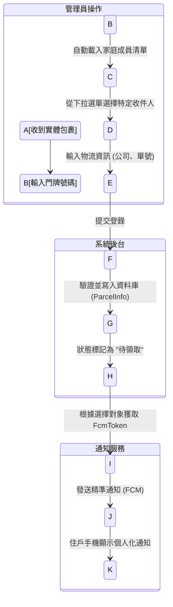
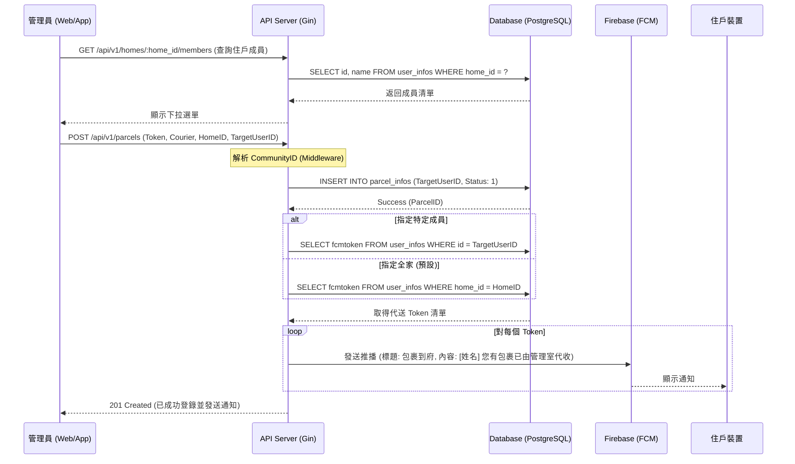

# 管理員代收包裹流程 (Parcel Receive)

## 功能說明
當物業管理員（保全）收到外部快遞公司送達的包裹時，需登錄包裹資訊。系統將自動根據住戶資訊，向該戶所有成員發送 FCM 推播通知。

## 角色視角：管理員
1.  **輸入門牌**：確認包裹上的地址，在系統輸入門牌號碼。
2.  **載入成員**：系統自動根據門牌（家庭群組）載入該戶所有註冊成員。
3.  **選擇收件人**：透過下拉選單選擇包裹所屬的成員（或選擇「全家」）。
4.  **登錄**：輸入物流公司、單號與備註。
5.  **確認**：提交後，系統針對特定成員（或全家）發送推播通知。

## 流程圖

### 活動圖 (Activity Diagram)



### 時序圖 (Sequence Diagram)



## API 規格概要

### 1. 登錄包裹
- **URL**: `POST /api/v1/parcels`
- **權限**: 管理員 (Role Level >= 2)
- **Request Body**:
    ```json
    {
      "home_id": 101,
      "courier_company": "黑貓宅急便",
      "tracking_number": "9876543210",
      "remark": "大型件"
    }
    ```
- **Response**: `201 Created`

## 異常處理
- **找不到住戶**：若輸入的 `home_id` 不存在，返回 `404 Not Found`。
- **重複單號**：若同一社區已有相同單號且處於「待領取」狀態，提示管理員確認。
