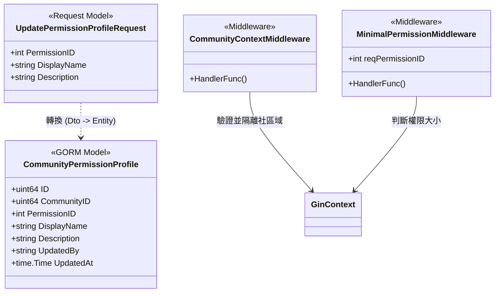
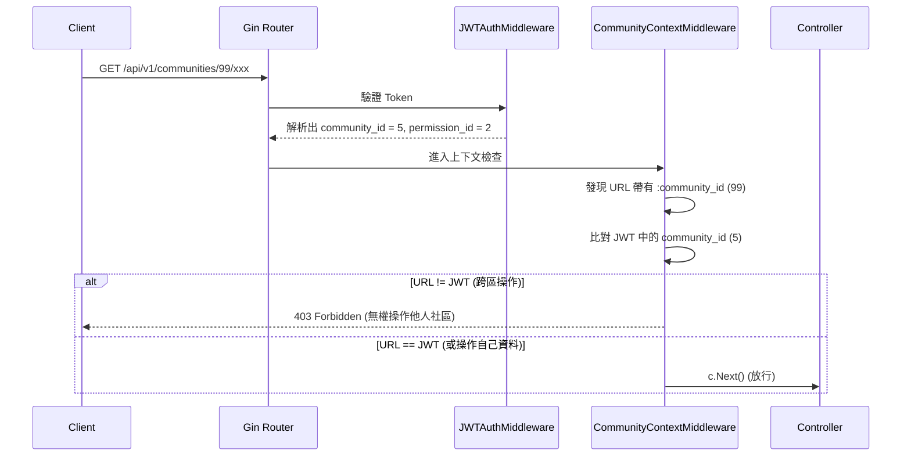
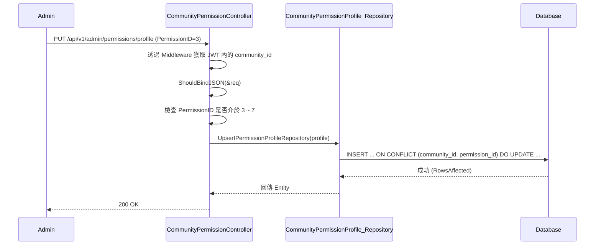

# 權限管理與社區隔離實作分析與知識點 (Implementation & Knowledge Points)

## 類別圖 (Class Diagram)

## 時序圖 (Sequence Diagram)

### 跨社區操作防護邏輯 (Middleware Interception)

### 社區自訂角色更新 (Upsert Profile)

## 程式碼逐行分析 (Line-by-Line Analysis)

### 1. 中介層擴充與隔離 (`jwt_middleware.go` & `community_context_middleware.go`)
- `jwt_middleware.go`: 將原先只萃取 `username` 的邏輯，擴充為連帶將 `user_id`、`permission_id` 與 `community_id` 都從 Token 解析出來並透過 `c.Set()` 存入 Gin Context 供後續流程調用。
- `CommunityContextMiddleware`：
  - `communityIDStr := c.Param("community_id")`: 在設計風格為 `/communities/:community_id/...` 的操作中，嘗試抓取路徑裡的社區號碼。
  - `if permID == 1 { c.Next(); return }`: 滿足了文件規範「權限 1 (Super admin) 擁有跨社區絕對總權限，不需檢查社區歸屬」。
  - 強力比對 `jwtCommIDStr != communityIDStr`: 確保 `PermissionID = 2~7` 的用戶只能存取自己社區內的資源。若企圖修改其他社區會直接回應 403 阻擋。

### 2. 權限防護中介層 (`permission_middleware.go`)
- `func MinimalPermissionMiddleware(reqPermissionID int)`: 這是一個 Factory 函數，會產生檢查權限層級的 Handler。
- `if userPermID > reqPermissionID`: 實作了文件中最核心的一段話：「**PermissionID 數值越小，權限越高** (1 > 2 > 3 > 4 > 5 > 6 > 7)」。假設我們設定路由需 `MinimalPermissionMiddleware(2)`，如果帶入 `PermissionID = 3`，則會因為 `3 > 2` 觸發 403 Forbidden。

### 3. 社區自訂角色權限表 (`CommunityPermissionProfile_Schema.go` & `.Repository.go`)
- `type CommunityPermissionProfile struct {...}`：設計了一個新的表格，負責儲存社區自定義 3~7 等級的角色名稱。
- `gorm:"index:...,unique"`：透過 GORM 在 `community_id` 與 `permission_id` 上建立 Unique Index 複合鍵，保證同一個社區裡同一個等級的角色名稱只有一筆。
- `check:permission_id >= 3 AND permission_id <= 7`：利用 GORM Check 欄位約束資料層，不允許有人偷偷更改等級 1 或 2，或是超出範圍的資料建立。
- `Clauses(clause.OnConflict{...}).Create()`：利用 PostgreSQL 的強大語法特性 (UPSERT)，這可以確保前端在呼叫 API 時，不用先查有沒有資料再決定是否 UPDATE 或 INSERT。

通過此三步驟實作，系統便正式擁有了支援全台多社區共構，並能各自保留自身隱私數據且互不干擾的 SaaS 等級多租戶防落機制。
