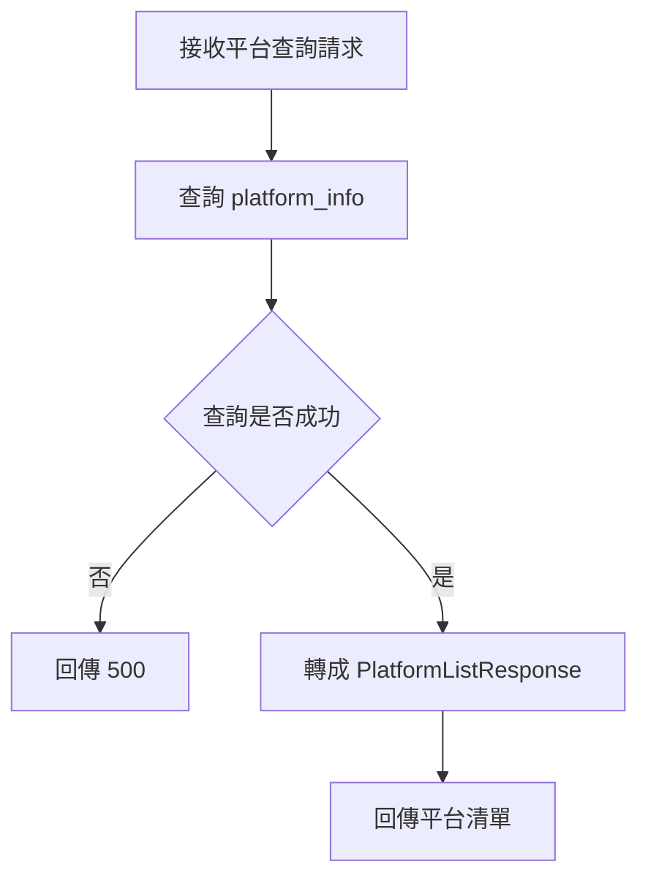
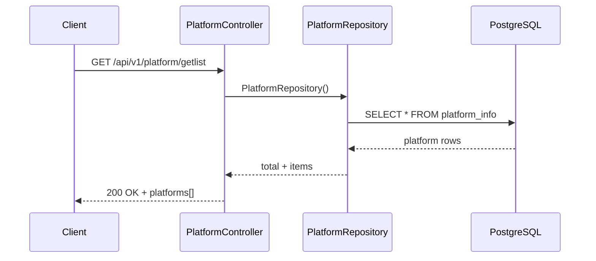

# 平台列表查詢

## 功能目標
提供前端取得系統支援的平台名稱清單。

## API
- 方法：`GET`
- 路徑：`/api/v1/platform/getlist`
- 是否需要 JWT：否

## 回傳格式

### 成功回傳 `200 OK`
```json
{
  "total": 3,
  "platforms": [
    { "name": "web" },
    { "name": "App" },
    { "name": "Desktop" }
  ]
}
```

### 錯誤回傳
`500 Internal Server Error`
```json
{
  "code": 500,
  "status": "Internal Server Error",
  "error": "取得平台資料失敗"
}
```

## Activity Diagram


## Sequence Diagram


## 實作備註
- 預設資料為 `web`、`App`、`Desktop`。
