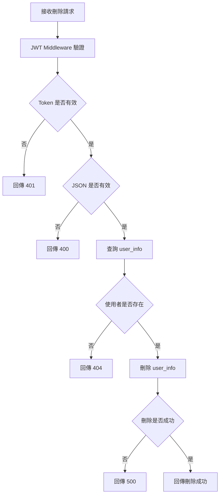
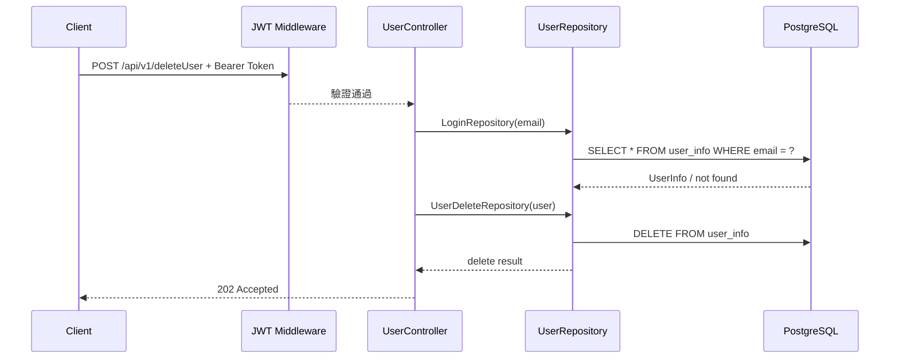

# 使用者刪除

## 功能目標
刪除既有使用者資料。

## API
- 方法：`POST`
- 路徑：`/api/v1/deleteUser`
- 是否需要 JWT：是

## 回傳格式

### 成功回傳 `202 Accepted`
```json
{
  "Message": "Delete Sucessful"
}
```

### 錯誤回傳
`400 Bad Request`
```json
{
  "code": 400,
  "status": "Bad Request",
  "error": "Invalid input"
}
```

`401 Unauthorized`
```json
{
  "error": "缺少 Authorization header"
}
```

或

```json
{
  "error": "格式錯誤，應為 Bearer token"
}
```

或

```json
{
  "error": "無效的 token"
}
```

`404 Not Found`
```json
{
  "code": 404,
  "status": "Not Found",
  "error": "User Not Found"
}
```

`500 Internal Server Error`
```json
{
  "code": 500,
  "status": "Internal Server Error",
  "error": "Delete Error"
}
```

## Activity Diagram


## Sequence Diagram


## 實作備註
- 雖註解提到需提供帳號密碼，但實作實際上只先查詢 email 對應使用者後執行刪除。
- 刪除前沒有再次驗證密碼。
