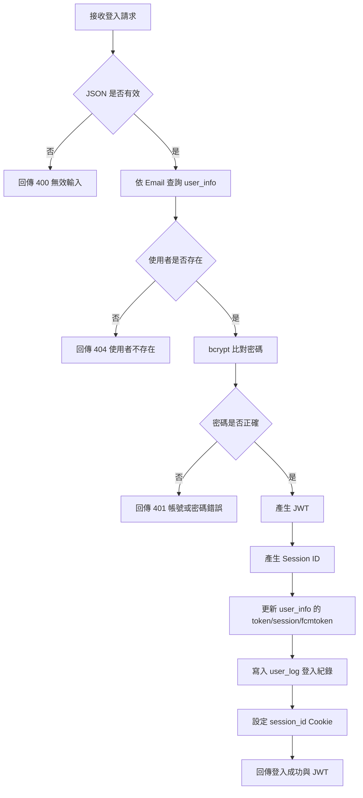
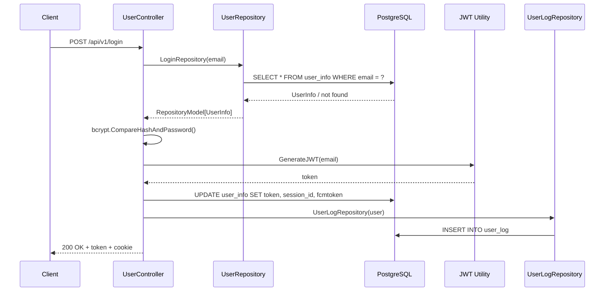

# 使用者登入

## 功能目標
讓既有使用者以帳號密碼登入系統，完成密碼驗證、JWT 簽發、Session Cookie 設定與登入紀錄寫入。

## 社區上下文規則
- 登入成功後，JWT 建議一併帶入 `community_id`、`user_id`、`permission_id`。
- 後續受保護 API 將透過 `CommunityContextMiddleware` 建立社區上下文。
- 若使用者未綁定有效 `community_id`，則只能存取不依賴社區範圍的公開 API。

## API
- 方法：`POST`
- 路徑：`/api/v1/login`
- 是否需要 JWT：否

## 輸入欄位
| 欄位 | 型別 | 說明 |
| --- | --- | --- |
| `email` | string | 使用者帳號 |
| `password` | string | 使用者密碼 |
| `platform` | string | 登入平台資訊 |
| `fcmtoken` | string | 使用者裝置推播 token |

## 涉及模組
- Controller：`app/controller/v1/user/User_Login.go`
- Repository：`app/repositories/user/User_repository.go`
- Schema：`database/User_DB/User_Schema.go`
- Schema：`database/UserLog_DB/Userlog_Schema.go`
- Utility：`utils/Jwt_Token.go`

## 回傳格式

### 成功回傳 `200 OK`
```json
{
  "message": "登入成功",
  "token": "<jwt-token>",
  "user_info": {
    "PermissionId": 1,
    "name": "系統管理員",
    "email": "user@example.com",
    "Home_id": "A1-01",
    "Birthdaytime": "2025-03-23T15:04:05Z",
    "Platform": 1,
    "Session_id": "<session-id>",
    "community_id": 1
  }
}
```

### 錯誤回傳
`400 Bad Request`
```json
{
  "code": 400,
  "status": "Bad Request",
  "error": "無效的輸入資料"
}
```

`401 Unauthorized`
```json
{
  "code": 401,
  "status": "Unauthorized",
  "error": "帳號或密碼錯誤"
}
```

`404 Not Found`
```json
{
  "code": 404,
  "status": "Not Found",
  "error": "使用者不存在"
}
```

`500 Internal Server Error`
```json
{
  "code": 500,
  "status": "Internal Server Error",
  "error": "JWT 簽發失敗"
}
```

## Activity Diagram


## Sequence Diagram


## 實作備註
- 會把 `session_id` 寫入 secure + httpOnly cookie。
- 實際 JWT payload 只包含 `username`、`exp`、`iat`。
- 後續建議擴充 JWT payload，加入 `community_id`、`user_id`、`permission_id`，供 middleware 建立社區上下文。
- 登入成功後會更新資料庫中的 `Token`、`Session_id`、`Fcmtoken`。
