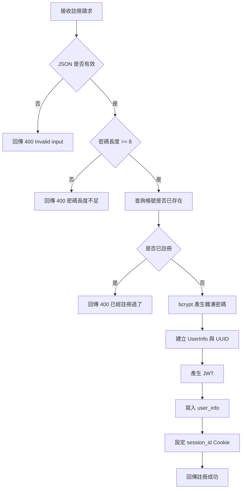
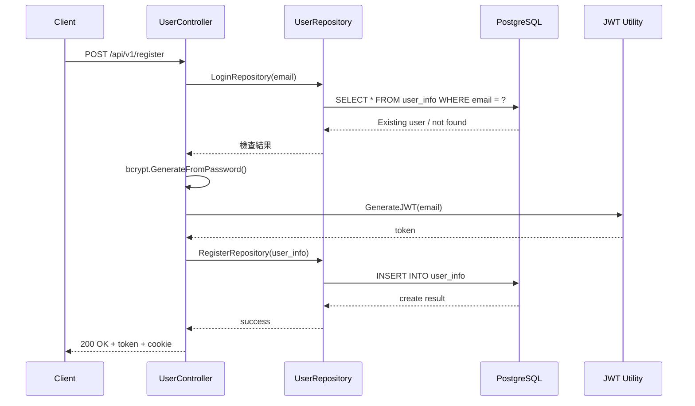

# 使用者註冊

## 功能目標
建立新帳號，檢查帳號重複、加密密碼、產生 JWT 與 Session Cookie，並寫入 `user_info`。

## 社區上下文規則
- 註冊資料中的 `community_id` 應視為後續社區上下文的來源之一。
- 註冊成功後若立即簽發 JWT，建議將 `community_id` 一併寫入 claims。
- 若註冊時未綁定社區，後續受保護 API 應限制其只能操作非社區型功能。

## API
- 方法：`POST`
- 路徑：`/api/v1/register`
- 是否需要 JWT：否

## 回傳格式

### 成功回傳 `200 OK`
```json
{
  "message": "Register successful",
  "token": "<jwt-token>",
  "user_info": {
    "PermissionId": 0,
    "name": "",
    "email": "",
    "Home_id": "",
    "Birthdaytime": "0001-01-01T00:00:00Z",
    "Platform": 0,
    "Session_id": "",
    "community_id": 0
  }
}
```

註：目前程式只設定 `message` 與 `token`，`user_info` 未填值，序列化後會出現零值欄位。

### 錯誤回傳
`400 Bad Request`
```json
{
  "code": 400,
  "status": "Bad Request",
  "error": "密碼長度至少需 8 碼"
}
```

其他可能的 `400` 訊息：
- `Invalid input`
- `已經註冊過了`
- `Register error`

`500 Internal Server Error`
```json
{
  "code": 500,
  "status": "Internal Server Error",
  "error": "JWT 簽發失敗"
}
```

## Activity Diagram


## Sequence Diagram


## 實作備註
- `Register` 請求中的 `Email` JSON key 為大寫開頭，與登入的 `email` 命名不同。
- 註冊成功回應訊息目前為英文 `Register successful`。
- 目前沒有把註冊行為寫入 `user_log`。
- 後續若全面啟用社區隔離，註冊流程應驗證 `community_id` 是否存在，避免產生無效社區關聯。
