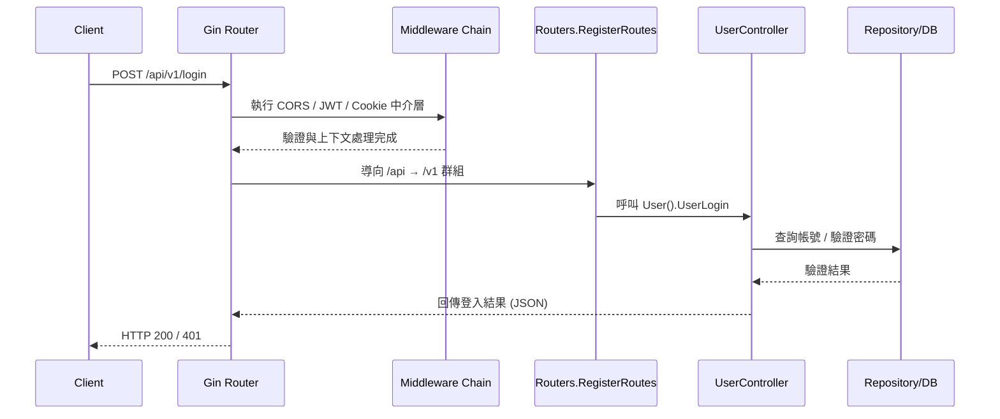

# Router 流程說明

## 檔案位置概觀
- `main.go`：建立 Gin 引擎、套用跨域 / JWT / Cookie 中介層、初始化設定與資料庫，並掛載 `/api` 路由群組及 Swagger。
- `routers/router.go`：提供 `RegisterRoutes`，將版本化路由群組 (`/v1`、`/v2`) 綁定到實際的路由設定函式。
- `routers/api/v1/v1.go`：定義 v1 API 底下的實際路由與控制器綁定。
- `routers/api/v2/v2.go`：定義 v2 API，當前與 v1 共用控制器實作，方便之後獨立演進。
- `app/controller/v1/*.go`：各路由對應的控制器方法，處理商業邏輯並呼叫資料庫層。

## 請求處理流程
1. 客戶端發送請求至對應的 API，例如 `POST /api/v1/login`。
2. `main.go` 中的 Gin 引擎接收請求並依序執行已註冊的中介層：
   - `middlewares.CORSMiddleware()`：設定跨域標頭。
   - `middlewares.JWTAuthMiddleware()`：驗證 JWT，並將驗證資訊存放於 `Context`。
   - `middlewares.CookieMiddleware()`：處理 Cookie（讀取 / 寫入）。
3. 請求進入 `/api` 路由群組後，由 `routers.RegisterRoutes` 將路徑導向對應版本（`/v1` 或 `/v2`）。
4. 在版本化路由群組內（例如 `routers/api/v1/v1.go`），依 HTTP 方法與路徑綁定到控制器，例如 `v1.User().UserLogin`。
5. 控制器執行對應的商業流程：驗證輸入、呼叫服務 / 資料存取層、產生回應。
6. Gin 將控制器的回應序列化為 JSON，並送回客戶端。

## 主要路由總覽
| 版本 | 方法 | 路徑 | 控制器方法 |
|------|------|------|------------|
| v1 / v2 | POST | `/login` | `app/controller/v1/user_controller.go:UserLogin` |
| v1 / v2 | POST | `/register` | `app/controller/v1/user_controller.go:UserRegister` |
| v1 / v2 | POST | `/deleteUser` | `app/controller/v1/user_controller.go:UserDelete` |
| v1 / v2 | POST | `/sendmessage` | `app/controller/v1/message_controller.go:SendMessage` |

> 註：v2 目前共用 v1 控制器實作，若未來功能差異化，只需在 `routers/api/v2` 建立新的控制器綁定即可。

## 時序圖：`POST /api/v1/login`

## 擴充建議
- 新增 API 時，優先決定版本號並在對應的 `routers/api/{version}` 檔案中註冊，必要時建立新的控制器。
- 若新增中介層，請在 `main.go` 中統一掛載，維持一致的安全與日誌策略。
- 建議為關鍵路由撰寫表單驗證與整合測試，確保版本演進時行為一致。
