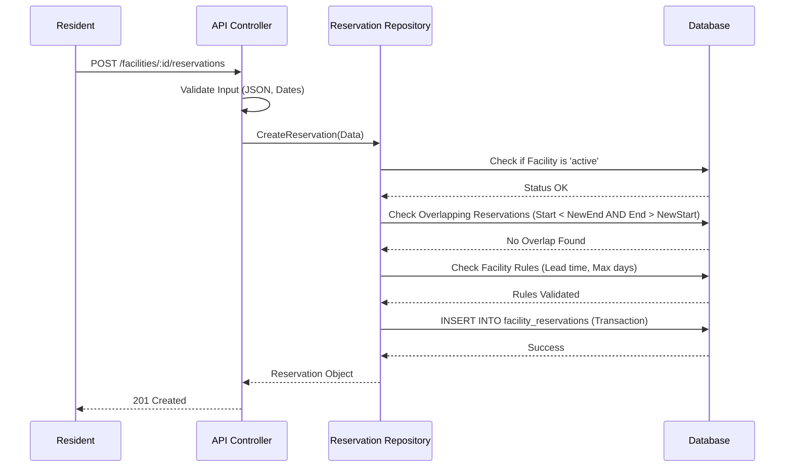
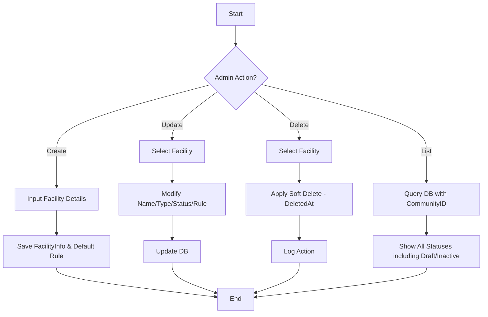
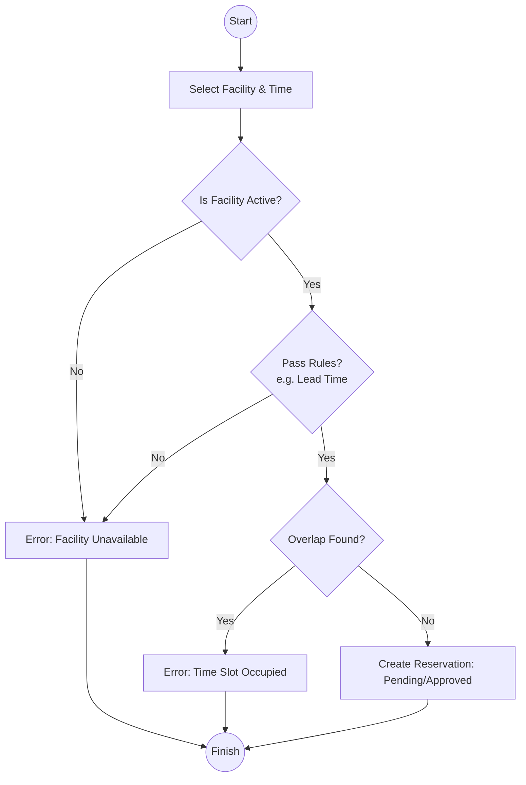

# Community Reservation Facility CRUD Design

## 1. Overview
This design covers the full CRUD operations for the Community Reservation Facility system. It builds upon the existing `FacilityInfo` and `FacilityReservation` models, adding soft delete support, role-based filtering for lists, and robust conflict checking for reservations.

## 2. User Stories
- **As a Community Manager (Admin)**: I want to create, update, and soft-delete facilities. I want to see all reservations in the community to manage resource usage.
- **As a Resident**: I want to browse active facilities, view my own reservations, and book facilities while ensuring there are no time overlaps with other bookings.

## 3. Database Updates
### FacilityInfo (Soft Delete)
- Add `deleted_at` field (using `gorm.DeletedAt`) to support soft deletes.
- Update unique index to include `deleted_at` to allow re-creating a facility with the same name after deletion.

### FacilityRule (Validation)
- Ensure `FacilityRule` is updated when facility settings change.

## 4. API Design

### Facility Management
| Method | Endpoint | Role | Description |
| :--- | :--- | :--- | :--- |
| POST | `/api/v1/admin/facilities` | Admin | Create a new facility (Already implemented). |
| GET | `/api/v1/facilities` | All | List facilities. Residents see only `active`. Admins see all. |
| GET | `/api/v1/facilities/:id` | All | Get facility details. |
| PUT | `/api/v1/admin/facilities/:id` | Admin | Update facility info and status. |
| DELETE | `/api/v1/admin/facilities/:id` | Admin | Soft delete a facility. |

### Reservation Management
| Method | Endpoint | Role | Description |
| :--- | :--- | :--- | :--- |
| POST | `/api/v1/facilities/:id/reservations` | Resident | Create a reservation with overlap check. |
| GET | `/api/v1/reservations` | All | List reservations. Residents see their own. Admins see all. |
| GET | `/api/v1/reservations/:id` | All | Get reservation details. |
| PATCH | `/api/v1/reservations/:id/cancel` | Resident | Cancel own reservation. |
| PATCH | `/api/v1/admin/reservations/:id/delete` | Admin | Soft delete (force cancel) a reservation. |

## 5. Business Logic

### Overlap Check Logic
When booking a facility for `[NewStart, NewEnd]` on `ReservationDate`:
1. Query `FacilityReservation` where:
   - `facility_id = :target_id`
   - `reservation_date = :target_date`
   - `status` is NOT in `('cancelled', 'rejected')`
   - `(start_time < :NewEnd) AND (end_time > :NewStart)`
2. If count > 0, return `409 Conflict`.

### Role-based Filtering
In the Repository/Controller:
- Check user permissions from JWT context.
- If Resident: append `WHERE user_id = :current_user_id` for reservations, or `WHERE status = 'active'` for facilities.
- If Admin (Level 2+): No filter (scoped to `community_id`).

## 6. Diagrams

### Sequence Diagram: Creating a Reservation

### Activity Diagram: Facility CRUD (Admin)

### Activity Diagram: Reservation Process (Resident)

## 7. Success Criteria
- [ ] Facilities can be soft-deleted and filtered by role.
- [ ] Reservations correctly block overlapping time slots.
- [ ] Residents only see their own reservations in the list.
- [ ] Admins can see and manage all reservations in the community.
